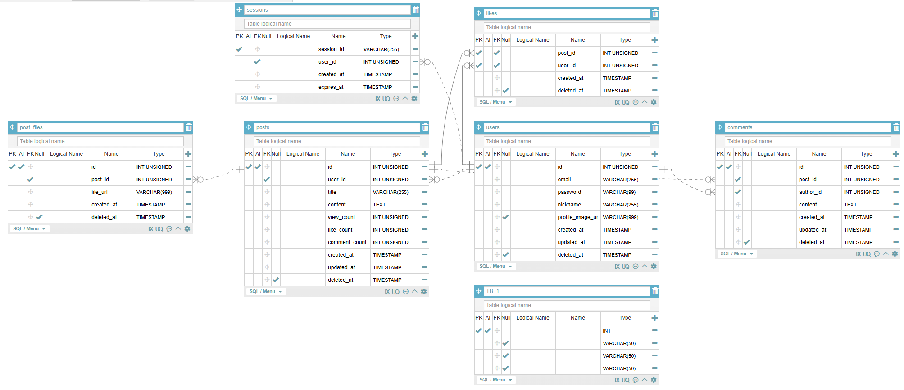

# PuppyTalk API

강아지 커뮤니티 서비스를 위한 백엔드 API 서버입니다.  
회원가입, 게시글, 댓글, 좋아요 등 커뮤니티 기능을 제공하며, 웹/앱 프론트엔드에서 이 API를 호출해 사용합니다.

---

## 이 API가 하는 일

| 기능 | 설명 |
|------|------|
| **인증 (Auth)** | 회원가입, 로그인, 로그아웃. 로그인하면 쿠키에 세션 정보가 저장되고, 이후 요청에 이 쿠키가 함께 전달됩니다. 비밀번호는 bcrypt로 암호화해 저장합니다. |
| **사용자 (Users)** | 로그인한 사용자 본인의 프로필 조회·수정, 비밀번호 변경, 프로필 사진 업로드. API 경로는 `/users/me` 입니다. |
| **게시글 (Posts)** | 게시글 작성·조회·수정·삭제, 게시글에 이미지 첨부. 목록은 페이지 단위로 조회합니다. |
| **댓글 (Comments)** | 게시글에 댓글 작성·조회·수정·삭제 |
| **좋아요 (Likes)** | 게시글에 좋아요 추가·취소 |

---

## 사용 기술

- **Python 3.8+** – 서버 개발 언어
- **FastAPI** – HTTP API를 쉽게 만들 수 있는 웹 프레임워크
- **MySQL** – 회원·게시글·댓글·좋아요 데이터를 저장하는 데이터베이스
- **Pydantic** – 요청/응답 데이터 형식 검증
- **bcrypt** – 비밀번호 암호화

## 실행 전 준비

- **Python 3.8 이상**이 설치되어 있어야 합니다.
- **MySQL**이 설치·실행 중이어야 합니다. `puppytalk` 데이터베이스를 생성한 뒤, `docs/puppyytalkdb.sql` 스크립트를 실행해 테이블을 생성하세요.

  ```bash
  mysql -u root -p -e "CREATE DATABASE IF NOT EXISTS puppytalk;"
  mysql -u root -p puppytalk < docs/puppyytalkdb.sql
  ```

---

## ERD (데이터베이스 구조)



테이블 관계는 `docs/erd.png`를 참고하고, DDL은 `docs/puppyytalkdb.sql`을 사용하세요.

---

## 요청이 처리되는 흐름 (전체 아키텍처)

API 요청이 들어왔을 때 어떤 순서로 어떤 개념이 적용되는지 이해할 수 있도록 흐름을 정리했습니다.

### 1. 전체 흐름도

```
[프론트엔드 / 클라이언트]  HTTP 요청 (JSON body, Cookie)
         │
         ▼
┌─────────────────────────────────────────────────────────────────────────┐
│  백엔드 (FastAPI)                                                        │
│                                                                         │
│  ① Lifespan (앱 시작 시)     → init_database() : DB 연결 확인            │
│                                                                         │
│  ② 미들웨어 (요청 진입 시, 역순 적용)                                    │
│     └─ CORS (CORSMiddleware)  → Origin 검사, credentials 허용            │
│     └─ add_security_headers   → X-Frame-Options, X-Content-Type-Options  │
│                                                                         │
│  ③ 라우터 매칭              → /posts, /auth/login 등 URL·메서드 분기     │
│                                                                         │
│  ④ 의존성 주입 (Depends)    → get_current_user(쿠키 → 세션 → user_id)    │
│                            → require_post_author (작성자 본인인지 확인)   │
│                                                                         │
│  ⑤ Pydantic 검증            → PostCreateRequest 등 스키마로 body 검증    │
│                            → 실패 시 RequestValidationError → 400       │
│                                                                         │
│  ⑥ Route 핸들러             → posts_controller.create_post() 호출        │
│                                                                         │
│  ⑦ Controller (비즈니스 로직) → Model 호출, 응답 포맷 생성                │
│                                                                         │
│  ⑧ Model (DB 접근)          → get_connection() → SQL 실행 → conn.commit  │
│                            → 트랜잭션: autocommit=False, 명시적 commit   │
│                                                                         │
│  ⑨ 예외 핸들러 (발생 시)    → IntegrityError, HTTPException 등           │
│                            → { "code": "CONFLICT", "data": null } 등    │
│                                                                         │
└─────────────────────────────────────────────────────────────────────────┘
         │
         ▼
    HTTP 응답  { "code": "POST_UPLOADED", "data": { "postId": 1 } }
```

### 2. 계층별 역할

| 계층 | 역할 |
|------|------|
| Lifespan | 서버 시작 시 DB 연결 확인 |
| Middleware | CORS, 기본 보안 헤더 |
| Router | URL·HTTP 메서드별 API 분기 |
| Dependencies | 인증(session_id), 권한 검사 |
| Schema | 요청 데이터 검증 (Pydantic) |
| Controller | 비즈니스 로직 처리 |
| Model | SQL 실행 및 트랜잭션 관리 |
| Exception Handler | 에러 응답 포맷 통일 |

### 3. 요청 처리 예시 (게시글 작성)

- 인증: Cookie의 `session_id`로 사용자 식별
- 검증: Pydantic 스키마로 요청 body 검증
- 처리: Controller → Model → DB 트랜잭션
- 응답: `{ "code": "POST_UPLOADED", "data": { "postId": 5 } }`

### 4. 인증·응답 형식

- **인증**: 로그인 시 `session_id`를 Set-Cookie로 전달. 이후 요청 시 브라우저가 자동으로 쿠키 포함.
- **응답**: 성공·실패 모두 `{ "code": "문자열", "data": ... }` 형식으로 통일.

---

## 폴더 구조

```
.
├── app/
│   ├── core/                      # 여러 도메인에서 공통으로 쓰는 코드
│   │   ├── __init__.py
│   │   ├── config.py              # .env에서 읽어오는 설정값 (HOST, PORT, DB_* 등)
│   │   ├── database.py            # MySQL 연결 (get_connection, init_database)
│   │   ├── dependencies.py        # 인증·권한 의존성 (get_current_user, require_post_author 등)
│   │   ├── exception_handlers.py  # 예외 처리 (RequestValidationError, HTTPException → {code, data} 변환)
│   │   ├── file_upload.py         # 프로필/게시글 이미지 검증·저장·URL 생성
│   │   ├── response.py            # success_response, raise_http_error
│   │   └── validators.py          # 비밀번호/닉네임/URL 형식 검증 (DTO에서 사용)
│   │
│   ├── auth/                      # 인증 (회원가입, 로그인, 로그아웃)
│   │   ├── auth_route.py          # POST /auth/signup, /login, /logout, GET /auth/me
│   │   ├── auth_controller.py     # signup, login, logout, get_me
│   │   ├── auth_model.py          # users, sessions 테이블 접근
│   │   └── auth_schema.py         # SignUpRequest, LoginRequest 등
│   │
│   ├── users/                     # 사용자 프로필
│   │   ├── users_route.py         # GET/PATCH/DELETE /users/me, PATCH /users/me/password, POST /users/me/profile-image
│   │   ├── users_controller.py    # get_user, update_user, update_password, upload_profile_image
│   │   ├── users_model.py         # AuthModel 래핑 (닉네임/비밀번호/프로필 수정)
│   │   └── users_schema.py        # UpdateUserRequest, UpdatePasswordRequest, CheckUserExistsQuery
│   │
│   ├── posts/                     # 게시글
│   │   ├── posts_route.py         # GET/POST /posts, GET/PATCH/DELETE /posts/{id}, POST /posts/{id}/image
│   │   ├── posts_controller.py    # create_post, get_posts, get_post, update_post, delete_post, upload_post_image
│   │   ├── posts_model.py         # posts, post_files 테이블 접근
│   │   └── posts_schema.py        # PostCreateRequest, PostUpdateRequest
│   │
│   ├── comments/                  # 댓글
│   │   ├── comments_route.py      # GET/POST /posts/{post_id}/comments, PATCH/DELETE /posts/{post_id}/comments/{comment_id}
│   │   ├── comments_controller.py # create_comment, get_comments, update_comment, delete_comment
│   │   ├── comments_model.py      # comments 테이블 접근
│   │   └── comments_schema.py     # CommentCreateRequest, CommentUpdateRequest
│   │
│   └── likes/                     # 좋아요
│       ├── likes_route.py         # POST/DELETE /posts/{post_id}/likes
│       ├── likes_controller.py    # create_like, delete_like
│       ├── likes_model.py         # likes 테이블 접근
│       └── likes_schema.py
│
├── public/                        # 업로드 이미지 저장 (실행 시 자동 생성)
│   ├── image/
│   │   ├── profile/               # 프로필 사진
│   │   └── post/                  # 게시글 이미지
│
├── docs/                          # 문서
│   ├── erd.png                    # 데이터베이스 ERD
│   └── puppyytalkdb.sql           # DB 테이블 생성 스크립트
│
├── main.py                        # 앱 진입점, lifespan, 미들웨어(CORS, 보안헤더), 라우터 등록, StaticFiles(/public)
├── pyproject.toml                 # 의존성 패키지 목록
├── .env                           # 환경 변수 (직접 생성)
└── README.md
```

**각 도메인 파일 역할**

| 파일 | 역할 |
|------|------|
| `*_route.py` | URL과 HTTP 메서드에 따른 라우팅, 의존성 주입 |
| `*_controller.py` | 비즈니스 로직 처리 |
| `*_model.py` | DB 조회·저장 (SQL 실행) |
| `*_schema.py` | 요청/응답 데이터 형식 정의 (Pydantic) |

---

## 실행 방법

### 1. 패키지 설치

이 프로젝트 폴더에서 아래 명령을 실행합니다.

```bash
pip install -e ".[dev]"
```

### 2. 환경 변수 파일 만들기

루트에 `.env`를 두고 아래 변수를 설정한다. MySQL은 `DATABASE_URL`(`mysql+pymysql://사용자:비밀번호@호스트:포트/DB이름`) 또는 개별 `DB_HOST`, `DB_PORT`, `DB_USER`, `DB_PASSWORD`, `DB_NAME` 사용. 없으면 localhost/root 등 기본값 적용.

- `HOST`, `PORT`, `DEBUG` — 서버 설정
- `CORS_ORIGINS` — 프론트 주소 (쉼표 구분, credentials 사용 시 `*` 불가)
- `SESSION_EXPIRY_TIME` — 세션 유효 시간(초)
- `MAX_FILE_SIZE`, `ALLOWED_IMAGE_TYPES` — 파일 업로드
- `BE_API_URL` — API 기본 URL

### 3. 서버 실행

```bash
uvicorn main:app --reload --host 0.0.0.0 --port 8000
```

`--reload`는 코드 수정 시 자동으로 서버를 다시 실행하는 개발용 옵션입니다.

### 4. API 문서 보기

서버가 실행된 상태에서 아래 주소로 접속하면 API 목록과 사용법을 확인할 수 있습니다.

- **Swagger UI**: http://localhost:8000/docs
- **ReDoc**: http://localhost:8000/redoc

---

## 프론트엔드에서 이 API를 호출할 때 (크로스 오리진)

프론트엔드(예: http://localhost:3000)와 이 API 서버(예: http://localhost:8000)가 **서로 다른 주소/포트**일 때를 “크로스 오리진”이라고 합니다. 이 경우 아래를 지켜야 로그인·인증이 정상 동작합니다.

1. **CORS_ORIGINS**에 프론트엔드 URL을 넣어 두세요. (예: `http://localhost:3000`)
2. **API 요청 시 credentials 포함**
   - `fetch` 사용 시: `credentials: 'include'` 옵션 추가
   - `axios` 사용 시: `withCredentials: true` 설정
3. 로그인 성공 시 서버가 `session_id`를 **Set-Cookie**로 보내므로, 이후 요청에는 브라우저가 자동으로 이 쿠키를 붙여 보냅니다.

---

## 확장 전략 개념 정리

- **DB 수평 확장(샤딩)**: 현재 단일 MySQL 인스턴스 사용. 확장 시 user_id 또는 post_id 기준으로 샤딩 키를 정하여 테이블을 여러 노드에 분산 배치할 수 있다.
- **읽기 전용 레플리카**: 쓰기는 Primary, 조회는 Replica로 분리하여 읽기 부하를 분산할 수 있다. `get_connection()`에서 read/write 구분하여 커넥션을 선택하도록 확장 가능.
- **캐시 레이어**: 자주 조회되는 게시글·댓글 목록에 Redis 캐시를 도입하면 DB 부하를 줄일 수 있다.
- **메시지 큐**: 이미지 업로드·알림 등 비동기 작업은 Celery/RQ + Redis로 분리하면 API 응답 지연을 줄일 수 있다.
- **API 게이트웨이**: 서비스가 커지면 Kong, Nginx 등으로 인증·로드밸런싱·레이트리밋을 중앙화할 수 있다.

---