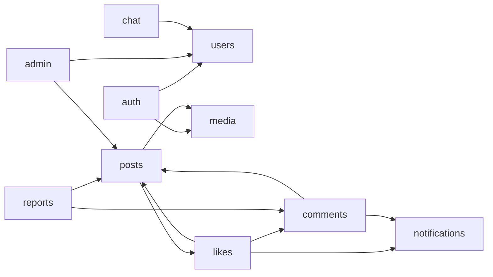
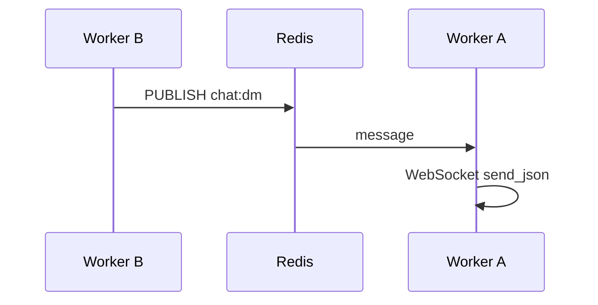

# 아키텍처 (Architecture)

PuppyTalk 백엔드의 **실제 코드**를 기준으로 설계 축과 구현 위치를 연결한 **허브 문서**입니다. 상세는 아래 주제별 문서로 나뉩니다.

**핵심 축**

- 비동기 I/O (FastAPI · SQLAlchemy Async · Redis)
- 실시간 DM (WebSocket + Redis Pub/Sub) · 알림 (SSE + Redis)
- API 식별자 (DB UUID v7, JSON Base62)
- 공통 응답 (`ApiResponse` + `requestId`)

실행·env·API 표: [README](../README.md). 배포·WAF: [infrastructure-reliability-design.md](infrastructure-reliability-design.md).

---

## 주제별 문서 (상세는 여기서)

| 문서 | 내용 |
|------|------|
| [request-and-api-contract.md](request-and-api-contract.md) | 미들웨어·DI·health · **ApiResponse**·전역 에러(`exception_handlers.py`) · 멱등 · OpenAPI camelCase · 페이징 |
| [security.md](security.md) | XSS·SQLi·CSRF · **인증·JWT·Refresh** · IDOR · 업로드 · Rate limit · CORS · 설정 검증 등 12항 |
| [realtime-notifications.md](realtime-notifications.md) | 알림 DB→Redis 순서 · **SSE** · SNS · **Celery** dispatch · `notif:user:*` |
| [domain-flows.md](domain-flows.md) | 미디어 업로드 · 피드·검색 · 트렌드 · 신고·블라인드 · 관리자 |
| [api-codes.md](api-codes.md) | `ApiCode` ↔ HTTP 상태 |

**이 문서 본문**: §1–2(개요·레이어), §3(데이터 계층), §4–8(동시성·백그라운드·Redis·도메인·DM).

---

## 목차

1. [설계 개요](#1-설계-개요)
2. [폴더·모듈 경계](#2-폴더모듈-경계)
3. [데이터 계층](#3-데이터-계층)
4. [동시성·락](#4-동시성락)
5. [백그라운드 작업](#5-백그라운드-작업)
6. [Redis 용도 요약](#6-redis-용도-요약)
7. [도메인 협업](#7-도메인-협업)
8. [DM 채팅](#8-dm-채팅)

---

## 1. 설계 개요

### 1.1 FastAPI + 비동기

- DB·Redis·S3 대기가 대부분 → `async`/`await`, `AsyncSession`.
- bcrypt 등 CPU 작업 → `asyncio.to_thread`.
- HTTP·WebSocket·Redis JSON → Pydantic v2.

### 1.2 HTTP 무상태, Redis에만 상태

- Access JWT — 서버 세션 없이 검증.
- 로그아웃·refresh·rate limit·캐시·Pub/Sub만 Redis.
- 워커 수평 확장 시 동일 규칙 유지.

---

## 2. 폴더·모듈 경계

### 2.1 레이어

| 계층 | 하는 일 | 위치 |
|------|---------|------|
| **Router** | URL, DI, `api_response` | `app/domain/*/router.py`, `app/api/v1/` |
| **Service** | 유스케이스, `db.begin()` | `app/domain/*/service.py` |
| **Model / Repository** | 쿼리 (커밋 없음) | `model.py`, `posts/repository.py` |
| **Schema** | DTO | `schema.py` |
| **공통** | `ApiCode`, 예외 | `app/common/` |
| **인프라** | Redis, S3, 설정 | `app/infra/`, `app/core/` |

### 2.2 Import 규칙

도메인은 **`app.domain.<영역>`** 만 사용. `app.posts` 같은 별칭 없음.

```python
from app.domain.posts.repository import PostsModel
from app.domain.auth.service import AuthService
```

### 2.3 `/v1` 라우터 순서

`app/api/v1/__init__.py`:

`chat_ws` → `auth` → `users` → `notifications` → `dogs` → `media` → `posts` → `comments` → `likes` → `reports` → `admin` → `chat_rest`

- WS: `/v1/ws/chat`
- `posts` 내부: `trending`, `trending-hashtags`가 `/{post_id}` **앞**.

요청 파이프라인·ApiResponse 형식은 [request-and-api-contract.md](request-and-api-contract.md).

---

## 3. 데이터 계층

PostgreSQL 접근 규칙, 읽기/쓰기 분리, 트랜잭션, 식별자, 인덱스·검색·성능 패턴.

### 3.1 연결·세션

**파일**: `app/db/engine.py`, `app/core/config.py`, `app/api/dependencies/db.py`

| 설정 | 설명 |
|------|------|
| 드라이버 | `postgresql+psycopg` (async) |
| `WRITER_DB_URL` / `READER_DB_URL` | 비어 있으면 `DB_HOST` 등으로 단일 URL 구성 |
| `autobegin=False` | 세션 열어도 자동 트랜잭션 없음 — **서비스가 `db.begin()` 호출** |
| 풀 | `DB_POOL_SIZE`, `DB_MAX_OVERFLOW`, `DB_POOL_RECYCLE` |

| 세션 | 팩토리 | DI |
|------|--------|-----|
| Writer | `AsyncSessionLocal` | `get_master_db` |
| Reader | `AsyncSessionLocalReader` | `get_slave_db` |

**비요청 스코프**: `get_connection()` (`app/db/session.py`) — lifespan cleanup, Celery async job, exception handler 등.

**모델 등록**: `app/db/model_registry.py` — Alembic·앱 기동 시 모든 ORM import.

#### Writer / Reader 사용 기준

| 작업 | 세션 | 이유 |
|------|------|------|
| 회원가입·로그인·글 CUD·좋아요·신고 | `get_master_db` | 쓰기 |
| 피드·상세·댓글 목록·알림 목록·트렌드 | `get_slave_db` | 읽기 전용 |
| 권한 검증(`require_post_author`) | `get_slave_db` | 작성자 ID 조회만 |
| 조회수 기록·view flush | `get_master_db` | 카운트 증가 |

리플리카 lag가 있으면 “방금 쓴 글이 목록에 안 보임”이 잠깐 생길 수 있다. 단일 URL 환경에서는 Writer/Reader가 같은 DB를 가리킬 수 있으나 **DI 구분은 유지**한다.

### 3.2 트랜잭션 (Unit of Work)

1. **Model / Repository** — `add`, `execute`, `flush`만. **commit 없음**.
2. **Service** — 유스케이스당 `async with db.begin():` 하나(또는 읽기 전용 begin).
3. **CUD** — 한 begin 블록 안에서 완결 (프로젝트 규칙).

| 패턴 | 예 |
|------|-----|
| bcrypt | 회원가입·비밀번호 변경 — hash는 **begin 밖** `asyncio.to_thread` |
| 알림 실시간 | DB `insert` 커밋 **후** `publish_after_commit` (Redis) |
| BackgroundTasks | **새 세션** `AsyncSessionLocal()` — 요청 세션 재사용 금지 |
| Celery job | `get_connection()` + `db.begin()` |

**DB 동시성**

- `SELECT FOR UPDATE` — **미사용**.
- UNIQUE + `IntegrityError` → `EMAIL_ALREADY_EXISTS` 등.
- 좋아요 — `ON CONFLICT DO NOTHING` + RETURNING.
- DM — `chat_rooms` 유저 쌍 UNIQUE (`006_chat_dm_tables`).
- 낙관적 충돌 — `StaleDataError` → `ConcurrentUpdateException` (409).

### 3.3 식별자 (UUID v7 · Base62)

**DB**

- 엔티티 PK: PostgreSQL `uuid`.
- 신규 행: `new_uuid7()` (`app/core/ids.py`) — 시간 국소성.
- **예외 (lookup)**: `Category`, `Hashtag` — integer autoincrement.

**API JSON** (`app/common/schemas.py`)

```python
PublicId = Annotated[
    UUID,
    BeforeValidator(parse_public_id_value),
    PlainSerializer(lambda u: uuid_to_base62(u), ...),
]
```

| 방향 | 동작 |
|------|------|
| 입력 | Base62 / UUID 문자열 / 레거시 ULID → `UUID` |
| 출력 | Base62 문자열 |

**JWT·로그**: JWT `sub` — `jwt_sub_to_uuid`. `jti`, `request_id` — ULID 문자열.

### 3.4 N+1 방지

**파일**: `app/domain/posts/repository.py` 등

| 조회 | 로딩 |
|------|------|
| 게시글 상세 | `joinedload` user·category, `selectinload` hashtags·images |
| 게시글 목록 | 관계 최소화 + 필요 시 selectinload |
| 댓글 트리 | `get_comments_by_post_id` — 한 번에 로드 후 앱에서 트리 구성 |

#### `post_is_visible` (경량 EXISTS)

존재·차단·블라인드만 확인. **likes**, **comments** 전 검증에 사용.

```text
get_post_by_id  → 상세·수정 화면용 (관계 eager load)
post_is_visible → 좋아요·댓글 전용 (EXISTS only)
```

### 3.5 게시글 검색

**API**: `GET /v1/posts?q=&category_id=&cursor=&size=`

**검증** (`validate_search_query`, `app/domain/posts/repository.py`)

| 규칙 | 내용 |
|------|------|
| 빈 문자열 | 검색 없음 (`None`) |
| `#태그` | 해시태그 **정확** 매칭, 최소 길이 예외(태그명 1자+) |
| 일반 토큰 | 공백으로 AND |
| 한글·숫자 | 토큰당 **2자 이상** |
| 영문 등 | 토큰당 **3자 이상** |

실패 시 `InvalidRequestException` → ApiResponse 400.

**쿼리**: 토큰마다 `_token_match_clause` — `title ILIKE`, `content ILIKE`, 해시태그 부분 일치. `007_pg_trgm_hashtag_gin_search` — GIN(trgm) 인덱스.

**피드·차단**: 목록·카운트 쿼리에 `UserBlock`, `deleted_at`, `is_blinded` 반영.

### 3.6 조회수 (Write-behind)

**API**: `POST /v1/posts/{post_id}/view` — 로그인 시 `u:{userId}`, 비로그인 시 `ip:{client_id}`.

**Redis**

- 중복 방지: `SET NX EX` (클라이언트·게시글 조합 키).
- 증가분 버퍼: Hash 또는 key 패턴 (`PostService.record_post_view`).

**Flush**: `lifespan` — `PostService.flush_view_counts_to_db` 주기 실행. 분산 락 `VIEW_FLUSH_LOCK_SECONDS` — 멀티 인스턴스 중복 flush 방지. [§5](#5-백그라운드-작업)

### 3.7 인덱스·마이그레이션 (요약)

| 리비전 | 내용 |
|--------|------|
| `001` | baseline |
| `002` | categories seed |
| `006` | chat DM tables |
| `007` | pg_trgm, hashtag GIN, 검색 |
| `caabca5fb0ad` | `idx_posts_feed_latest` 등 피드 인덱스 |

상세 DDL: `migrations/versions/`, 참고용 `docs/puppytalkdb.sql`.

---

## 4. 동시성·락

DB 트랜잭션·충돌 처리는 [§3](#3-데이터-계층). 여기서는 **프로세스·WebSocket** 쪽만 다룬다.

### 4.1 채팅 `ConnectionManager`

`app/domain/chat/manager.py` — 프로세스 내 `user_id → WebSocket set`, `asyncio.Lock`. 프로세스 간은 Redis ([#8](#8-dm-채팅)).

### 4.2 낙관적 충돌

`ConcurrentUpdateException` → **409**.

---

## 5. 백그라운드 작업

### 5.1 `BackgroundTasks`

예: `POST /v1/admin/media/sweep` — 202 후 **새 DB 세션**으로 스윕.

### 5.2 `lifespan` (`app/main.py`)

| 태스크 | 역할 |
|--------|------|
| 설정 검증 | `validate_settings_for_environment()` |
| signup/media cleanup | 임시·고아 이미지 |
| 조회수 flush | Redis → DB |
| chat subscribe | DM Pub/Sub 리스너 |

### 5.3 Celery (선택)

`CELERY_ENABLED=true` — 알림 `dispatch` 등. 꺼져 있어도 DB·SSE(요청 경로 publish) 동작. → [realtime-notifications.md](realtime-notifications.md)

---

## 6. Redis 용도 요약

| 용도 | 키/채널 | 상세 |
|------|---------|------|
| Refresh / RTR | `rt:*` | [security.md](security.md) |
| Access 블랙리스트 | `blacklist:jti:{jti}` | |
| Rate limit | `rl:*` | [security.md](security.md) |
| 알림 SSE | `notif:user:{uuid}` | [realtime-notifications.md](realtime-notifications.md) |
| DM | `puppytalk:channel:chat:dm` | [§8](#8-dm-채팅) |
| 트렌딩 해시태그 | `cache:trending_hashtags` | [domain-flows.md](domain-flows.md) |
| 멱등·업로드 토큰 | `idemp:*`, `upload_token:*` | [request-and-api-contract.md](request-and-api-contract.md) |
| 조회수·잡 락 | view buffer, `lock:media-sweep` | [§3](#3-데이터-계층) |

---

## 7. 도메인 협업



- **알림** · **미디어·피드·신고** — [realtime-notifications.md](realtime-notifications.md), [domain-flows.md](domain-flows.md)

---

## 8. DM 채팅

### 문제

WebSocket은 **프로세스 메모리**에만 있어, 송신 HTTP 워커 ≠ 수신 소켓 워커면 로컬만으로 전달 불가.

### 해결

1. 메시지 DB 저장 후 `publish_chat_dm` → `puppytalk:channel:chat:dm`
2. 모든 워커 `run_chat_subscribe_listener` 구독
3. 수신 워커 `ConnectionManager` → `send_json`

**파일**: `app/domain/chat/pubsub.py`, `manager.py`, `app/api/v1/chat/ws.py`, `ws_auth.py`



