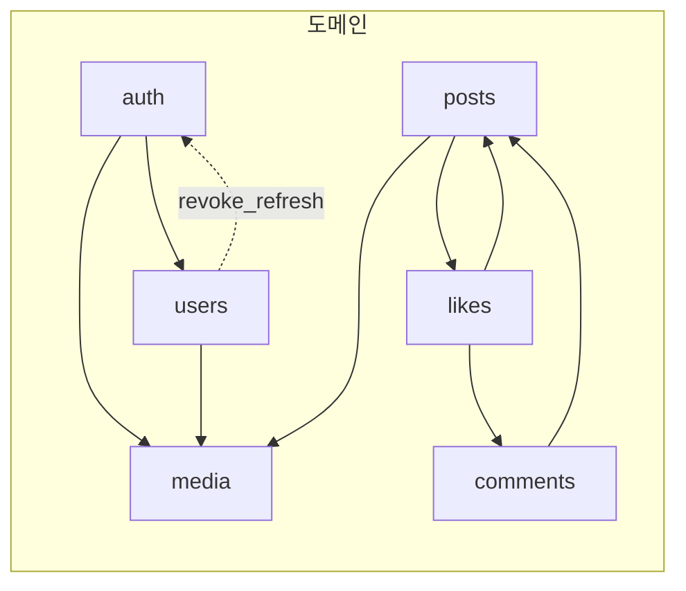
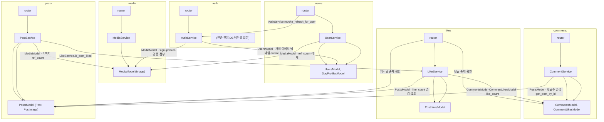
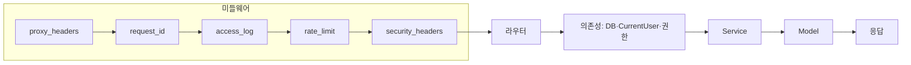

# 아키텍처 (Architecture)

이 문서는 **새로 합류한 개발자**가 PuppyTalk 백엔드의 **내부 동작 원리**를 깊이 이해할 수 있도록, 설계 의도(Why)와 실제 코드 흐름(How)을 단계별로 정리한 딥다이브 가이드입니다.  
기능 나열이 아니라 **요청이 어떻게 검증·제한·라우팅되는지**, **DB·인증·정합성·성능이 어떤 이유로 설계되었는지**를 중심으로 서술합니다.

### FastAPI + REST API를 선택한 이유

#### FastAPI: AI/ML 파이프라인 통합 및 고성능 비동기 아키텍처

- **Unified ML Ecosystem**: 백엔드와 AI/ML 모델링 언어를 Python으로 통일하여, 별도의 인터페이스 계층 없이 **TensorFlow, PyTorch 등의 모델을 즉시 서빙(Inference)**할 수 있는 최적의 환경을 구축함.
- **Asynchronous Concurrency**: uvloop 기반의 비동기 I/O 처리를 통해 대규모 동시 접속 상황에서도 낮은 지연 시간(Latency)과 높은 처리량(Throughput)을 보장함.
- **Data Integrity via Pydantic V2**: Pydantic을 활용한 엄격한 타입 힌트와 자동 검증으로 데이터 엔지니어링 단계에서의 무결성을 확보하며, 이는 추천 알고리즘 및 데이터 분석 시 신뢰성 있는 입출력을 보장함. [cite: 2026-03-04]

#### REST API: 리소스 지향 설계 및 유연한 확장성

- **Resource-Centric Design**: 유저, 게시글, 댓글 등 서비스 도메인을 독립적인 리소스로 관리하여 API 가독성과 유지보수 편의성을 극대화함.
- **Stateless Architecture**: 서버의 상태를 공유하지 않는 설계를 통해 트래픽 급증 시 컨테이너 기반의 **수평 확장(Scale-out)**에 최적화된 구조를 유지함.

추후 **추천·AI 챗봇** 등 복합 쿼리나 스트리밍이 필요해지면 해당 기능만 GraphQL·SSE 등으로 부분 도입하는 전략을 취할 수 있음.

---

## 목차

1. [폴더 구조 및 의존성](#1-폴더-구조-및-의존성)
2. [요청 흐름 (Request Lifecycle)](#2-요청-흐름-request-lifecycle)
3. [데이터베이스 아키텍처](#3-데이터베이스-아키텍처)
4. [인증·보안](#4-인증보안)
5. [데이터 정합성](#5-데이터-정합성)
6. [성능 최적화](#6-성능-최적화)
7. [이미지: signupToken·ref_count](#7-이미지-signuptokenref_count)

---

## 1. 폴더 구조 및 의존성

### 1.1 의존성 단일화 (app/api/dependencies)

요청 스코프에서 쓰는 **인증(CurrentUser, get_current_user)·DB 세션(get_master_db, get_slave_db)·권한(require_post_author, require_comment_author)·쿼리 파싱·클라이언트 식별자(get_client_identifier)**는 **`app/api/dependencies`** 한 곳에서 제공한다. 라우터·핸들러는 여기서만 import하여, "어디서 DB·유저가 주입되는지"를 한눈에 파악할 수 있다.  
비요청 스코프(cleanup, exception_handlers)용 세션은 **`app/db/session.py`의 `get_connection()`** (비동기 컨텍스트 매니저)만 사용한다.

### 1.2 폴더 구조 요약

| 파일 | 역할 |
|------|------|
| **router** | HTTP 엔드포인트 정의. `Depends(...)`로 DB·유저·클라이언트 식별자 주입. **Service** 호출 후 반환값을 ApiResponse로 포장·예외(ValueError)를 HTTP 에러로 변환. |
| **service** | 비즈니스 로직·도메인 간 조율(Orchestration). 순수 데이터 반환 또는 ValueError. Redis·토큰·카운트 동기화·이미지 ref_count 등 처리. ApiResponse·ApiCode·raise_http_error 미사용. |
| **model** | DB 접근(CRUD·쿼리). AsyncSession만 사용. **commit/rollback은 하지 않으며**, 트랜잭션 경계는 서비스의 `async with db.begin():` 블록에서만 둠. |
| **schema** | 요청/응답 DTO. Pydantic v2 검증·alias. |

도메인 레이어는 **router → service → model → schema** 4계층 패턴을 따른다. 복합 연산·도메인 간 협업은 Service에서 수행한다.

### 1.3 도메인 의존성 (Domain Dependency)

요청 흐름(섹션 2.2)과 별도로, **도메인 간 참조 관계**만 아래 다이어그램으로 정리한다. 화살표 A → B는 "A 도메인의 Router/Service가 B 도메인의 Model·Service를 참조한다"는 의미다. 단방향으로 유지하며, 순환 참조 방지를 위해 필요한 경우 함수 내부 임포트를 사용한다.

**요약 (도메인 → 참조 대상)**



**상세 (계층별·참조 대상 명시)**



- **auth**: 회원가입·로그인 시 `UsersModel`, `MediaModel`(signupToken 검증·첨부) 사용. Redis는 서비스 내부에서만 사용.
- **users**: 라우터가 비밀번호 변경·탈퇴 시 `AuthService.revoke_refresh_for_user` 호출. `UserService`는 프로필/강아지·이미지 ref_count에 `MediaModel` 사용.
- **posts**: `PostService`는 이미지 ref_count·상세 조회 시 `is_liked`를 위해 `MediaModel`, `LikeService` 참조.
- **comments**: `CommentService`는 댓글 수 동기화를 위해 `PostsModel`만 참조(함수 내부 임포트).
- **likes**: 라우터가 게시글/댓글 존재 여부 확인에 `PostsModel`, `CommentsModel` 사용. `LikeService`는 `PostLikesModel`, `CommentsModel`(get_like_count), `CommentLikesModel`(create/delete·like_count 갱신), `PostsModel`(like_count 갱신) 사용.
- **media**: 다른 도메인을 참조하지 않음.

---

## 2. 요청 흐름 (Request Lifecycle)

모든 HTTP 요청은 **미들웨어 파이프라인**을 거친 뒤 라우터·컨트롤러·모델로 전달됩니다. Starlette는 **나중에 등록한 미들웨어가 요청 시 먼저** 실행되므로, 아래 순서는 “요청이 들어올 때” 통과하는 순서입니다.

**요청 흐름**

```
[클라이언트]  HTTP 요청 (JSON body, Cookie)
    │
    ▼
① Lifespan (앱 시작 1회, main.py)
   → init_database() 로 DB 연결 확인. 실패 시 log.critical 후 요청 시점에 재시도.
   → REDIS_URL 있으면 ConnectionPool·Redis 생성, app.state.redis 저장. 실패 시 Fail-open.
   → cleanup_once() 1회 실행 후, SESSION_CLEANUP_INTERVAL > 0 이면 run_loop_async(stop_event) asyncio 태스크 시작.
   → yield 이후(종료 시): stop_event.set() → cleanup 태스크 대기(최대 15초) → redis.aclose() → close_database().

② GET /health (main.py)
   → check_database() 호출. 성공 200 + { code, data: { status: "ok", database: "connected" } }, 실패 503 + { code: DB_ERROR, data: { status: "degraded", database: "disconnected" } }.

③ 미들웨어 (요청마다, main.py app.middleware("http")(...) 등록 역순)
   proxy_headers → request_id → access_log → rate_limit → security_headers (2.1 미들웨어 순서 참고).

④ 라우터 매칭 (main.py: app.include_router(v1_router), app/api/v1.py)
   v1_router = APIRouter(prefix="/v1"). include 순서: auth → users → media → posts → comments.
   예: /v1/auth/login, /v1/users/me, /v1/posts, /v1/posts/{id}/comments.

⑤ 의존성 (Depends, app/api/dependencies)
   → get_master_db / get_slave_db: 요청마다 AsyncSession 주입. 트랜잭션은 서비스에서 `async with db.begin():`으로만 시작·커밋(autobegin=False). finally에서 세션 close.
   → get_current_user: Authorization Bearer 검증 → CurrentUser. 만료 시 401 + TOKEN_EXPIRED.
   → require_post_author / require_comment_author: 게시글·댓글 수정/삭제 시 작성자 본인 여부.

⑥ Pydantic (Schema)
   요청 body·쿼리 검증. 실패 시 400 + code (exception_handlers에서 RequestValidationError 처리).

⑦ Route 핸들러 → Service → Model
   라우터가 Service를 호출하고 반환값을 ApiResponse로 포장. 비즈니스 로직·도메인 간 조율은 Service에서 수행. Model은 AsyncSession만 사용하며, 트랜잭션은 Service의 `async with db.begin():` 블록에서만 시작·커밋됨.

⑧ 예외 핸들러 (app/core/exception_handlers.py, register_exception_handlers(app))
   RequestValidationError → 400 + code. HTTPException → status_code + { code, data }. IntegrityError/OperationalError 등 DB 예외 → 500/503 + code. 응답 형식 { code, data [, message] } 통일.
    │
    ▼
HTTP 응답  { "code": "...", "data": { ... } }
```

### 2.1 미들웨어 순서

| 순서 | 단계 | 의도(Why) |
|------|------|-----------|
| 1 | **Proxy Headers** | Nginx/ALB 뒤에서 실제 클라이언트 IP를 쓰기 위해 `X-Forwarded-For`를 사용할 수 있으나, **직접 파싱하면 IP 스푸핑**에 취약하다. 이 미들웨어는 **신뢰할 수 있는 프록시 IP**(`TRUSTED_PROXY_IPS`)에서 온 요청일 때만 첫 번째 값을 `request.scope["client"]`에 반영한다. Rate Limit·접근 로그는 **이후 항상 `request.client.host`만** 사용해, 한 번 검증된 IP만 신뢰한다. |
| 2 | **Request ID** | `X-Request-ID` 생성 후 `request.state`·contextvars에 설정. 이후 모든 로그에 `[%(request_id)s]`가 자동 포함되어 **요청 단위 추적**이 가능해진다. |
| 3 | **Access Log** | 요청 전 구간 시간 측정 → `call_next` 실행. 4xx는 WARNING, 5xx·미처리 예외는 ERROR·traceback 기록. DEBUG 시 응답에 `X-Process-Time` 헤더 추가. |
| 4 | **Rate Limit** | Redis 기반 **Fixed Window**. 경로별로 전역(`rl:global:{ip}`), 로그인(`rl:login:{ip}`), 회원가입 업로드(`rl:signup_upload:{ip}`) 키를 두고, **Lua 스크립트**(INCR + EXPIRE + TTL)로 원자적으로 카운트·TTL을 처리한다. Redis 미설정·예외 시 **Fail-open**(요청 허용)으로 가용성을 우선한다. OPTIONS·`/health`는 제외. |
| 5 | **Security Headers** | X-Frame-Options, X-Content-Type-Options, Referrer-Policy, Permissions-Policy, CSP(설정 시) 등으로 클릭재킹·MIME 스니핑 등을 완화한다. |

이후 **라우터 매칭** → **의존성 주입**(get_master_db / get_slave_db, get_current_user, get_client_identifier, 권한 체크) → **Route 핸들러** → **Service** → **Model** 순으로 진행합니다.

### 2.2 요청 흐름 다이어그램



- **IP 일관성**: Rate Limit·Access Log 모두 **proxy_headers에서 검증된 `request.client.host`**만 사용하므로, 헤더를 직접 파싱하는 코드는 두지 않는다(스푸핑 방어).

---

## 3. 데이터베이스 아키텍처

### 3.1 Master / Slave 분리 원리

| 구분 | 의존성 | URL | 용도 |
|------|--------|-----|------|
| **쓰기(CUD)** | `get_master_db()` | `WRITER_DB_URL` (미설정 시 `DB_*` 단일 URL) | 회원가입·로그인 제외한 모든 생성·수정·삭제 |
| **읽기(Read)** | `get_slave_db()` | `READER_DB_URL` (미설정 시 Writer와 동일) | 목록·상세·가용성 조회 등 읽기 전용 |

- **의도**: 조회 부하를 Reader 풀으로 분산하고, Writer 풀은 쓰기 전용으로 유지한다. 단일 URL 구성 시에도 **의존성만 나누어** 추후 Read Replica 도입 시 URL만 바꾸면 된다.

### 3.2 READ ONLY 세션 적용 메커니즘

Reader 엔진은 Writer와 **별도 풀**로 분리되어 있으며, 동일 URL(또는 `READER_DB_URL`)로 읽기 전용 복제본에 연결할 수 있다. PostgreSQL에서는 필요 시 트랜잭션 시작 시 `SET TRANSACTION READ ONLY`를 적용해 쓰기 방지할 수 있다. 애플리케이션에서는 `get_slave_db()`로 Reader 세션만 사용하므로, 쓰기 로직이 Reader에 주입되지 않도록 의존성 구분을 유지한다.

### 3.3 풀 및 세션 (Full-Async)

- 엔진은 **psycopg3** (`postgresql+psycopg://`) + **create_async_engine**으로 생성하며, `async_sessionmaker`로 AsyncSession 팩토리(autobegin=False, expire_on_commit=False)를 둔다.
- 풀 설정(`DB_POOL_SIZE`, `DB_MAX_OVERFLOW`, `DB_POOL_RECYCLE`, `pool_pre_ping`)은 `app/core/config`에서 환경 변수로 조정한다.
- 요청 스코프의 세션은 `app/api/dependencies/db.py`의 **get_master_db**·**get_slave_db**에서 AsyncSession을 yield한 뒤, finally에서 close한다. **트랜잭션은 서비스 레이어에서만** `async with db.begin():`으로 시작·커밋한다(모델에서 commit/rollback 호출 금지).
- **비요청 스코프**(cleanup, exception_handlers 등)에서는 `app/db/session.py`의 **get_connection()** 비동기 컨텍스트 매니저만 사용하며, 호출부에서 `async with db.begin():`으로 트랜잭션을 관리한다.

---

## 4. 인증·보안

### 4.1 JWT + Redis를 조합한 토큰 무효화(Revocation) 전략

- **Access Token**: Stateless. `Authorization: Bearer <token>`으로 전달. 서버에 저장하지 않아 **수평 확장·멀티 인스턴스**에 유리하다. 만료 시 401 + `TOKEN_EXPIRED`로 프론트에서 Refresh 호출을 유도한다.
- **Refresh Token**: HttpOnly 쿠키 + **Redis** `rt:{user_id}` 저장. XSS로부터 토큰 값을 읽기 어렵게 하고, **로그아웃·탈퇴·비밀번호 변경 시** Redis에서 해당 키를 삭제해 **즉시 무효화**할 수 있다.
- 로그인 시 Access는 JSON body, Refresh는 쿠키(HttpOnly, Secure, SameSite=Lax)로 내려준다. Refresh 요청 시 쿠키의 토큰과 Redis 값을 비교한 뒤, 통과 시 새 Access Token만 JSON으로 반환한다.

### 4.2 Magic Byte 기반 이미지 업로드 검증

업로드 파일의 **Content-Type 헤더만 믿으면** 악의적으로 조작된 파일이 이미지로 저장될 수 있다. `app/domain/media/image_policy.py`에서는 **파일 시그니처(매직 바이트)**로 실제 포맷을 판별한다.

- JPEG: `\xff\xd8\xff`
- PNG: `\x89PNG\r\n\x1a\n`
- WebP: `RIFF....WEBP`

헤더가 허용 타입이어도 **바이트 스트림 앞부분**이 위 시그니처와 일치하지 않으면 `INVALID_IMAGE_FILE`로 거부한다. 용량은 청크 단위로 읽으며 `MAX_FILE_SIZE`를 초과하면 중단한다.

### 4.3 Pydantic을 활용한 XSS 방어

요청·응답 DTO는 **Pydantic v2** 스키마로 검증·직렬화된다. 문자열 필드는 이스케이프 등으로 안전하게 다루며, 응답은 항상 스키마를 거쳐 내려가므로 **임의 HTML/스크립트 주입**을 줄이는 데 기여한다. (추가로 CSP 등 보안 헤더는 security_headers 미들웨어에서 설정한다.)

---

## 5. 데이터 정합성

- **게시글(Post)**: `deleted_at`으로 **Soft Delete**. 목록·상세 조회 시 `deleted_at IS NULL`만 노출하며, 삭제 시 댓글(Comment)·좋아요(Like)·post_images·이미지 ref_count를 함께 정리한다.
- **좋아요(Like)**: 게시글·댓글 좋아요는 **PostLikesModel**·**CommentLikesModel**의 `create`(ON CONFLICT DO NOTHING + RETURNING으로 삽입 여부 판단), like_count 증감은 **UPDATE ... RETURNING**으로 처리하며, 하나의 요청당 **단일 `async with db.begin():`** 블록으로 묶어 트랜잭션을 관리한다. 게시글 삭제 시 좋아요 행은 Hard Delete로 제거한다.
- **댓글(Comment)**: 루트·대댓글 모두 **Soft Delete**. GET 댓글 목록 시 **대댓글은 삭제된 항목을 쿼리에서 제외**(`deleted_at IS NULL` OR `parent_id IS NULL`)하고, **루트는 삭제된 것도 포함**해 프론트에서 "삭제된 댓글입니다" 표시. 자식이 없는 삭제된 루트는 트리 빌드 시 목록에서 제외한다.

### 5.2 트랜잭션을 활용한 회원가입–이미지 참조 무결성(ref_count) 보장

회원가입 시 **유저 생성**과 **프로필 이미지 소유권 이전**은 서비스 레이어에서 처리한다. `app/domain/auth/service.py`의 **AuthService.signup**에서는:

1. `UsersModel.create_user(...)` 로 유저 생성.
2. `profile_image_id`가 있으면 `MediaModel.attach_signup_image(profile_image_id, created.id, db=db)` 호출 — 이미지의 `uploader_id` 설정, `ref_count` 1 증가, `signup_token_hash`·`signup_expires_at` NULL 처리.

이미지가 없을 때는 `attach_signup_image`를 호출하지 않아 정상 가입된다. 트랜잭션 커밋은 서비스 내 `async with db.begin():` 블록 종료 시 자동으로 수행된다.

### 5.3 기타 복수 모델 조작 및 서비스 조율

게시글 삭제·댓글 생성/삭제 시 게시글 comment_count 갱신·좋아요·이미지 ref_count 변경 등 **여러 테이블·도메인을 건드리는 로직**은 **Service** 레이어에서 조율한다. (예: **CommentService**에서 댓글 생성 후 `PostsModel.increment_comment_count`, 삭제 후 `PostsModel.decrement_comment_count`. **UserService.update_user_profile**에서 강아지 동기화 및 `MediaModel` ref_count 증감. **PostService.delete_post**는 Model에서 댓글·좋아요·이미지 정리 후 soft delete.)

---

## 6. 성능 최적화

### 6.1 selectinload를 활용한 N+1 쿼리 방어

게시글 목록처럼 **1:N 컬렉션**(예: `post_images`)을 함께 불러올 때, **joinedload**만 쓰면 LIMIT이 “행 기준”으로 적용되어, 조인 결과 행이 폭증한 뒤 애플리케이션에서 unique로 줄이는 형태가 된다.  
**`selectinload(Post.post_images)`**를 사용하면:

- 메인 쿼리: Post에 **LIMIT/OFFSET**이 정확히 적용되고, N:1인 `Post.user`는 **joinedload**로 유지해도 행 수를 부풀리지 않는다.
- 보조 쿼리 1회: `post_id IN (...)`으로 해당 포스트들의 `post_images`(및 필요 시 `PostImage.image`)만 추가 로드한다.

따라서 **N+1**을 막으면서도 **페이지네이션**이 DB 레벨에서 올바르게 동작한다. (구현: `app/domain/posts/model.py`의 `get_all_posts`.)

### 6.2 Boto3 S3 클라이언트 싱글톤 패턴

`app/infra/storage.py`에서는 S3 사용 시 **매 요청마다 `boto3.client("s3", ...)`를 생성하지 않는다**.  
**Lazy-loading 싱글톤** `_get_s3_client()`를 두고, 첫 호출 시에만 인증 검사 후 클라이언트를 생성해 모듈 전역에 캐시한다. 이후 `_s3_save`·`_s3_delete`는 모두 이 클라이언트를 재사용해 **연결·인증 오버헤드**를 줄인다.  
`STORAGE_BACKEND=local`인 환경에서는 S3 경로를 타지 않으므로, boto3는 **`_get_s3_client()`가 호출될 때만** import되어 불필요한 의존성이 생기지 않는다.

---

## 7. 이미지: signupToken·ref_count

이미지는 **미리 업로드한 뒤** 본문·가입과 연결하는 방식이다. 가입 전 이미지는 **signupToken**으로 소유를 증명하고, **ref_count**로 참조 수를 관리해 0이 되면 파일·DB 레코드를 정리한다.

- **signupToken**: 업로드 시 토큰 발급, DB에는 해시만 저장. 회원가입 요청 시 `profileImageId`·`signupToken`을 보내 서버가 검증한 뒤 `attach_signup_image`로 `uploader_id`·ref_count 갱신 및 토큰 필드 NULL 처리.
- **ref_count**: 게시글 첨부·프로필·가입 시 +1, 제거·삭제 시 -1. **0 이하가 되면** `storage_delete` 후 Image 레코드 삭제. 사용 중인 이미지(`ref_count > 0`)는 `delete_image_by_owner`에서 삭제를 거부(409 CONFLICT)하여 **엑스박스·정합성 깨짐**을 방지한다.

저장소는 `STORAGE_BACKEND=local`이면 프로젝트 `upload/`, `s3`이면 S3이며 `build_url`로 URL을 만든다.

---

이 문서는 현재 코드 동작과 일치하도록 유지한다. 폐기된 로직(예: 댓글 수를 매번 COUNT(*) 하던 방식, 요청마다 Boto3 클라이언트를 생성하던 방식)은 반영하지 않는다.
