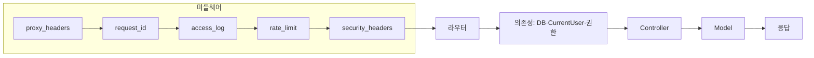

# 아키텍처 (Architecture)

이 문서는 **새로 합류한 개발자**가 PuppyTalk 백엔드의 **내부 동작 원리**를 깊이 이해할 수 있도록, 설계 의도(Why)와 실제 코드 흐름(How)을 단계별로 정리한 딥다이브 가이드입니다.  
기능 나열이 아니라 **요청이 어떻게 검증·제한·라우팅되는지**, **DB·인증·정합성·성능이 어떤 이유로 설계되었는지**를 중심으로 서술합니다.

---

## 1. 요청 흐름 (Request Lifecycle)

모든 HTTP 요청은 **미들웨어 파이프라인**을 거친 뒤 라우터·컨트롤러·모델로 전달됩니다. Starlette는 **나중에 등록한 미들웨어가 요청 시 먼저** 실행되므로, 아래 순서는 “요청이 들어올 때” 통과하는 순서입니다.

### 1.1 파이프라인 순서

| 순서 | 단계 | 의도(Why) |
|------|------|-----------|
| 1 | **Proxy Headers** | Nginx/ALB 뒤에서 실제 클라이언트 IP를 쓰기 위해 `X-Forwarded-For`를 사용할 수 있으나, **직접 파싱하면 IP 스푸핑**에 취약하다. 이 미들웨어는 **신뢰할 수 있는 프록시 IP**(`TRUSTED_PROXY_IPS`)에서 온 요청일 때만 첫 번째 값을 `request.scope["client"]`에 반영한다. Rate Limit·접근 로그는 **이후 항상 `request.client.host`만** 사용해, 한 번 검증된 IP만 신뢰한다. |
| 2 | **Request ID** | `X-Request-ID` 생성 후 `request.state`·contextvars에 설정. 이후 모든 로그에 `[%(request_id)s]`가 자동 포함되어 **요청 단위 추적**이 가능해진다. |
| 3 | **Access Log** | 요청 전 구간 시간 측정 → `call_next` 실행. 4xx는 WARNING, 5xx·미처리 예외는 ERROR·traceback 기록. DEBUG 시 응답에 `X-Process-Time` 헤더 추가. |
| 4 | **Rate Limit** | Redis 기반 **Fixed Window**. 경로별로 전역(`rl:global:{ip}`), 로그인(`rl:login:{ip}`), 회원가입 업로드(`rl:signup_upload:{ip}`) 키를 두고, **Lua 스크립트**(INCR + EXPIRE + TTL)로 원자적으로 카운트·TTL을 처리한다. Redis 미설정·예외 시 **Fail-open**(요청 허용)으로 가용성을 우선한다. OPTIONS·`/health`는 제외. |
| 5 | **Security Headers** | X-Frame-Options, X-Content-Type-Options, Referrer-Policy, Permissions-Policy, CSP(설정 시) 등으로 클릭재킹·MIME 스니핑 등을 완화한다. |

이후 **라우터 매칭** → **의존성 주입**(get_master_db / get_slave_db, get_current_user, 권한 체크) → **Route 핸들러** → **Controller** → **Model** 순으로 진행합니다.

### 1.2 요청 흐름 다이어그램



- **IP 일관성**: Rate Limit·Access Log 모두 **proxy_headers에서 검증된 `request.client.host`**만 사용하므로, 헤더를 직접 파싱하는 코드는 두지 않는다(스푸핑 방어).

---

## 2. 데이터베이스 아키텍처

### 2.1 Master / Slave 분리 원리

| 구분 | 의존성 | URL | 용도 |
|------|--------|-----|------|
| **쓰기(CUD)** | `get_master_db()` | `WRITER_DB_URL` (미설정 시 `DB_*` 단일 URL) | 회원가입·로그인 제외한 모든 생성·수정·삭제 |
| **읽기(Read)** | `get_slave_db()` | `READER_DB_URL` (미설정 시 Writer와 동일) | 목록·상세·가용성 조회 등 읽기 전용 |

- **의도**: 조회 부하를 Reader 풀으로 분산하고, Writer 풀은 쓰기 전용으로 유지한다. 단일 URL 구성 시에도 **의존성만 나누어** 추후 Read Replica 도입 시 URL만 바꾸면 된다.

### 2.2 READ ONLY 세션 적용 메커니즘

Reader 엔진에서는 **연결 시점**에 MySQL 세션을 읽기 전용으로 고정한다. `app/db/engine.py`에서 `@event.listens_for(engine, "connect")`로 **connect 이벤트**를 구독하고, 커넥션이 풀에서 만들어질 때마다 다음을 실행한다.

- `SET SESSION time_zone = '+00:00'` — **UTC 타임존 강제**. 모든 `created_at`·`updated_at`·`deleted_at`을 서버·클라이언트와 일관되게 다룬다.
- `SET SESSION TRANSACTION READ ONLY` — **Slave 세션에서의 쓰기 시도**를 DB가 거부하므로, 실수로 Reader 세션으로 INSERT/UPDATE/DELETE를 날리는 것을 방지한다.

Writer 엔진에는 `time_zone`만 설정하고 `READ ONLY`는 적용하지 않는다.

### 2.3 풀 및 세션

- 풀 설정(`DB_POOL_SIZE`, `DB_MAX_OVERFLOW`, `DB_POOL_RECYCLE`, `pool_pre_ping`)은 `app/core/config`에서 환경 변수로 조정한다.
- 요청 스코프의 세션은 `app/api/dependencies/db.py`의 `get_master_db`·`get_slave_db`에서 yield 후 commit/rollback/close를 보장한다.
- **비요청 스코프**(cleanup, exception_handlers 등)에서는 `app/db/session.py`의 **`get_connection()`** 컨텍스트 매니저만 사용한다. (요청 스코프용 세션은 `app.api.dependencies`의 get_master_db/get_slave_db 사용.)

---

## 3. 인증·보안

### 3.1 JWT + Redis를 조합한 토큰 무효화(Revocation) 전략

- **Access Token**: Stateless. `Authorization: Bearer <token>`으로 전달. 서버에 저장하지 않아 **수평 확장·멀티 인스턴스**에 유리하다. 만료 시 401 + `TOKEN_EXPIRED`로 프론트에서 Refresh 호출을 유도한다.
- **Refresh Token**: HttpOnly 쿠키 + **Redis** `rt:{user_id}` 저장. XSS로부터 토큰 값을 읽기 어렵게 하고, **로그아웃·탈퇴·비밀번호 변경 시** Redis에서 해당 키를 삭제해 **즉시 무효화**할 수 있다.
- 로그인 시 Access는 JSON body, Refresh는 쿠키(HttpOnly, Secure, SameSite=Lax)로 내려준다. Refresh 요청 시 쿠키의 토큰과 Redis 값을 비교한 뒤, 통과 시 새 Access Token만 JSON으로 반환한다.

### 3.2 Magic Byte 기반 이미지 업로드 검증

업로드 파일의 **Content-Type 헤더만 믿으면** 악의적으로 조작된 파일이 이미지로 저장될 수 있다. `app/domain/media/image_policy.py`에서는 **파일 시그니처(매직 바이트)**로 실제 포맷을 판별한다.

- JPEG: `\xff\xd8\xff`
- PNG: `\x89PNG\r\n\x1a\n`
- WebP: `RIFF....WEBP`

헤더가 허용 타입이어도 **바이트 스트림 앞부분**이 위 시그니처와 일치하지 않으면 `INVALID_IMAGE_FILE`로 거부한다. 용량은 청크 단위로 읽으며 `MAX_FILE_SIZE`를 초과하면 중단한다.

### 3.3 Pydantic을 활용한 XSS 방어

요청·응답 DTO는 **Pydantic v2** 스키마로 검증·직렬화된다. 문자열 필드는 이스케이프 등으로 안전하게 다루며, 응답은 항상 스키마를 거쳐 내려가므로 **임의 HTML/스크립트 주입**을 줄이는 데 기여한다. (추가로 CSP 등 보안 헤더는 security_headers 미들웨어에서 설정한다.)

---

## 4. 데이터 정합성

### 4.1 게시글(Soft Delete)과 좋아요(Hard Delete)의 연관 관계

- **게시글(Post)**: `deleted_at`으로 **Soft Delete**. 목록·상세 조회 시 `deleted_at IS NULL`만 노출하며, 삭제 시 댓글(Comment)·좋아요(Like)·post_images·이미지 ref_count를 함께 정리한다.
- **좋아요(Like)**: 게시글 삭제 시 **Hard Delete**로 행을 제거한다. 게시글과 1:N이므로, 게시글 삭제 트랜잭션 안에서 Like 삭제·Comment soft delete·PostImage 삭제·Image ref_count 감소를 한 블록으로 처리한다.

### 4.2 트랜잭션을 활용한 회원가입–이미지 참조 무결성(ref_count) 보장

회원가입 시 **유저 생성**과 **프로필 이미지 소유권 이전**은 하나의 트랜잭션으로 묶는다. `app/domain/auth/controller.py`의 `signup_user`에서는:

1. `UsersModel.create_user(...)` 로 유저 생성.
2. `profile_image_id`가 있으면 `MediaModel.attach_signup_image(profile_image_id, created.id, db=db)` 호출 — 이미지의 `uploader_id` 설정, `ref_count` 1 증가, `signup_token_hash`·`signup_expires_at` NULL 처리.

이 전체를 **`with db.begin():`** 블록 안에 넣어, 이미지 연결 실패 시 유저 생성까지 **롤백**되도록 한다. 이미지가 없을 때(`has_image == False`)는 `attach_signup_image`를 호출하지 않아 트랜잭션만으로 정상 가입된다.

### 4.3 기타 복수 모델 조작

게시글 삭제·댓글/좋아요/이미지 ref_count 변경 등 **여러 테이블을 건드리는 로직**은 controller에서 **`with db.begin():`** 한 블록으로 묶어, 실패 시 전체 롤백되도록 한다. (예: `app/domain/posts/controller.py`의 `delete_post`.)

---

## 5. 성능 최적화

### 5.1 selectinload를 활용한 N+1 쿼리 방어

게시글 목록처럼 **1:N 컬렉션**(예: `post_images`)을 함께 불러올 때, **joinedload**만 쓰면 LIMIT이 “행 기준”으로 적용되어, 조인 결과 행이 폭증한 뒤 애플리케이션에서 unique로 줄이는 형태가 된다.  
**`selectinload(Post.post_images)`**를 사용하면:

- 메인 쿼리: Post에 **LIMIT/OFFSET**이 정확히 적용되고, N:1인 `Post.user`는 **joinedload**로 유지해도 행 수를 부풀리지 않는다.
- 보조 쿼리 1회: `post_id IN (...)`으로 해당 포스트들의 `post_images`(및 필요 시 `PostImage.image`)만 추가 로드한다.

따라서 **N+1**을 막으면서도 **페이지네이션**이 DB 레벨에서 올바르게 동작한다. (구현: `app/domain/posts/model.py`의 `get_all_posts`.)

### 5.2 Boto3 S3 클라이언트 싱글톤 패턴

`app/core/storage.py`에서는 S3 사용 시 **매 요청마다 `boto3.client("s3", ...)`를 생성하지 않는다**.  
**Lazy-loading 싱글톤** `_get_s3_client()`를 두고, 첫 호출 시에만 인증 검사 후 클라이언트를 생성해 모듈 전역에 캐시한다. 이후 `_s3_save`·`_s3_delete`는 모두 이 클라이언트를 재사용해 **연결·인증 오버헤드**를 줄인다.  
`STORAGE_BACKEND=local`인 환경에서는 S3 경로를 타지 않으므로, boto3는 **`_get_s3_client()`가 호출될 때만** import되어 불필요한 의존성이 생기지 않는다.

---

## 6. 이미지: signupToken·ref_count

이미지는 **미리 업로드한 뒤** 본문·가입과 연결하는 방식이다. 가입 전 이미지는 **signupToken**으로 소유를 증명하고, **ref_count**로 참조 수를 관리해 0이 되면 파일·DB 레코드를 정리한다.

- **signupToken**: 업로드 시 토큰 발급, DB에는 해시만 저장. 회원가입 요청 시 `profileImageId`·`signupToken`을 보내 서버가 검증한 뒤 `attach_signup_image`로 `uploader_id`·ref_count 갱신 및 토큰 필드 NULL 처리.
- **ref_count**: 게시글 첨부·프로필·가입 시 +1, 제거·삭제 시 -1. **0 이하가 되면** `storage_delete` 후 Image 레코드 삭제. 사용 중인 이미지(`ref_count > 0`)는 `delete_image_by_owner`에서 삭제를 거부(409 CONFLICT)하여 **엑스박스·정합성 깨짐**을 방지한다.

저장소는 `STORAGE_BACKEND=local`이면 프로젝트 `upload/`, `s3`이면 S3이며 `build_url`로 URL을 만든다.

---

## 7. 폴더 구조 및 의존성

### 7.1 의존성 단일화 (app/api/dependencies)

요청 스코프에서 쓰는 **인증(CurrentUser, get_current_user)·DB 세션(get_master_db, get_slave_db)·권한(require_post_author, require_comment_author)·쿼리 파싱**은 **`app/api/dependencies`** 한 곳에서 제공한다. 라우터·핸들러는 여기서만 import하여, “어디서 DB·유저가 주입되는지”를 한눈에 파악할 수 있다.  
비요청 스코프(cleanup, exception_handlers)용 동기 세션은 **`app/db/session.py`의 `get_connection()`**만 사용한다.

### 7.2 폴더 구조 요약

```
app/
├── api/
│   ├── dependencies/     # get_master_db, get_slave_db, get_current_user, 권한, 쿼리 파싱
│   └── v1.py             # /v1 prefix 라우터 묶음
├── common/               # ApiCode, response, validators, logging_config
├── core/
│   ├── config.py
│   ├── middleware/       # request_id, proxy_headers, access_log, rate_limit, security_headers
│   ├── security.py       # JWT, 비밀번호 해시
│   ├── storage.py        # 로컬/S3, _get_s3_client() 싱글톤
│   ├── exception_handlers.py
│   └── cleanup.py        # 만료 세션·회원가입용 이미지 TTL 정리
├── db/                   # engine(Writer/Reader, READ ONLY·UTC), session(get_connection)
└── domain/               # auth, users, media, posts, comments (router → controller → model → schema)
```

도메인 레이어는 **router → controller → model → schema** 패턴을 따른다. Controller에서 복합 연산 시 `with db.begin():` 사용, Model은 Session만 사용하며 commit/rollback은 의존성 세션 스코프에서 처리한다.

---

## 8. 요청 흐름 요약

1. **Lifespan**: DB 초기화 → Redis(Rate Limit·Refresh Token) 연결 → cleanup asyncio 태스크 시작. 종료 시 cleanup 대기 → Redis aclose → close_database.
2. **GET /health**: DB ping. 성공 200, 실패 503.
3. **미들웨어**: proxy_headers → request_id → access_log → rate_limit → security_headers.
4. **라우터**: v1 prefix 하위에 auth, users, media, posts, comments include.
5. **의존성**: get_master_db / get_slave_db → 요청마다 Session 주입, 성공 시 commit·예외 시 rollback·finally close. get_current_user → Bearer 검증·CurrentUser(만료 시 TOKEN_EXPIRED). require_post_author / require_comment_author → 작성자 본인 여부.
6. **Route 핸들러 → Controller → Model** → Model은 Session만 사용.
7. **예외 핸들러**: RequestValidationError, HTTPException, DB 예외 → `{ code, data [, message] }` 통일.

---

## 9. 핵심 코드 위치

| 구분 | 파일 | 설명 |
|------|------|------|
| DB 엔진 | app/db/engine.py | WRITER/READER URL, pool 설정, Reader `@event.listens_for` READ ONLY·UTC |
| 세션 의존성 | app/api/dependencies/db.py | get_master_db, get_slave_db |
| 비요청용 세션 | app/db/session.py | get_connection() |
| Request ID | app/core/middleware/request_id.py | contextvars set/reset |
| Proxy·IP 검증 | app/core/middleware/proxy_headers.py | TRUSTED_PROXY_IPS, scope["client"] |
| Rate Limit | app/core/middleware/rate_limit.py | Redis Lua, get_client_ip는 request.client.host만 사용 |
| 스토리지 | app/core/storage.py | _get_s3_client() 싱글톤, local/S3 분기 |
| 이미지 정책 | app/domain/media/image_policy.py | 매직 바이트 검증, purpose, 용량 |
| 로깅 | app/common/logging_config.py | RequestIdFilter, [%(request_id)s] |

이 문서는 현재 코드 동작과 일치하도록 유지한다. 폐기된 로직(예: 댓글 수를 매번 COUNT(*) 하던 방식, 요청마다 Boto3 클라이언트를 생성하던 방식)은 반영하지 않는다.
