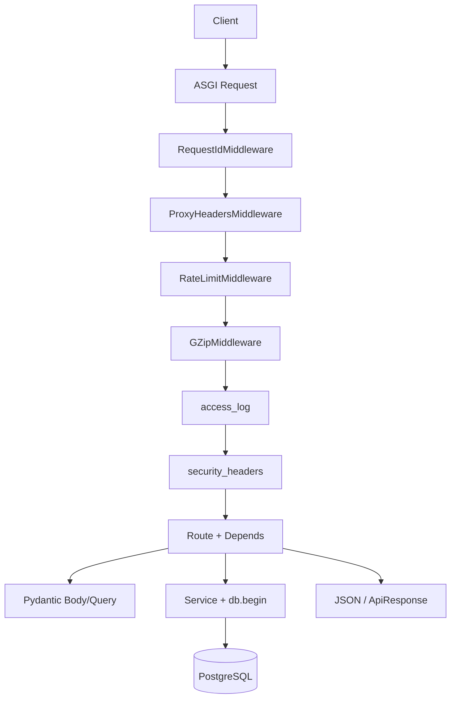
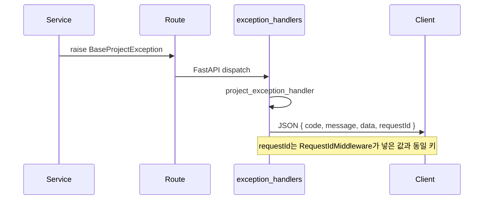
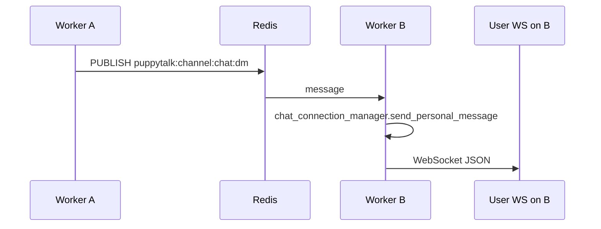
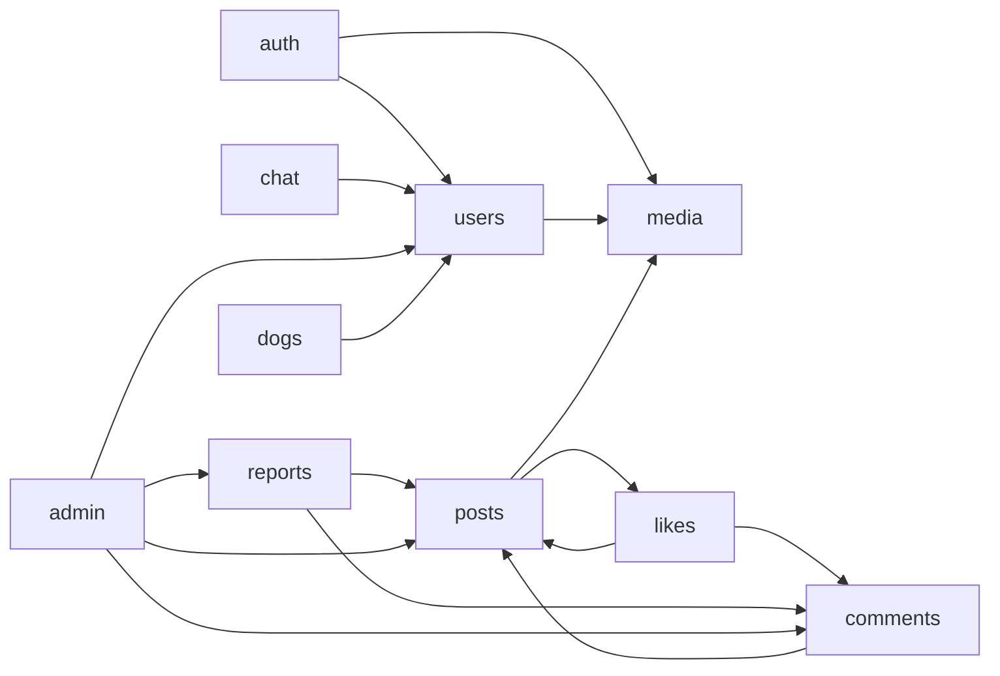
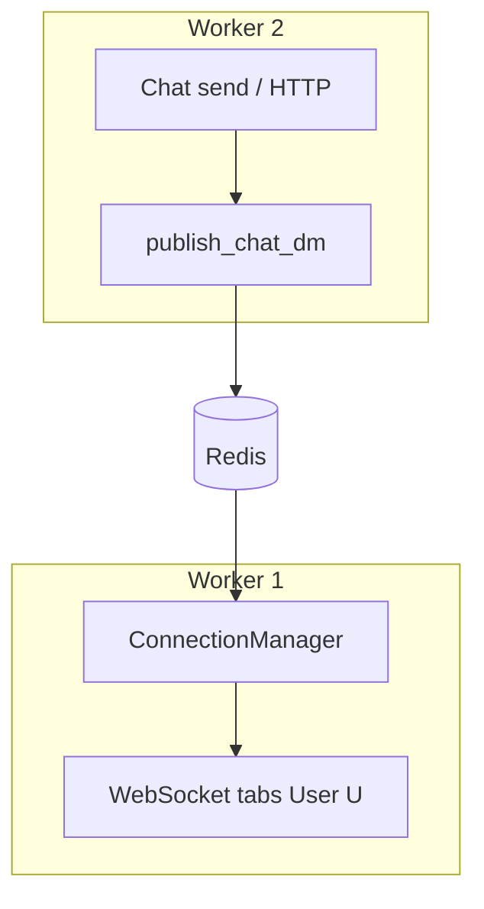

# 아키텍처 (Architecture)

PuppyTalk 백엔드의 **실제 구현**을 기준으로, 설계 의도(Why)와 코드 위치(How)를 연결한 기술 문서입니다.  
**고성능 비동기 I/O**(SQLAlchemy Async · Redis)와 **실시간 DM(WebSocket)**, **분산 환경에서의 Redis Pub/Sub**, **식별자(UUID v7 + Base62 투트랙)**을 중심으로 보안·에러·동시성을 **코드 매핑**과 함께 정리합니다.

---

## 목차

1. [설계 개요](#1-설계-개요)
2. [폴더·모듈 경계](#2-폴더모듈-경계)
3. [요청 생명주기](#3-요청-생명주기)
4. [보안 강화 (Security Hardening)](#4-보안-강화-security-hardening)
5. [전역 에러 흐름](#5-전역-에러-흐름)
6. [동시성·락](#6-동시성락)
7. [백그라운드 작업·스케줄링](#7-백그라운드-작업스케줄링)
8. [다목적 Redis 레이어](#8-다목적-redis-레이어)
9. [데이터베이스](#9-데이터베이스)
10. [식별자: UUID v7 · Base62 (투트랙 직렬화)](#10-식별자-uuid-v7--base62-투트랙-직렬화)
11. [인증·토큰·세션성 상태](#11-인증토큰세션성-상태)
12. [데이터 정합성·도메인 협업](#12-데이터-정합성도메인-협업)
13. [성능: N+1·스토리지·조회수](#13-성능-n1스토리지조회수)
14. [DM 채팅: WebSocket · Redis Pub/Sub · 다중 워커](#14-dm-채팅-websocket--redis-pubsub--다중-워커)
15. [이미지·피드·신고 (요약)](#15-이미지피드신고-요약)

---

## 1. 설계 개요

### 1.1 왜 FastAPI·비동기인가

- **I/O 바운드 병렬성**: DB·Redis·스토리지·외부 네트워크 대기 시간이 대부분이므로 `async`/`await`와 `AsyncSession`으로 이벤트 루프 효율을 취한다. 장시간 블로킹 연산(예: bcrypt)은 `asyncio.to_thread`로 오프로딩한다.
- **WebSocket과 동일 프로세스**: DM은 Starlette WebSocket 핸들러로 처리하며, 업스트림에서 **동일 앱 인스턴스**의 Redis 클라이언트·DB 세션 패턴을 공유한다. 실시간 경로도 비동기 컨텍스트에서 동작하도록 유지한다.
- **계약**: Pydantic v2로 HTTP·WebSocket 페이로드와 Redis 캐시 JSON에 동일한 타입 규율을 적용한다(`TypeAdapter`·`PublicId` 등).

### 1.2 Stateless HTTP + Redis에 두는 상태

HTTP API는 **무상태**를 지향한다. Access JWT는 서버에 세션을 두지 않고, 무효화가 필요한 경우(로그아웃)만 Redis에 **`jti` 블랙리스트**를 둔다. Refresh는 HttpOnly 쿠키 + Redis Set/Lua로 **회전·검증**한다.  
수평 확장 시에도 동일 규칙이면 인스턴스 간 일관성이 유지된다.

---

## 2. 폴더·모듈 경계

### 2.1 레이어

| 계층 | 책임 | 코드 위치 |
|------|------|-----------|
| **Router** | 라우트·의존성 주입·`api_response`로 포장 | `app/domain/*/router.py`, `app/api/v1/chat/*.py` |
| **Service** | 유스케이스·트랜잭션 경계 `async with db.begin():` | `app/domain/*/service.py` |
| **Model** | 쿼리·CRUD, **커밋 없음** | `app/domain/*/model.py` 등 |
| **Schema** | Pydantic DTO | `app/domain/*/schema.py` |
| **공통** | `ApiCode`, `ApiResponse`, 예외 기저 | `app/common/` |
| **전역** | 미들웨어, 보안, 예외 핸들러, ID 유틸 | `app/core/` |

### 2.2 `app` 패키지 별칭

`app/__init__.py`에서 `app.domain.auth` 등을 `sys.modules["app.auth"]`로 주입한다. 따라서 런타임 import는 `from app.auth.router import ...` 형태가 유지되고, **`app.chat`** 역시 `domain.chat`을 가리킨다.

### 2.3 `/v1` 라우터 등록 순서

`app/api/v1/__init__.py`에서 `v1_router`에 다음 순으로 `include`한다(경로 충돌 시 선등록 우선):

`chat_ws` → `auth` → `users` → `notifications` → `dogs` → `media` → `posts` → `comments` → `likes` → `reports` → `admin` → `chat_rest`

WebSocket은 **`/v1/ws/chat`**, REST 채팅은 **`/v1/chat/*`**.

---

## 3. 요청 생명주기

### 3.1 미들웨어 (LIFO)

Starlette는 **나중에 `add_middleware`로 등록한 것이 요청 시 가장 먼저** 실행된다. `app/main.py`에서 **맨 아래**에 `RequestIdMiddleware`를 두어, 진입 직후 ULID `request_id`를 `scope["state"]`와 로깅 context에 심는다.

실행 순서(요청 방향): **RequestId** → **ProxyHeaders** → **RateLimit** → **GZip** → (HTTP 함수형) **access_log** → **security_headers** → 라우터.

### 3.2 단순 흐름도



### 3.3 의존성

- **`get_master_db` / `get_slave_db`**: 쓰기 vs 읽기 세션. 트랜잭션은 서비스의 `async with db.begin():`에서만 연다(`autobegin=False`).
- **`get_current_user`**: `app/api/dependencies/auth.py` — JWT 검증 후 `jti` 블랙리스트 조회.

---

## 4. 보안 강화 (Security Hardening)

### 4.1 Rate Limiting (고정 윈도우 + Redis Lua)

**구현**: `app/core/middleware/rate_limit.py`

- Redis 키당 **Fixed Window**: Lua 스크립트로 `INCR` → 최초 1회만 `EXPIRE`, TTL과 카운트를 원자적으로 반환한다. **슬라이딩 윈도우는 현재 미구현**이다.
- **Fail-open**: Redis 예외 시 대부분 경로는 **제한 없이 통과**해 가용성을 우선한다. 다만 로그인·회원가입 이미지 업로드 등 **치명 경로**는 인메모리 고정 윈도우(최대 1만 키, eviction)로 보조한다.
- 클라이언트 IP는 **`get_client_ip_from_scope`**로만 취하며, `ProxyHeadersMiddleware`가 이미 검증한 `scope["client"]`를 신뢰한다(직접 `X-Forwarded-For` 파싱 금지로 스푸핑 완화).

**Why**: 분산 환경에서 카운트를 인메모리만 쓰면 인스턴스마다 한도가 갈라진다. Redis 단일 저장소 + Lua로 경쟁 조건 없이 카운트한다.

### 4.2 데이터 무결성 — `TypeAdapter` · `validate_json`

| 용도 | 파일 | 내용 |
|------|------|------|
| 멱등성 캐시 복원 | `app/api/dependencies/client.py` | `TypeAdapter(ApiResponse[PostIdData])` 등으로 Redis에 저장된 JSON이 **현재 스키마와 맞는지** 검증. 불일치 시 캐시 미스 후 정상 플로우. |
| 트렌딩 해시태그 | `app/domain/posts/services/hashtag_service.py` | `TypeAdapter(list[TrendingHashtagResponse]).validate_json` |
| WebSocket 페이로드 | `app/domain/chat/payload.py` | `TypeAdapter(ChatMessageSend).validate_json(raw_json)` |

**Why**: 외부 저장소(Redis)나 클라이언트 문자열은 항상 **스키마 드리프트** 위험이 있다. 런타임에 Pydantic으로 한 번 더 접어 넣으면 잘못된 페이로드가 도메인으로 내려가지 않는다.

### 4.3 인증·비밀번호·주입 방어

| 주제 | 구현 | 비고 |
|------|------|------|
| **Access 무효화(로그아웃)** | Redis 키 `blacklist:jti:{jti}` (`app/core/security.py`의 `access_jti_blacklist_redis_key`) | TTL은 Access 잔여 수명에 맞춤. `app/api/dependencies/auth.py`, `app/domain/chat/ws_auth.py`에서 조회. Redis 실패 시 **Fail-open**(가용성 우선). |
| **Refresh 회전(RTR)** | `app/domain/auth/service.py` — Lua 기반 원자 회전 + 실패 시 폴백 경로 | 동시 `/auth/refresh` 경쟁 시 한 건만 성공하도록 설계. |
| **비밀번호** | **bcrypt** (`app/core/security.py`), `asyncio.to_thread`로 이벤트 루프 블로킹 방지. `PASSWORD_PEPPER` 적용·레거시 무페퍼 폴백 (`verify_password_with_legacy_fallback`) | **현재 코드는 bcrypt**이다. |
| **SQL Injection** | SQLAlchemy 2.0 Core/ORM **바인딩 파라미터** 사용 | Raw 문자열 연결로 쿼리를 만들지 않는 것이 1차 방어선이다. |
| **XSS(저장형)** | 응답은 Pydantic 스키마 통과. 프론트 이스케이프와 함께 **CSP 등**은 `app/core/middleware/security_headers.py`에서 설정 가능. |

---

## 5. 전역 에러 흐름

### 5.1 예외 계층

- **`BaseProjectException`** (`app/common/exceptions.py`): `status_code`, `code`(주로 `ApiCode`), `message`, `data`를 들고 서비스에서 `raise`.
- **FastAPI `HTTPException`**: `detail`이 dict이고 `code` 키가 있으면 그대로 API 규격으로 직렬화.
- **`RequestValidationError`**: 본문/쿼리 스키마 불일치 → 400, 세부 `ApiCode`는 메시지 휴리스틱으로 선택 (`app/core/exception_handlers.py`의 `_pick_validation_code`).
- **SQLAlchemy `IntegrityError` / `OperationalError` / `DatabaseError`**: 중복 키·FK 등은 매핑된 `ApiCode`와 HTTP 상태로 변환. 500 계열은 **마스킹 메시지**만 클라이언트에 노출.

### 5.2 변환 파이프라인



**핵심 파일**: `app/core/exception_handlers.py` — `register_exception_handlers(app)`는 `app/main.py`에서 앱 생성 직후 호출된다.

**Why**: 비즈니스 코드는 HTTP 세부를 몰라도 되고, 클라이언트는 항상 동일한 JSON 뼈대로 디버깅(`requestId`)할 수 있다.

---

## 6. 동시성·락

### 6.1 DB

- **트랜잭션 격리**: PostgreSQL 기본(READ COMMITTED) 하에서 서비스 단위로 `async with db.begin():`로 경계를 명확히 한다.
- **`SELECT FOR UPDATE`**: 현재 코드베이스에서 **명시적 행 잠금 쿼리는 사용하지 않는다** (검색 결과 없음).
- **Race 완화**:
  - **유니크 제약** + `IntegrityError` 핸들러(이메일·닉네임 등).
  - 좋아요 등: **`ON CONFLICT DO NOTHING` + RETURNING** 패턴(README·도메인 로직).
  - DM 방: `chat_rooms`에 **유저 쌍 순서 고정 + UNIQUE**(마이그레이션 `006_chat_dm_tables`).

### 6.2 애플리케이션 — `ConnectionManager`와 `asyncio.Lock`

**파일**: `app/domain/chat/manager.py`

- 워커(프로세스) 로컬에서 `user_id → Set[WebSocket]`을 유지한다.
- **`asyncio.Lock`**으로 `_by_user` 맵 갱신(connect/disconnect)과 스냅샷 읽기를 직렬화해, 동시 연결·해제 시 set이 깨지지 않게 한다.
- **인스턴스 간** 일관성은 이 락이 아니라 **Redis Pub/Sub**(`app/domain/chat/pubsub.py`)으로 보완한다. 상세는 [§14](#14-dm-채팅-websocket--redis-pubsub--다중-워커).

### 6.3 낙관적 충돌

`ConcurrentUpdateException` (`app/common/exceptions.py`)은 Stale 데이터 등 **409 CONFLICT** 응답용으로 정의되어 있다. 실제 매핑은 도메인별 서비스 로직을 따른다.

---

## 7. 백그라운드 작업·스케줄링

### 7.1 FastAPI `BackgroundTasks`

**예시**: `app/domain/admin/router.py`의 `POST /v1/admin/media/sweep`

- 응답 **202**를 먼저 보낸 뒤, **요청 스코프 DB 세션이 아닌** `AsyncSessionLocal()`로 새 세션을 열어 고아 이미지 스윕을 수행한다.
- **Why**: 요청이 끝난 뒤 실행되므로, 요청에 묶인 세션을 쓰면 안 된다는 주석과 동일한 이유다.

### 7.2 앱 수명주기 `asyncio` 태스크

**파일**: `app/main.py` — `lifespan` 컨텍스트

| 태스크 | 조건 | 역할 |
|--------|------|------|
| `cleanup` 루프 | `SIGNUP_IMAGE_CLEANUP_INTERVAL > 0` | `app/core/cleanup.py` — 가입 임시 이미지·고아 이미지·탈퇴 유저 파기·오래된 알림 삭제 등 |
| 조회수 flush | Redis + 설정 간격 | `PostService.flush_view_counts_to_db` |
| 채팅 Pub/Sub 리스너 | `REDIS_URL` | `app/domain/chat/pubsub.py` — `run_chat_subscribe_listener` |

종료 시 `stop_event`로 태스크를 정리하고 타임아웃을 둔다.

### 7.3 `BackgroundTasks` vs lifespan

- **BackgroundTasks**: 단발·요청 연관 작업(관리자 트리거 스윕).
- **lifespan**: 프로세스 전역 **장기 루프**(정리 주기, 조회수 버퍼, Redis 구독).

Celery 등 외부 큐는 **미도입**이며, 주기 작업은 위 루프에 의존한다.

---

## 8. 다목적 Redis 레이어

| 역할 | 키/채널 패턴 | 파일·코드 |
|------|----------------|-----------|
| Refresh 토큰 다이제스트·RTR | `rt:*` 등 (auth 서비스) | `app/domain/auth/service.py` |
| Access `jti` 블랙리스트 | `blacklist:jti:{jti}` | `app/core/security.py`, `app/api/dependencies/auth.py` |
| Rate limit 카운트 | `rl:*` | `app/core/middleware/rate_limit.py` |
| 알림 SSE 팬아웃 | `notif:user:{userId}` (개념) | 알림 도메인 + `app/infra/redis.py` |
| DM **Pub/Sub** | `puppytalk:channel:chat:dm` | `app/domain/chat/pubsub.py` |
| 트렌딩 해시태그 캐시 | (서비스 설정 TTL) | `hashtag_service.py` |
| 멱등성·업로드 토큰 등 | 클라이언트 식별자·엔드포인트별 | `app/api/dependencies/client.py`, media |

**Stateless API**: 세션을 Redis에 두지 않고, **토큰 무효화·속도 제한·캐시·Pub/Sub**에 Redis를 쓴다.

### 8.1 WebSocket 분산 Fan-out



발행 측은 `publish_chat_dm` (`pubsub.py`). 구독은 연결 풀과 분리된 **전용 Redis 연결**로 블로킹 루프를 돌린다(SSE 알림과 유사 패턴).

---

## 9. 데이터베이스

- **Master / Slave**: `get_master_db` · `get_slave_db` — URL은 `app/core/config.py`·`app/db/session.py`에서 구성. 단일 URL이면 동일 풀을 가리킬 수 있으나 **의존성 분리**는 유지한다.
- **엔진**: `postgresql+psycopg` + `create_async_engine`, `async_sessionmaker`(`autobegin=False`).
- **모델 커밋 금지**: CUD는 서비스의 `db.begin()` 안에서만 커밋한다.

---

## 10. 식별자: UUID v7 · Base62 (투트랙 직렬화)

### 10.1 저장 계층: 16바이트 UUID (시간 국소성)

**파일**: `app/core/ids.py`

- 엔티티 PK는 PostgreSQL **`uuid`** 타입으로 저장한다. 신규 행은 앱에서 **`new_uuid7()`** (`app/core/ids.py`, `uuid_extensions.uuid7` 기반)을 발급해 B-Tree 인덱스의 **시간 국소성(Locality)** 과 삽입 패턴을 완화한다.
- ORM·서비스·쿼리 경로에서는 **`UUID` 객체**로 다루어 비교·FK 조인 비용을 일정하게 유지한다.

### 10.2 API 계층: Base62 문자열 (가독성·노출면)

클라이언트-facing JSON에서는 PK를 **가변 길이 Base62 문자열**로 내려보낸다. 프론트는 고정 길이 ULID만 가정하면 안 된다.

### 10.3 투트랙 브리지: `BeforeValidator` + `PlainSerializer`

**파일**: `app/common/schemas.py`

```python
PublicId = Annotated[
    UUID,
    BeforeValidator(parse_public_id_value),
    PlainSerializer(lambda u: uuid_to_base62(u), return_type=str),
    WithJsonSchema({"type": "string", "description": "엔티티 공개 ID (Base62)"}),
]
```

| 방향 | 동작 | 이점 |
|------|------|------|
| **입력 (역직렬화)** | `BeforeValidator(parse_public_id_value)` | 경로 파라미터·JSON 문자열이 Base62·UUID 문자열·레거시 ULID 등으로 와도 **단일 `UUID`로 정규화**된다. 서비스/DB는 항상 네이티브 UUID로 동작한다. |
| **출력 (직렬화)** | `PlainSerializer` → `uuid_to_base62` | 응답 JSON에는 **짧은 Base62**만 노출되어 URL·로그에 적합하고, 내부 표현은 여전히 `UUID`이다. |
| **스키마(OpenAPI)** | `WithJsonSchema` | 문서상 타입은 `string`으로 고정되어 클라이언트 생성 코드와 일치한다. |

`parse_public_id_value`는 `app/core/ids.py`에 정의되어 있으며, ORM에서 온 `UUID`는 그대로 통과시키고 문자열만 파싱한다.

### 10.4 JWT `sub`와 비엔티티 ID

- JWT `sub`는 Base62·UUID 문자열·레거시 ULID를 `jwt_sub_to_uuid`로 수용한다(`app/core/ids.py`).
- Access/Refresh의 **`jti`**, 요청 추적용 **`request_id`** 등 비엔티티 식별자는 **ULID 문자열**을 유지해 로그·블랙리스트 키와의 호환을 취한다.

---

## 11. 인증·토큰·세션성 상태

- **Access**: Bearer, 짧은 TTL, `jti`로 로그아웃 시 블랙리스트.
- **Refresh**: HttpOnly 쿠키, Redis에 SHA256 다이제스트, Lua **원자 회전**으로 동시 리프레시 레이스 완화.
- **비밀번호**: bcrypt + pepper(위 §4.3).

상세 흐름은 README 「기능 정리」와 동일하며, 여기서는 **아키텍처 관점에서 Redis가 토큰 상태의 단일 진실 공급원(SoT)** 역할을 한다는 점만 강조한다.

---

## 12. 데이터 정합성·도메인 협업

- **게시글·댓글·좋아요·신고**: 소프트 삭제, `ON CONFLICT` 멱등, 신고 누적·블라인드 등은 README 「기능 정리」 및 각 `service.py`가 단일 진실 공급원이다.
- **알림**: 트랜잭션 커밋 **후** Redis로 팬아웃해 DB 커밋과 이벤트 순서를 맞춘다.

### 12.1 도메인 참조(요약)



**chat**: 방·메시지 영속은 DB, 실시간 전달은 WebSocket + Redis Pub/Sub. 인증은 `users`와 동일 JWT 규칙을 공유한다.

---

## 13. 성능: N+1·스토리지·조회수

- **N+1**: 게시글 목록에서 `selectinload` + FK 인덱스.
- **S3**: 클라이언트 싱글톤(`app/infra/storage.py` 패턴).
- **조회수**: Redis 버퍼 + 주기 flush 루프(`main.py` lifespan). 클라이언트 식별자·중복 억제 정책은 README와 동일.

---

## 14. DM 채팅: WebSocket · Redis Pub/Sub · 다중 워커

### 14.1 다중 워커에서의 한계

**Gunicorn + Uvicorn worker** 또는 **여러 Uvicorn 프로세스**로 수평 확장하면, 각 프로세스는 **자기 메모리 안의** `ConnectionManager`만 본다.  
따라서 “유저 A의 WebSocket이 워커 1에 붙어 있는데, 동일 유저에게 메시지를 보내는 HTTP 요청이 워커 2에서 처리된 경우”처럼 **송신 처리와 수신 소켓이 다른 OS 프로세스**에 있으면, 로컬 딕셔너리만으로는 상대방 소켓을 찾을 수 없다.

이 제약을 풀기 위해 **프로세스 간 브로드캐스트**로 Redis **Pub/Sub**를 사용한다.

### 14.2 Fan-out 아키텍처 (핵심)

1. 메시지가 커밋되면(또는 송신 경로에서) `publish_chat_dm` (`app/domain/chat/pubsub.py`)이 채널 **`puppytalk:channel:chat:dm`** 으로 **envelope**를 `PUBLISH`한다. envelope에는 수신자 `target_user_id`(UUID 문자열)와 클라이언트에 그대로 전달할 `payload`가 들어간다.
2. **각 워커 프로세스**는 앱 기동 시 `run_chat_subscribe_listener`로 **동일 채널을 구독**한다(풀과 분리된 전용 연결).
3. 메시지를 받은 워커만 로컬 `chat_connection_manager` (`app/domain/chat/manager.py`의 싱글톤)로 **해당 `user_id`에 연결된 WebSocket**에 `send_json`한다. 다른 워커에 붙은 소켓은 그 워커의 구독 루프가 처리한다.

이로써 **워커는 무상태에 가깝게** 유지되고, “누가 어느 TCP에 붙었는지”는 각 프로세스의 로컬 맵 + Redis가 분담한다.



### 14.3 `ConnectionManager`: 1 User → N Sockets + `asyncio.Lock`

**파일**: `app/domain/chat/manager.py`

- 구조: `_by_user: dict[UUID, set[WebSocket]]` — 한 사용자가 **여러 탭·기기**로 동시에 연결하면 **여러 소켓**이 한 버킷에 들어간다.
- **`asyncio.Lock`**: `connect` / `disconnect` / `send_personal_message`에서 맵을 갱신하거나 스냅샷을 뜰 때 **동시 코루틴이 set을 망가뜨리지 않도록** 직렬화한다. 전송 루프는 스냅샷 `list(sockets)`에 대해 순회하며, 전송 실패 시 해당 소켓에 대해 `disconnect`를 호출한다.
- WebSocket 엔드포인트: `app/api/v1/chat/ws.py` — **`/v1/ws/chat`**, 쿼리 `token=` Access JWT.
- 인증: `app/domain/chat/ws_auth.py` — HTTP `get_current_user`와 동일하게 JWT·**`jti` 블랙리스트**를 적용한다.

### 14.4 메시지 검증

- 수신 텍스트 JSON은 `app/domain/chat/payload.py`에서 `TypeAdapter(ChatMessageSend).validate_json`으로 검증한다.

---

## 15. 이미지·피드·신고 (요약)

- **이미지**: 매직 바이트 검증, `signupToken`·`ref_count`, 스토리지 백엔드 추상화 — 세부는 README 및 도메인 `media`.
- **피드**: `pg_trgm`·GIN·부분 인덱스·차단 필터·신고 누적 블라인드 — DB·쿼리 전략은 README와 동일.

---

## 문서 이력

- 최신: AI/ML 로드맵 섹션 제거. **투트랙 식별자(Pydantic `PublicId`)**·**다중 워커 + Redis Pub/Sub DM** 서술 보강. 이미지·피드·신고 세부는 README 및 `app/domain/*`와 병행.
