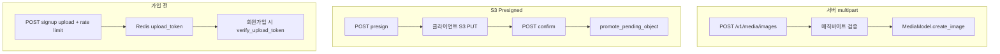
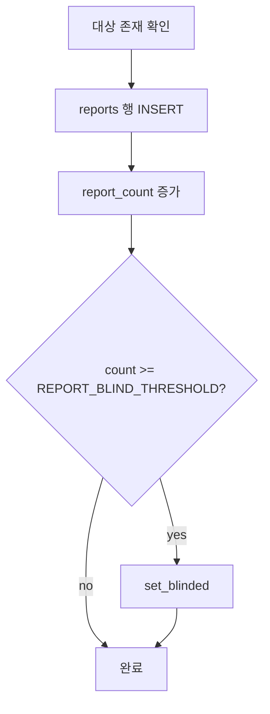
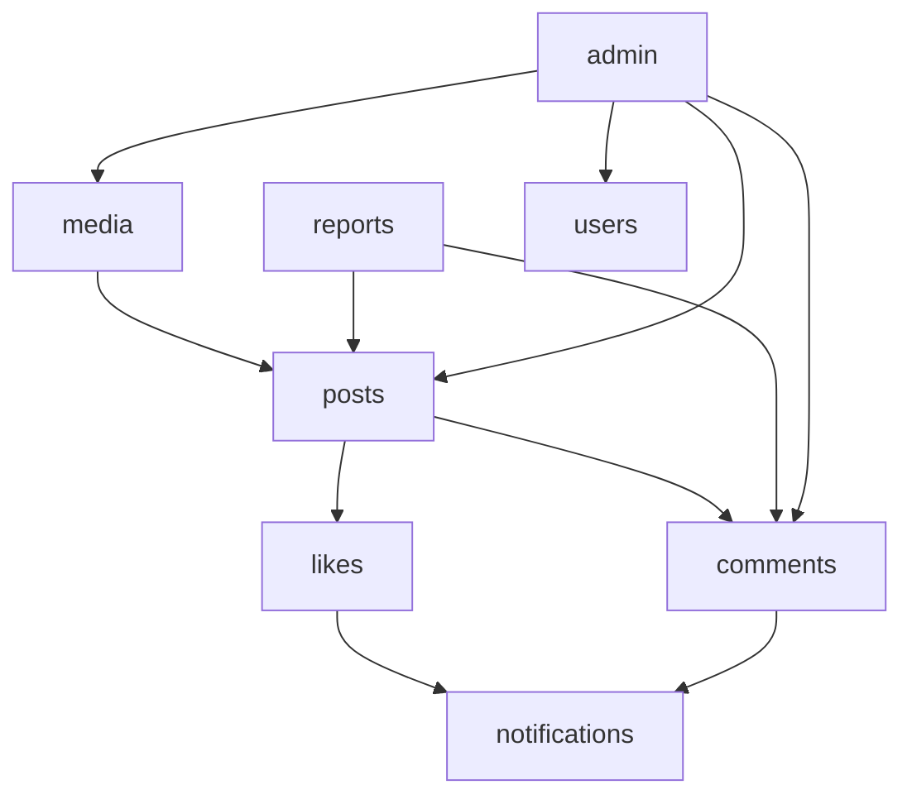

# 도메인 플로우 (미디어 · 피드 · 신고 · 관리)

게시글·이미지·검색·트렌드·신고·관리자 API의 **엔드투엔드 흐름**을 코드 기준으로 정리한다.

[← 아키텍처 개요](architecture.md) · [실시간·알림](realtime-notifications.md)

---

## 1. 이미지 (media)

**위치**: `app/domain/media/`, `app/infra/storage.py`, `app/api/dependencies/upload.py`

### 1.1 저장 백엔드

| `STORAGE_BACKEND` | 동작 |
|-------------------|------|
| `local` | 디스크 + `/upload` 정적 마운트 |
| `s3` | boto3 (`run_in_threadpool`) |

### 1.2 업로드 경로 (3가지)

| API | 인증 | 멱등 | 비고 |
|-----|------|------|------|
| `POST /v1/media/images` | 로그인 | `X-Idempotency-Key` | multipart, `MAX_FILE_SIZE` |
| `POST .../images/presign` | 로그인 | — | S3 전용 |
| `POST .../confirm` | 로그인 | — | pending → final key |
| `POST .../images/signup` | 없음 | 멱등 | Redis 토큰 발급 |
| `POST .../signup/confirm` | 없음 | — | 토큰 검증 후 메타만 |

### 1.3 검증·보안

- `validate_image_content_type` — 허용 MIME
- `sniff_image_type` — JPEG/PNG/WebP 매직 바이트
- `sanitize_presign_filename` — traversal·특수문자
- `validate_purpose` — `post`, `profile`, `dog` 등 용도

[보안 §6](security.md#6-파일-업로드-악용)

### 1.4 ref_count·고아 정리

- 게시글·프로필·강아지 프로필이 `media_images.id` FK 참조.
- `ref_count`로 참조 수 추적.
- **관리자** `POST /v1/admin/media/sweep` — 202 후 `BackgroundTasks` + **새 세션**으로 `MediaService.sweep_unused_images`.
- **lifespan** — `SIGNUP_IMAGE_CLEANUP_INTERVAL` 등으로 임시·탈퇴 유저 이미지 정리 (`_JOB_LOCK_*` Redis 락).

### 1.5 게시글과 연결

1. 이미지 업로드 → `image_id` 획득
2. `POST /v1/posts` body에 `imageIds` — `PostService`가 `post_images` 연결
3. 게시글 삭제 시 이미지 ref 감소·스윕 대상

---

## 2. 게시글 피드·상세

**위치**: `app/domain/posts/`

### 2.1 목록 `GET /v1/posts`

| 쿼리 | 설명 |
|------|------|
| `cursor` | 마지막 게시글 **공개 ID** (Base62) |
| `size` | 페이지 크기 |
| `category_id` | 카테고리 필터 |
| `q` | 검색 ([architecture §3.5](architecture.md#35-게시글-검색)) |

**필터**: `deleted_at IS NULL`, `is_blinded=false`, 차단 유저 제외, 로그인 시 차단 관계 반영.

**응답**: `PaginatedResponse` — `items`, `hasMore`, `total`.

### 2.2 상세 `GET /v1/posts/{post_id}`

- `get_post_by_id` + `selectinload`/`joinedload`
- 없거나 블라인드·차단·삭제 → `PostNotFoundException`

### 2.3 작성 `POST /v1/posts`

1. `post_create_idempotency_before` — 캐시 히트 시 즉시 반환
2. `PostService.create_post` — `db.begin()` 안에서 post + hashtags + images
3. 성공 시 멱등 응답 저장

### 2.4 수정·삭제

- `require_post_author` — 작성자만
- 삭제는 soft delete (`deleted_at`)

---

## 3. 검색 (`q`)

프론트·백엔드 **동일 규칙** 권장 (`validate_search_query`).

| 입력 | 결과 |
|------|------|
| 빈 `q` | 일반 피드 |
| `#강아지` | 해시태그 정확 매칭 |
| `12 2024` | 숫자 토큰 2자+ OK |
| `ab` (영문만) | 400 — 3자 미만 |

실패 메시지는 `InvalidRequestException` → ApiResponse 400.

---

## 4. 트렌드

### 4.1 인기 게시글 `GET /v1/posts/trending`

**파일**: `TrendingPostService` (`trending_post_service.py`)

1. 시간 창(`window_hours`) + `category_id` 로 점수/좋아요 기반 조회
2. 결과가 sparse 하면 **더 긴 창**으로 fallback
3. 그래도 비면 전체 기간 like-order fallback
4. TODO: Redis `cache:trending_posts:...` (해시태그와 동일 패턴 예정)

**라우터 순서**: `trending`, `trending-hashtags`가 `/{post_id}` **앞**에 등록 (`posts/router.py` 주석).

### 4.2 인기 해시태그 `GET /v1/posts/trending-hashtags`

**파일**: `HashtagService`

- Redis `cache:trending_hashtags` — JSON + `TypeAdapter` 검증
- miss 시 DB + 분산 락 `cache:trending_hashtags:lock`
- 스키마 불일치 시 캐시 무시 후 재조회

---

## 5. 조회수

`POST /v1/posts/{post_id}/view`

1. `post_is_visible` 또는 상세 존재 확인
2. Redis `SET NX` — 방문자 키(`u:{id}` / `ip:{client}`)
3. 카운트 버퍼 증가
4. `lifespan`에서 `flush_view_counts_to_db` — 분산 락으로 중복 flush 방지

상세: [architecture §3.6](architecture.md#36-조회수-write-behind).

---

## 6. 좋아요·댓글 (알림 연계)

### 6.1 좋아요

**파일**: `app/domain/likes/service.py`

1. `post_is_visible` / 댓글 존재 확인
2. `db.begin()` — `ON CONFLICT` insert, like_count 갱신
3. **커밋 후** `NotificationService.publish_after_commit` (타인 글만)
4. 중복 좋아요 → `AlreadyLikedException` + 현재 count

### 6.2 댓글

**파일**: `app/domain/comments/service.py`

- 작성 전 `post_is_visible`
- 대댓글·트리 — repository에서 flat 로드 후 앱에서 트리 구성
- 작성 성공 시 게시글 작성자에게 `COMMENT_ON_POST` 알림

[실시간·알림 §1–2](realtime-notifications.md).

---

## 7. 신고 (reports)

**파일**: `app/domain/reports/`

### 7.1 API

`POST /v1/reports` — body: `targetType`, `targetId`, `reason`

### 7.2 트랜잭션 (`ReportService.submit_report`)

- **항상** 신고 레코드는 남긴다 (중복 신고 정책은 DB UNIQUE·비즈니스 규칙 확인).
- `REPORT_BLIND_THRESHOLD` — `settings` (env).
- 응답 `ReportSubmitData`: `reported`, `blinded`.

### 7.3 블라인드 이후

- 피드·상세·`post_is_visible`에서 제외
- 관리자 `unblind` API로 해제 가능

---

## 8. 관리자 (admin)

**접근**: `require_admin` — JWT `role == ADMIN`

**파일**: `app/domain/admin/router.py`, `admin/service.py`

| 기능 | 메서드 | 설명 |
|------|--------|------|
| 신고 게시글 목록 | GET reported-posts | 통합 목록·필터 |
| 게시글 블라인드 해제 | POST posts/{id}/unblind | `PostsModel.unblind_post` |
| 댓글 블라인드 해제 | POST comments/{id}/unblind | |
| 유저 정지 | POST users/{id}/suspend | 활동 제한 |
| 미디어 스윕 | POST media/sweep | 202 + BackgroundTasks |

모든 CUD는 `async with db.begin():` 단일 블록.

---

## 9. 엔드포인트·의존 관계 요약

---

## 10. ApiCode·에러 (도메인별)

| 상황 | code |
|------|------|
| 게시글 없음/비가시 | `POST_NOT_FOUND` 등 |
| 이미 좋아요 | `ALREADY_LIKED` |
| 검색어 짧음 | `INVALID_REQUEST` |
| 멱등 충돌 | `CONFLICT` |
| 관리자 아님 | `FORBIDDEN` |

전체: [api-codes.md](api-codes.md).

---

## 11. 프론트 연동 포인트

1. **피드**: cursor는 응답 마지막 `postId`, `hasMore`로 무한 스크롤.
2. **검색**: BE와 동일 `validate_search_query` 미러 (`postSearch.js`) — 실패 시 목록 숨기고 힌트만.
3. **이미지**: 업로드 후 `imageId`로 글 작성; 멱등 키는 글 작성·업로드 각각.
4. **알림**: SSE + 목록; 좋아요/댓글 후 배지 갱신.
5. **신고**: `blinded` 응답으로 UI 피드백.

관련: [요청·API 계약](request-and-api-contract.md), [보안](security.md).
