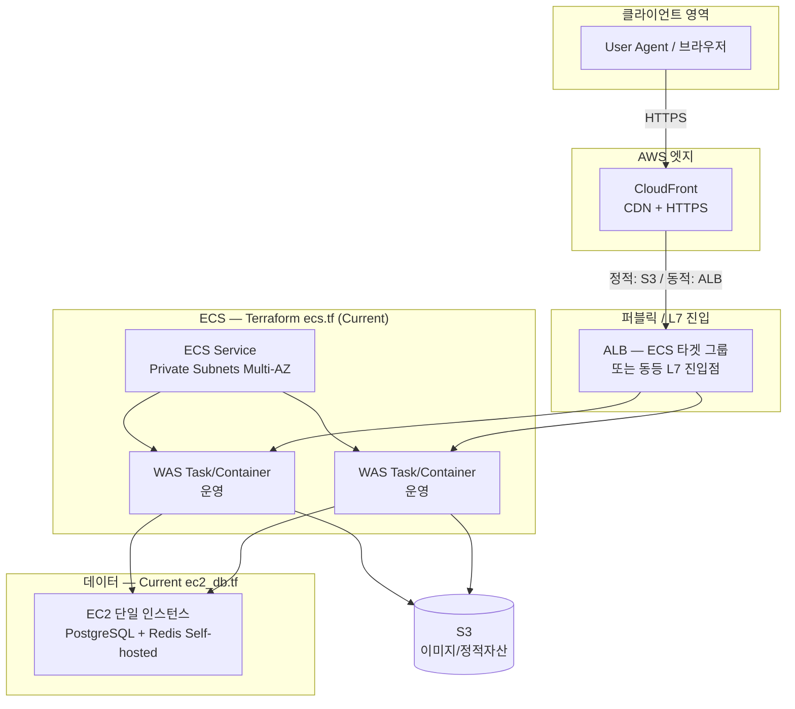
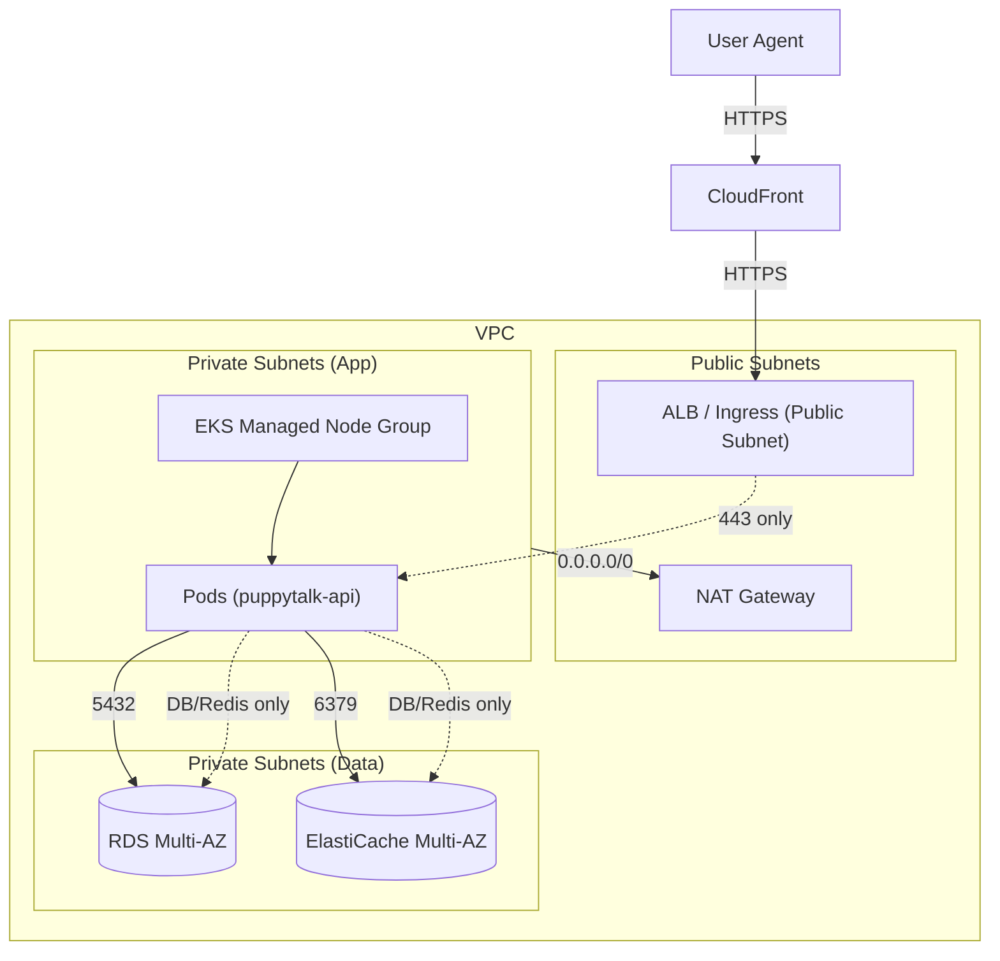
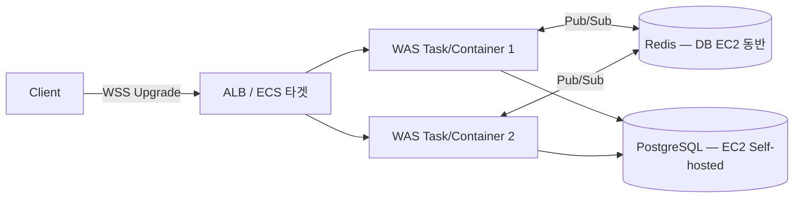
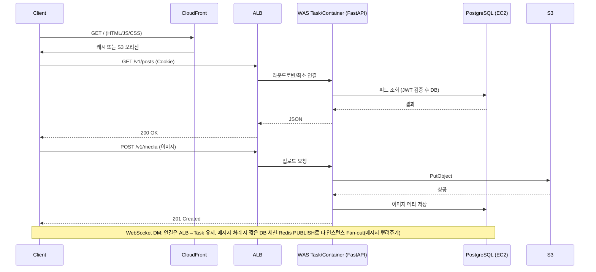
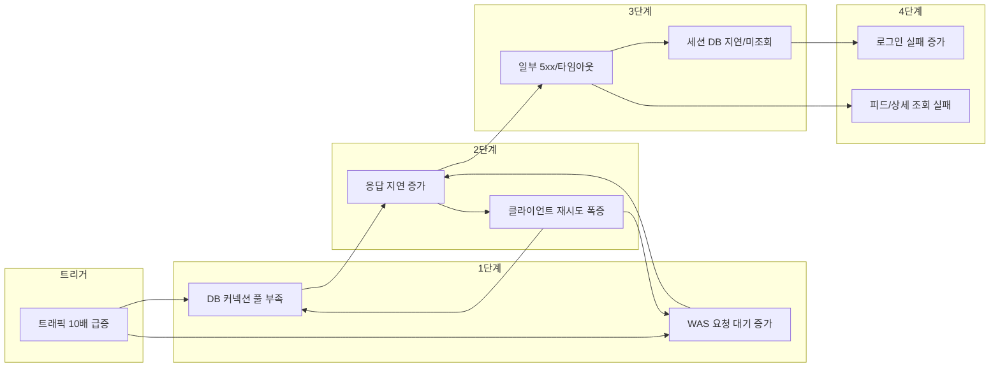

# PuppyTalk 인프라 및 안정성 설계 보고서

## [프로젝트 개요 및 설계 배경]

본 보고서는 PuppyTalk 서비스의 **인프라·안정성·장애 대응**을 프로젝트 성과의 형태로 정리한 것입니다. **제한된 예산과 인력이 주어진 초기 프로젝트 환경**에서 실제로 구축해 운영 중인 **Current**와, **향후 대규모 트래픽 확장·AI 워크로드 도입 등 특정 임계점**에 대비해 정리한 **Target**을 한 문서에서 대비시켰습니다. **비용 효율을 확보한 현재의 실전 운영**과, **피크 트래픽·고가용 데이터 계층에 대비한 기술적 준비**가 동시에 드러나도록 구성했습니다.

---

> **대상 서비스**: PuppyTalk (반려견 커뮤니티)
>
> **문서 성격**: 초기 예산을 고려한 **실운영(Current)** 과, 트래픽·기능 요구에 대비한 **Target** 을 함께 정리한 **프로젝트 결과 보고서**입니다.
>
> **초점**
>
> - **확장 가능**한 인프라를 목표로 구성했습니다.
> - **결함 내성(Fault-tolerant)** — 고장이 나도 서비스가 버티도록 설계했습니다.
> - **장애 복구** 경로를 문서화했습니다.
> - **고가용성(HA)** — 서비스를 가능한 한 끊기지 않게 유지하는 방향으로 정리했습니다.
>
> **기준 — Current vs Target**
>
> - **작성 방식**: 백엔드·프론트 **실제 코드·설정**을 반영해 **현재 구현(Current)** 과 **목표 아키텍처(Target)** 를 **구분**해 기술했습니다.
> - **인프라 단일 공급원(IaC)**: [PuppyTalk Infra](https://github.com/kyjness/2-kyjness-community-infra) Terraform
> - **Current — 예산과 효율을 고려한 운영 환경**
>   - **`ecs.tf`**: ECS 서비스·태스크/컨테이너
>   - **`ec2_db.tf`**: EC2 **단일 인스턴스**에 PostgreSQL·Redis 직접 설치
>   - **한 줄 요약**: 스타트업·초기 서비스에 맞춰 **전략적 비용 최적화**를 구현한 구성입니다.
> - **Target — 단순한 이상향이 아니라, 임계점 도달 시 즉각 전환할 수 있도록 설계한 확장 기술 자산**
>   - **EKS(쿠버네티스)** 등: IaC로 자산화하고 배포 파이프라인을 구성해, 대규모 트래픽 시 **즉시 투입 가능한 경로**로 정리했습니다. (인프라 레포의 EKS용 `.tf` 명칭은 운영에 따라 달라질 수 있습니다.)
>   - **운영 현실**: **프로덕션 트래픽은 현재 ECS**에서 처리하고 있습니다.
>   - **DB Target — RDS Multi-AZ** (가용 영역 분산: 서울 내 서로 다른 데이터센터에 나누어 배치해 정전 등에 대비): 고가용 데이터 계층 설계를 문서화했습니다.
>
> **관계**
>
> - **애플리케이션 구조**(폴더·도메인·엔드포인트·미들웨어 상세) → [README](https://github.com/kyjness/2-kyjness-community-be/blob/main/README.md), [architecture.md](https://github.com/kyjness/2-kyjness-community-be/blob/main/docs/architecture.md)
> - **본 문서 범위** → 인프라·안정성·장애 시나리오·고가용성을 **구축·설계한 범위**에서 정리했습니다.

**관련 문서**

- [README](https://github.com/kyjness/2-kyjness-community-be/blob/main/README.md)
- [architecture.md](https://github.com/kyjness/2-kyjness-community-be/blob/main/docs/architecture.md)
- [PuppyTalk Infra](https://github.com/kyjness/2-kyjness-community-infra)
---

## 목차

아래 절차는 **현재 운영 중인 Current** 와 **임계점 도달 시 전환할 Target** 을 함께 다룹니다.

1. [시스템 아키텍처 설계 (AWS 기반)](#1-시스템-아키텍처-설계-aws-기반)
2. [예상 트래픽 기반 장애 시나리오 분석](#2-예상-트래픽-기반-장애-시나리오-분석)
3. [고가용성(HA) 및 장애 복구 전략](#3-고가용성ha-및-장애-복구-전략)
4. [운영 단계 안정성·복원력 조치](#4-운영-단계-안정성복원력-조치)
5. [한계·가정 및 목표 아키텍처 (Target Architecture)](#5-한계가정-및-목표-아키텍처-target-architecture)

---

## 1. 시스템 아키텍처 설계 (AWS 기반)

### 1.1 기술 스택

| 구분             | 기술                                                     | 비고                                                                                  |
| -------------- | ------------------------------------------------------ | ----------------------------------------------------------------------------------- |
| **언어·패키지**     | Python 3.11+, uv                                       | `pyproject.toml` (PEP 621), `uv.lock`; 의존성·optional `dev`, Poe 태스크                        |
| **클라이언트**      | React 19, Vite 8, Tailwind CSS 4, TypeScript           | SPA (`src/`), `src/config.js`·환경변수 `VITE_API_BASE_URL`로 API 베이스 URL 설정 (기본 `/api/v1`) |
| **WAS**        | FastAPI, Uvicorn(개발) / Gunicorn + Uvicorn worker(프로덕션) | `Dockerfile`: `-w 4`, `UvicornWorker`; `app/main.py` 진입                             |
| **DB**         | PostgreSQL (psycopg 비동기)                             | **Current**: `ec2_db.tf` → EC2 **단일 인스턴스** Self-hosted PostgreSQL. **Target**: **RDS Multi-AZ**(가용 영역 분산 — 본문 도입부 정의와 동일) 전환 아키텍처·운영 지표를 정리했습니다. 앱 스택(`engine.py`, Alembic) 동일. |
| **ORM·마이그레이션** | SQLAlchemy 2.x, Alembic                                | 루트 `migrations/` (`env.py`, `versions/`); `alembic.ini`의 `script_location=migrations`          |
| **캐시/세션**      | **현재** JWT + Redis(Refresh Token·Rate Limit) / 세션 테이블 없음     | README·`.env.example`: `REDIS_URL` 설정 시 Redis; `pyproject.toml`에 redis 의존성 있음 |
| **스토리지**       | 로컬 파일 / S3 (boto3)                                     | `app/core/config.py`: `STORAGE_BACKEND=local` 또는 `s3`; `app/core/storage.py`에서 분기      |
| **검증·암호화**     | Pydantic v2, bcrypt(비밀번호)                              | 요청·응답 DTO 검증; `app/core/security.py`                                                |
| **외부 연동**      | 동일 백엔드 REST API, S3 API                                | 프론트는 `src/api/client.js`(axios)로 `baseURL`·`withCredentials: true` 설정, 쿠키 기반 인증    |

### 1.2 전체 구성도 (Mermaid)

### 1.2.1 네트워크 격리 설계 (Public/Private Subnet · NAT · Routing · Security Group)

본 프로젝트에서는 “초기 비용 최적화(Current)”와 “고가용성 확장(Target)”의 방향성은 다르더라도, **네트워크 격리(퍼블릭/프라이빗 분리)와 최소 권한 접근**이라는 원칙을 공통 기준으로 두었습니다.

#### Current (ECS + EC2 DB) — 현실적 비용 최적화 + 핵심 자산 보호

- **Public Subnet**: ALB/CloudFront 연동 등 **외부 진입점**과, 퍼블릭 접근이 필요한 리소스를 배치했습니다.
- **Private Subnet**: 애플리케이션 계층(ECS 태스크)은 **프라이빗 서브넷**에 배치해 직접 인터넷 노출을 피했습니다.
- **DB/Redis (EC2 단일 인스턴스)**: 비용 절감 목적의 단일 EC2 구성은 유지하되, 접근 경로를 **Security Group으로 통제**해 “인터넷 직접 접근”이 아니라 “허용된 컴퓨트에서만 접근”이 되도록 운영 모델을 정리했습니다.

#### Target (EKS + RDS/ElastiCache) — 서브넷 분리 + NAT 기반 아웃바운드 + 장애 격리

- **Public Subnet**: Ingress(ALB Controller)가 만드는 ALB, NAT Gateway(비용 정책에 따라 단일/다중)를 배치합니다.
- **Private Subnet**: EKS 워커 노드(Managed Node Group), RDS/ElastiCache를 **프라이빗 서브넷**에 배치해 데이터 계층을 외부로부터 격리합니다.
- **Routing**: 프라이빗 서브넷의 기본 경로(0.0.0.0/0)는 **NAT Gateway**로 향하게 구성해, 노드의 이미지 Pull/업데이트 등 **필수 아웃바운드만 허용**했습니다.

아래 다이어그램은 Target 기준으로 “외부 → L7 → 워커/파드 → 데이터 계층”의 경로와, Security Group 관점의 격리 포인트를 요약합니다.

#### Target 보안 그룹(Security Group) 정책 (요약 표)

아래 표는 Target(EKS + RDS/ElastiCache) 기준으로, “누가 누구에게 어떤 포트로 접근하는가”를 **최소 권한(Least Privilege)** 관점에서 고정한 정책입니다. (실제 리소스명은 Terraform/모듈 구성에 따라 다를 수 있으나, **규칙의 방향성과 포트/프로토콜**은 동일합니다.)

| 구분(예시 SG) | 인바운드(Inbound) | 아웃바운드(Outbound) | 의도(격리 포인트) |
|---|---|---|---|
| **ALB SG** | `0.0.0.0/0:443` (또는 CloudFront/WAF 경유 시 제한) | **EKS Node/Pod** 대상 서비스 포트(예: 8000)로만 | 외부 진입점은 ALB로 단일화, 앱 계층은 직접 노출 금지 |
| **EKS Node SG** | **ALB SG → Node/Pod 포트(예: 8000)**, 노드 간 통신(필요 범위) | **RDS:5432**, **Redis:6379**, AWS API/ECR/S3 등 필수 아웃바운드(Private는 NAT 경유) | “앱 계층은 데이터 계층 포트만” 허용, 불필요한 동서(East-West) 확산 차단 |
| **RDS SG** | **EKS Node SG → 5432/tcp** | (기본 제한 또는 필요 시 AWS 관리 트래픽) | DB는 프라이빗 서브넷 + SG로 “오직 앱 계층만” 접근 |
| **ElastiCache SG** | **EKS Node SG → 6379/tcp** | (기본 제한) | 세션/레이트리밋/실시간 허브를 앱 계층으로만 한정 |

**운영 체크포인트(심사/실전 공통)**:

- **DB/Redis 퍼블릭 접근 금지**: Target에서는 RDS/ElastiCache를 Public Subnet에 두지 않고, SG에서도 `0.0.0.0/0` 인바운드를 두지 않습니다.
- **EKS 아웃바운드 최소화**: 프라이빗 서브넷 노드는 NAT를 통해서만 외부로 나가며, 가능하면 VPC Endpoint(S3/ECR 등)로 NAT 의존을 줄여 비용/장애 반경을 축소합니다.

### 1.2.2 실시간 경로: WebSocket(WSS) · Redis Pub/Sub · Stateless Scale-out

REST와 달리 **DM 채팅**은 브라우저가 `wss://`(TLS)로 **WebSocket**을 열어 **장시간 연결**을 유지하도록 설계했습니다.

**왜 Redis가 필요한가**

- Gunicorn **Worker**마다 메모리가 **분리**되어, **소켓이 붙은 서버**와 **메시지를 DB에 쓰고 Pub 한 서버**가 **달라질 수 있음**을 전제로 했습니다.
- 그 간극을 **Redis Pub/Sub**으로 메웠습니다. 채널 예: `puppytalk:channel:chat:dm`.
- **Fan-out(메시지 뿌려주기: 하나의 메시지를 접속한 모든 서버에 동시에 전달하는 방식)** 으로 모든 워커가 구독한 뒤, **로컬 `ConnectionManager`**만 해당 사용자 소켓으로 push하도록 했습니다.

**얻는 효과**

- **Sticky Session(같은 사용자를 항상 같은 서버로 붙이는 방식)** 없이 **Scale-out** 할 수 있게 했습니다.
- **Stateless WAS**(상태는 Redis·DB에 두고 WAS는 가볍게 유지하는 패턴)를 유지했습니다.

상세는 [architecture.md](https://github.com/kyjness/2-kyjness-community-be/blob/main/docs/architecture.md) #14 를 참고해 주십시오.

**ALB·WebSocket**

| 항목 | Impact |
|------|--------|
| **Idle timeout** | ALB 기본 **유휴 타임아웃** 동안 송수신이 없으면 연결 종료 가능. 채팅처럼 **조용한 소켓**은 끊길 수 있으므로, 운영에서 **타임아웃 상향**(예: 수백 초~3600초) 또는 **클라이언트 keepalive/ping** 권장. |
| **동일 타겟 그룹** | HTTP와 WebSocket을 **동일 WAS 타겟**으로 처리 가능. `Connection: Upgrade` 후 **단일 TCP 세션** 장시간 유지. |
| **TLS** | `wss://`는 ACM 인증서로 ALB에서 종단 간 암호화. |

### 1.2.2 짧은 DB 트랜잭션과 Connection Pool 방어

**앱 동작**

- WebSocket **연결**은 오래 열려 있어도, DB는 **메시지 처리 순간에만** `AsyncSessionLocal()` 등으로 세션을 열도록 구현했습니다.
- `ChatService`에서는 **짧은 트랜잭션**(DB에 묶인 시간을 짧게 유지해 다른 요청이 DB를 쓸 수 있게 하는 것)만 하고 **바로 반환**합니다.
- **소켓 1개 = DB 커넥션 1개 상시 점유**가 되지 않게 해, 접속 폭주가 곧바로 **Connection Pool 고갈(접속 대기줄 꽉 참: DB가 동시에 받을 수 있는 한도 초과)** 로 이어지지 않도록 했습니다.

**인프라에서 맞출 상한**

- **`(풀 크기) × Worker 수 × 태스크(또는 Pod) 수 ≤ PostgreSQL max_connections`**
- **Current**는 EC2 단일 노드의 **DB 파라미터·인스턴스 크기**가 전체 상한이 됩니다.

### 1.3 서비스 간 흐름 및 컴포넌트 역할

| 단계     | 컴포넌트                         | 역할                                                     | 비고                        |
| ------ | ---------------------------- | ------------------------------------------------------ | ------------------------- |
| 1      | **User Agent**               | SPA 로드, API 호출, 쿠키(세션) 유지                              | -                         |
| 2      | **CloudFront**               | HTTPS 종료, 정적 자산(JS/CSS/이미지) 캐시, DDoS 완화, ALB로 동적 요청 전달 | -                         |
| 3      | **ALB** (ECS 타겟 연동)        | **Multi-AZ(가용 영역 분산: 서울 내에서도 물리적으로 멀리 떨어진 데이터센터에 부하를 나누는 방식)** 트래픽 분산, 헬스체크, SSL/TLS, **ECS 서비스** 백엔드로 라우팅         | 타겟 그룹으로 Task/컨테이너 등록                         |
| 4      | **ECS + WAS (Current)**                | **ECS Service** 의 **태스크/컨테이너** 에서 Gunicorn+Uvicorn. **ECS 서비스 오토스케일링**(CPU·메모리 등)으로 태스크 수 1차 확장, 클러스터 용량·시작 타입 정책에 따른 **용량 조정**   | Terraform `ecs.tf`: 프라이빗 서브넷, `desired_count`/`capacity` 등 |
| 5      | **PostgreSQL (Current)**     | **`ec2_db.tf`**: 단일 EC2에 **Self-hosted** PostgreSQL — 비즈니스 데이터 쓰기·읽기 | **SPOF(단일 고장점: 서버 한 대가 고장 나면 전체 서비스가 멈출 수 있는 위험 지점)·수동 페일오버** 리스크 — #3.1·#3.3·요약 표 참고 |
| 6      | **S3**                       | 업로드 이미지, 정적 웹 자산(선택), 버전·수명 주기로 백업                     | -                         |
| **Redis (Current)** | **`ec2_db.tf` user_data**로 DB EC2에 **Redis6** 동반 설치 | 앱 `REDIS_URL`로 접속. **Critical Path(이게 끊기면 핵심 기능이 같이 멈추는 경로)** — **Target**은 ElastiCache **Multi-AZ(가용 영역 분산)** 등 분리·HA 권장 |
| **Target** | **RDS PostgreSQL (Multi-AZ)** · **Read Replica** | 트래픽·**RTO** 요구에 맞춰 **Managed DB 전환 시나리오·읽기 분산·자동 페일오버를 설계** | Terraform 필수 리소스에는 **아직 미포함** — 요구사항·패턴은 본 보고서에 **자산화** |

### 1.4 요청 흐름 (단계별)

- **도메인**: `app/domain` 및 `app` 하위 — auth, users, media, posts, comments, likes, dogs, reports, admin. 각각 router → service → model → schema 4계층 패턴.
- **주요 API 경로**: `v1_router` prefix `/v1`. 예: `/v1/auth/login`, `/v1/users/me`, `/v1/posts`, `/v1/media/images`, **`/v1/ws/chat`**(WebSocket), **`/v1/chat/*`**(채팅 REST) 등.
- **미들웨어 순서** (LIFO 기준 안→바깥): CORS → security_headers → access_log → GZip → rate_limit → ProxyHeaders → RequestId.  
  - CORS: `allow_credentials=True`로 쿠키 전송.  
  - GZip: 응답 1KB 이상 시 압축(`minimum_size=1024`), 대역폭 절감.  
  - rate_limit: IP당 전역 제한, 로그인은 별도(분당 5회), 회원가입 업로드 별도.  
  - ProxyHeaders: X-Forwarded-For 등 프록시 헤더 신뢰(클라이언트 IP).  
  - RequestId: 요청별 ULID 발급, 응답 헤더 `X-Request-ID`(에러 응답 포함)로 추적.  
  - access_log: 4xx/5xx 시 request_id·Path·Status·소요 시간 로깅.

**인프라 관점 요청 흐름 (단계)**:

1. **Lifespan** — `init_database()`, `init_redis(app)`(Refresh Token·Rate Limit), 미사용 이미지 cleanup 태스크 기동; 종료 시 `close_redis`, `close_database()`.
2. **GET /health** — writer·reader DB 엔진 각각 `SELECT 1`로 ping, 성공 시 200/ 실패 시 503 (ALB 헬스체크용).
3. **미들웨어** — 위 순서대로 통과.
4. **라우터 매칭** — `/v1/`* → 해당 도메인 router.
5. **의존성** — `get_master_db` / `get_slave_db`(AsyncSession), `get_current_user`(JWT·Redis `jti` 블랙리스트), 작성자 검증 등.
6. **핸들러 → Service → Model** — DB/스토리지 접근 후 응답.

아래 시퀀스 다이어그램은 클라이언트부터 DB·S3까지의 흐름을 요약했습니다.

### 1.5 현재 코드·설정 기준 구현 상태

본 절은 코드/설정 수준의 구현 상세가 길어, 본문에서는 인프라 관점 핵심만 요약하고 **상세 표는 부록 A**로 이동했습니다.

**요약(인프라 관점 핵심 구현)**

- **헬스체크**: `/health`(또는 EKS 전환 시 `/v1/health`로 표준화)에서 DB 연결 상태를 200/503으로 반환해 L7 헬스체크 및 무중단 배포 판단에 활용했습니다.
- **DB 세션/트랜잭션**: 고빈도 경로에서도 **짧은 트랜잭션**을 유지해 Connection Pool 점유를 최소화했습니다.
- **실시간 확장성**: DM 채팅은 **Redis Pub/Sub Fan-out**으로 다중 워커/인스턴스 환경에서 전달되도록 구성했습니다.

---

## 2. 예상 트래픽 기반 장애 시나리오 분석

### 2.1 상황 가정

| 항목          | 평소          | 이벤트 시 (가정) |
| ----------- | ----------- | ---------- |
| 동시 접속       | ~500        | **5,000+** |
| RPS (초당 요청) | ~100        | **1,000+** |
| **WebSocket 동시 연결 (DM)** | 저부하 | **급증 가능** (이벤트·바이럴) |
| 피크 시간대      | 20:00–22:00 | 이벤트 기간 전체  |

**시나리오**: 이벤트로 인해 **평소 대비 10배 이상** 트래픽이 급증하는 경우를 가정했습니다.

### 2.2 병목 지점(Bottleneck, 전체 속도를 가장 많이 늦추는 좁은 구간) 분석

| 병목 지점             | 원인                               | 증상                             | 영향도       | 현재 코드 기준                                                                                   |
| ----------------- | -------------------------------- | ------------------------------ | --------- | ------------------------------------------------------------------------------------------ |
| **DB 커넥션 풀 고갈(접속 대기줄 꽉 참)**   | SQLAlchemy 풀 크기 고정, 장시간 쿼리·락 대기  | `Too many connections`, 5xx 증가 | **높음**    | `engine.py`: `pool_size=settings.DB_POOL_SIZE`(기본 20). 워커 4개면 태스크당 최대 80 커넥션 수준. **EC2 단일 PostgreSQL**의 `max_connections`·CPU가 전체 상한 |
| **WAS 스레드/워커 고갈** | Gunicorn worker 수 제한, 블로킹 I/O 대기 | 요청 큐잉·타임아웃, ALB 5xx            | **높음**    | `Dockerfile`: **-w 4** 고정. 스케일 아웃 또는 워커 수 증가 필요                                            |
| **PostgreSQL 쓰기 한계** | Single Primary(쓰기는 한 곳으로만 모이는 구조), 인덱스 부족·풀스캔       | 쓰기 지연, 복제 지연(Lag, 복제본이 원본보다 늦게 따라오는 정도) 증가           | **중간**    | 단일 DB 구성 시 쓰기 집중                                                                           |
| **네트워크 대역폭**      | EC2 인스턴스 타입별 제한                  | 패킷 드롭, 지연 증가                   | 중간        | -                                                                                          |
| **Rate Limit 분산** | Redis 미사용·장애 시 워커별 Fallback       | IP당 한도가 인스턴스마다 달라질 수 있음  | **중간**    | **`REDIS_URL` + ElastiCache**로 **전역 Fixed Window** 권장. |
| **웹소켓 동시 접속 폭주로 인한 DB 커넥션 풀 고갈 위험** | 소켓 수 ≫ 풀 상한 가정 시 오인 가능 | `Too many connections`, API 전반 지연 | **높음** | **짧은 DB 트랜잭션(DB에 묶인 시간 최소화)**: 메시지 처리 시에만 `AsyncSessionLocal`로 세션을 열고 즉시 반환 — **장기 점유 차단**. 풀·`max_connections`는 여전히 운영 산정 필요. |
| **특정 WAS 인스턴스 다운 시 채팅 유실 위험** | 해당 노드의 WebSocket 끊김 | 일시 미수신 | **중간**    | **Redis Pub/Sub Fan-out(메시지 뿌려주기)**: 메시지는 **다른 워커** 구독자가 수신자 소켓이 있는 노드로 전달. 재연결·오프라인 정책은 클라이언트·제품 측과 병행. |
| **Redis 연결 수·SPOF(단일 고장점)**    | maxclients, 단일 노드         | Refresh·Rate Limit·DM·알림 동시 악화          | **높음**    | **ElastiCache Multi-AZ(가용 영역 분산)** 또는 **Sentinel** 등 **HA(고가용성)** 권장. `REDIS_URL` 미설정 시 기능 축소·Fail-open(장애 시 막지 않고 통과시키는 완화 동작). |
| **ALB 연결/처리량**    | 연결 수·새 연결 생성률 제한                 | 503, Latency 상승                | 낮음(상한 높음) | -                                                                                          |

### 2.3 장애 전파(Cascading Failure, 한 구간 고장이 연쇄로 전체를 망가뜨리는 현상) 분석

| 전파 단계   | 현상                              | 결과              |
| ------- | ------------------------------- | --------------- |
| **1단계** | DB 풀·WAS 워커 한도 도달               | 새 요청이 대기열에 쌓임   |
| **2단계** | 응답 지연 증가 → 클라이언트·ALB 재시도 증가     | 동일 자원에 부하 가중    |
| **3단계** | 타임아웃·5xx 발생, DB/Redis 조회 지연·실패 | 로그인 불가·일부 기능 오류 |
| **4단계** | 사용자 이탈·문의 증가, 일부 API 완전 불통      | 서비스 신뢰도 하락      |

**핵심**: 한 리소스(DB/WAS)의 한도 돌파가 재시도와 결합되어 **전체 시스템**으로 빠르게 퍼져 나갈 수 있음을 전제로 분석했습니다.

---

## 3. 고가용성(HA) 및 장애 복구 전략

### 3.1 Multi-AZ 분산 배치 전략 (Current vs Target)

| 리소스 | **Current (Terraform 반영)** | **효과·리스크** | **Target** |
| ------ | --------------------------- | -------------- | ---------- |
| **ALB / L7** | **Multi-AZ** L7 진입점 | AZ 장애 시에도 로드밸런싱 유지 | 동일 |
| **ECS Service / Capacity** | `ecs.tf`: 프라이빗 서브넷 **Multi-AZ** 배치 가능 | 태스크가 여러 AZ에 퍼지면 **애플리케이션 계층**은 AZ 단일 장애에 일부 견딤 | **EKS Managed Node Group** (`eks.tf`): 노드 수·인스턴스 타입·**CA(Cluster Autoscaler, 노드 대수를 자동 조절하는 구성요소)** 정책으로 용량 여유 |
| **WAS (태스크/컨테이너)** | **ECS 서비스 오토스케일링** 등으로 **태스크** 수를 부하에 맞게 확장; 클러스터/용량 한계 시 **용량(인스턴스·Fargate)** 조정이 뒤따름 | **1차**: 태스크 증설 → **2차**: 기반 용량 증설 | **Target(EKS)**: **HPA** 로 Pod 증설 → 노드 부족 시 **노드 그룹 스케일아웃**; 리소스 쿼터·`max_size` 상한 설계 |
| **PostgreSQL** | **`ec2_db.tf` 단일 EC2** (퍼블릭 서브넷 등 현재 정의) | **SPOF(단일 고장점)**: 인스턴스·AZ·디스크 장애 시 **RTO(복구 시간)** 는 수동 복구에 좌우. **RPO(데이터 복구 시점: 최악의 경우 몇 분 전 데이터까지 잃어도 되는가의 기준)** 는 **EBS 스냅샷·운영 백업 주기**로 방어 | **RDS Multi-AZ(가용 영역 분산)**: 동기 스탠바이·**자동 페일오버**, RTO·RPO 개선 |
| **Redis** | **DB EC2 동반** (`user_data`로 redis6) | DB와 **동일 SPOF 버킷** — 세션성·Pub/Sub까지 함께 영향 | **ElastiCache** 복제 그룹 Multi-AZ |
| **Read Replica** | 없음 | 읽기·분석 부하가 Primary EC2에 집중 | **RDS Read Replica** (별 AZ) |

**정리**

- **Current**: **컴퓨트(ECS)** 에 **수평 확장·AZ 분산**을 구현했습니다. **데이터는 단일 EC2**라 앱보다 **가용성 목표가 낮다**는 전제로 **비용을 의도적으로 최적화**했습니다.
- **Target**: **EKS(쿠버네티스)** — 배포 파이프라인·클러스터 정의를 IaC로 자산화했고, **RDS Multi-AZ + (선택) Read Replica + Redis 분리**를 설계해 트래픽 증가 시 **격차를 바로 줄일 수 있는 기술 자산**으로 정리했습니다.

### 3.2 Target — EKS 환경: ALB(Ingress)·HPA·Managed Node Group 오토스케일링

**전제**: 아래 표는 **Target 컴퓨팅(EKS)** 기준으로 본 프로젝트의 운영 패턴을 정리한 것입니다. EKS 배포 파이프라인을 구성했고, **프로덕션 트래픽은 현재 #3.1의 ECS**에서 처리하고 있습니다. 필요 시 Target 스택으로 전환·투입할 수 있도록 경로를 열어 두었습니다.

| 설정 항목 | 권장·현실 | 설명 |
| --------- | -------- | ---- |
| **ALB 타겟** | Ingress가 지정한 **Service → Pod** | 헬스체크 경로: `/v1/health`. **현재 앱**: writer·reader DB 엔진 연결 성공 시 200, 실패 시 503(`app/main.py`) → **Unhealthy Pod는 타겟에서 제외** |
| **Pod 오토스케일 (1차)** | **HPA(트래픽·CPU 등에 따라 Pod 개수를 자동으로 늘려 주는 쿠버네티스 기능)** (CPU·메모리 또는 커스텀 메트릭) | 트래픽 급증 시 **Replica 수 증가**로 WAS 처리량 확장 |
| **노드 오토스케일 (2차)** | **Cluster Autoscaler** 또는 **Managed Node Group** 스케일링 정책 | 스케줄링 가능한 노드 자원이 부족하면 **노드 추가**; `eks.tf`의 `max_size` 등이 상한 |
| **스케일 인** | HPA·CA 정책에 따름 | 과도한 스케일 인으로 **플래핑(켰다 껐다를 반복하는 불안정한 스케일링)** 하지 않게 쿨다운·최소 Replica 유지 |
| **롤링 배포** | `Deployment` **RollingUpdate** | 새 Pod가 **Ready( readinessProbe )** 된 뒤 구 Pod 트래픽 제거 — 무중단에 가깝게 전환 |

**연동 흐름**: 부하 증가 → **HPA가 Pod 수 증가** → 노드 용량 부족 시 **노드 그룹 확장** → ALB(Ingress)가 **Healthy Pod**로만 트래픽을 분산합니다. (과거 **ALB–ASG–EC2** 한 덩어리 스케일과 달리, **컴퓨트는 Kubernetes가 단계적으로 확장**합니다.)

### 3.3 데이터 이중화 및 백업 (Current vs Target)

| 항목 | **Current** | **Target** |
| ---- | ----------- | ---------- |
| **PostgreSQL** | **단일 EC2**: 고가용 **동기 스탠바이 없음**. **EBS 스냅샷·`pg_dump` 등 운영 백업**으로 **RPO(데이터 복구 시점 기준)** 방어; 복구는 **수동 프로비저닝·복원**에 의존 → **RTO(복구 시간)** 는 RDS 대비 길 수 있음 | **RDS Multi-AZ(가용 영역 분산)** (동기 스탠바이), **자동 백업·PITR(특정 시점으로 되돌리기)**, 장애 시 **자동 페일오버** |
| **Read Replica** | 없음 | **RDS Read Replica**로 읽기·분석 부하 격리 |
| **Redis** | EC2 로컬 볼륨 — **DB와 동일 장애 반경** | **ElastiCache** 백업·복제 정책 |
| **S3** | 버전 관리·라이프사이클·(선택) 크로스 리전 복제 | DR 요구에 맞게 유지 |

### 3.4 PostgreSQL 성능: UUID v7·B-Tree·디스크 I/O

엔티티 PK에 **UUID v7**(시간 순서가 드러나는 UUID)을 사용하면, 대량 **INSERT** 시 클러스터형 PK 인덱스에서 **무작위 UUID(v4 등) 대비 키 분포가 순차에 가깝게** 쌓입니다. **Impact**: **Current(EC2)·Target(RDS)** 모두 PostgreSQL이므로 **Page Split(인덱스 페이지가 꽉 차 쪼개지는 일)**·인덱스 **단편화(조각나서 느려지는 현상)** 완화, 피크 시 **디스크 I/O·쓰기 지연**(및 Replica 도입 시 **Lag(복제 지연)**) 완화에 기여할 수 있도록 설계했습니다. 세부는 [architecture.md](https://github.com/kyjness/2-kyjness-community-be/blob/main/docs/architecture.md) 식별자 절을 참고해 주십시오.

### 3.5 재해 복구(DR, 큰 재해·장애 후 서비스를 다른 축으로 되살리는 계획) 지표 제안 (Current vs Target)

Target 환경에서는 “관리형 고가용 DB(RDS Multi-AZ)”의 특성을 전제로, 심사/운영 관점에서 측정 가능한 **명확한 DR 목표치**를 아래처럼 수치화했습니다.

| 지표 | **Current (EC2 PostgreSQL)** | **Target (RDS Multi-AZ 등)** |
| ---- | ---------------------------- | ----------------------------- |
| **RPO** | **스냅샷·논리 백업 주기**에 의존 — 간격을 짧게 가져가면 RPO를 줄일 수 있으나 **비용·운영 부하**와 트레이드오프 | **0(또는 수 초 이내)** 를 목표로 설정했습니다. Multi-AZ의 **동기식 복제**(스탠바이 반영 완료 후 커밋)로 “커밋된 트랜잭션” 기준 데이터 유실을 최소화하도록 설계했습니다 |
| **RTO** | **단일 인스턴스 SPOF(단일 고장점)** — 장애 시 **새 EC2 프로비저닝·복원·DNS/엔드포인트 전환** 등 **수동·준수동** 단계로 **시간이 길어질 수 있음** | **1분 이내**를 목표로 설정했습니다. 장애 감지 후 **자동 페일오버**로 스탠바이를 Primary로 승격하고, 동일 엔드포인트로 재연결되도록 구성합니다 |
| **운영 목표(참고)** | 문서 전체 상한으로 **RTO 1시간·RPO 5분**을 두되, **Current는 그보다 불리할 수 있음**을 인지하고 **백업 빈도·런북**으로 방어 | 위 목표치를 SLO로 두고, 장애/훈련(게임데이) 결과에 따라 임계값을 갱신하는 운영을 전제로 했습니다 |

**RDS Multi-AZ가 이 목표치를 달성하는 방식(핵심)**: Primary 장애 시 RDS가 **동기 스탠바이**를 자동으로 승격하고, 애플리케이션은 기존 **DB 엔드포인트**로 재연결합니다. 이 과정에서 “연결이 끊기는 구간”이 필연적으로 발생하므로, 애플리케이션( FastAPI ) 레이어에서는 아래의 완화책(재시도·타임아웃·DNS)을 함께 적용하는 것을 전제로 했습니다.

**정리**: **Current**에서 **단일 DB EC2의 SPOF** 를 전제로 **스냅샷·백업으로 RPO를 방어**하는 운영 모델을 명확히 하였고, **RTO 개선**을 **RDS Multi-AZ 전환 시나리오(Target)** 로 **설계·지표화**했습니다. **Target**을 프로덕션에 반영하시면 #3.3·본 표의 우측 열이 **운영 SLA의 기준**이 됩니다.

### 3.6 Target 확장 시 엣지 케이스 및 완화책 (Failover · DNS · Connection Pool)

대규모 트래픽 상황에서 RDS Multi-AZ 페일오버가 발생하면, 단순히 DB가 “자동으로 살아나는 것”만으로는 충분하지 않고 **애플리케이션 관점 부작용**을 함께 제어해야 했습니다.

| 리스크(부작용) | 발생 맥락 | 완화 대책(설계/운영) |
|---|---|---|
| **DB 커넥션 타임아웃/연결 폭풍(Storm)** | 페일오버 구간에 다수 워커/파드가 동시에 재연결 시도 | **짧은 커넥트 타임아웃 + 지수 백오프 재시도**를 적용하고, `pool_pre_ping`/`pool_recycle`로 죽은 커넥션을 조기에 제거합니다. (Target 전환 시 “재시도 정책”을 SLO와 함께 운영 파라미터로 둡니다) |
| **DNS 캐싱으로 인한 지연(스테일 엔드포인트)** | 클라이언트/런타임의 DNS 캐시가 길면 승격 후에도 이전 IP로 붙으려 시도 | RDS 엔드포인트 사용을 전제로, 런타임 레벨에서 **DNS TTL/캐시 정책**을 점검하고, 장애 구간에는 재시도 로직이 “DNS 재해석”을 유도하도록 구성합니다. |
| **풀 고갈로 인한 연쇄 장애** | 재시도와 느린 쿼리가 겹치면 WAS 전체가 대기열로 확산 | Circuit Breaker/Throttling을 병행하고, `(pool_size × worker × pod)`가 RDS `max_connections`를 넘지 않게 상한을 설계합니다. |

추가로, 트래픽 증가가 지속되는 국면에서는 다음 대안이 비용 대비 효과가 높다고 판단했습니다.

- **Read Replica 분리**: 읽기 부하가 커지면 Read Replica로 “읽기 트래픽”을 분리해 Primary의 쓰기 지연과 페일오버 부담을 낮춥니다.
- **Karpenter 도입(선제 제안)**: EKS 노드 스케일이 빈번해지는 단계에서는 Managed Node Group만으로도 운영 가능하지만, 워크로드가 다양해질수록 **Karpenter**로 인스턴스 타입/용량을 유연하게 조정해 비용 효율을 높이는 선택지가 됩니다.

---

## 4. 운영 단계 안정성·복원력 조치

### 4.1 Circuit Breaker(회로 차단기: 아래층이 자꾸 실패하면 잠깐 호출을 멈춰 전체가 같이 죽는 것을 막는 패턴) 도입

| 구간              | 적용 위치                      | 동작                                      |
| --------------- | -------------------------- | --------------------------------------- |
| **WAS → PostgreSQL**   | SQLAlchemy 풀 또는 애플리케이션 레이어 | 연속 실패 N회 시 일정 시간 DB 호출 중단 → 풀/스레드 고갈 방지 |
| **WAS → Redis** | 캐시 클라이언트 래퍼                | Redis 장애 시 캐시 미사용(폴백 to DB), 재시도 제한     |
| **WAS → S3**    | 업로드/다운로드 래퍼                | 타임아웃·연속 실패 시 업로드 실패만 반환, WAS 블로킹 최소화    |

**효과**: 하위 리소스 장애가 WAS 전체를 붕괴시키지 않도록 차단하고, 자동 복구 시도(주기적 재연결)로 복구 가능하게 하는 것을 목표로 했습니다.

### 4.2 Throttling(속도 제한: 한꺼번에 몰리는 요청을 받아들이는 양을 제한하는 정책) 정책

| 대상                      | 권장 정책                             | 목적                                                                                                         |
| ----------------------- | --------------------------------- | ---------------------------------------------------------------------------------------------------------- |
| **ALB / WAF**           | IP당 초당 요청 수 제한(예: 100 req/s)      | 비정상 트래픽·봇 완화                                                                                               |
| **로그인 API**             | IP당 분당 5회 (기존 설계 유지)              | 브루트포스 방지. **현재 구현**: `rate_limit.py` + `check_login_rate_limit()` (auth 라우터에서 사용), `LOGIN_RATE_LIMIT_`* 설정 |
| **쓰기 API (게시글/댓글/업로드)** | 사용자당 분당 N회                        | 스팸·오용 방지, DB 쓰기 부하 완화                                                                                      |
| **WAS 미들웨어**            | 전역 요청 수 제한(예: worker당 동시 처리 수 상한) | 스레드 고갈 방지                                                                                                  |

Throttling 시 **429 Too Many Requests** + `Retry-After` 헤더로 클라이언트 재시도 주기를 조절하시길 권장합니다.

### 4.3 모니터링·알람 권장

| 항목                 | 알람 조건                             | 조치 예시                           |
| ------------------ | --------------------------------- | ------------------------------- |
| **ALB 5xx 비율**     | 5분간 ≥ 5%                          | **Current**: 태스크 로그·`/health`·타겟 그룹 Healthy 비율 확인, **ECS 서비스 오토스케일·용량** 검토. **Target(EKS)**: Pod 로그 동일 + **HPA·노드 용량** 검토    |
| **PostgreSQL (EC2)** | CPU·디스크·연결 수 급증 | 슬로우 쿼리·풀·`max_connections` 점검; **Target** Read Replica·RDS 지표로 치환 |
| **RDS 복제 지연**      | Replica Lag ≥ 10초 ( **Target** )   | Read Replica 도입 후 적용                    |
| **EKS (Target)**            | **HPA** 가 **maxReplica**에 도달, Pending Pod 증가 | 노드 그룹 `max_size`·CA·인스턴스 타입 검토 (**Target EKS로 프로덕션 컴퓨트를 전환한 뒤**)             |
| **Redis (EC2)**    | 메모리·연결·eviction (지표 구성 시)        | **Target** ElastiCache 전환 시 공식 메트릭 활용                   |

CloudWatch (**ECS·ALB·EC2 DB·(선택) Container Insights·Target 시 EKS**) + SNS로 온콜 알림을 구성하시길 권장합니다. **Target** RDS 도입 시 RDS Performance Insights·메트릭을 동일 패널에 편입하실 수 있습니다.

### 4.4 배포·변경 시 안정성

- **롤링·카나리·블루/그린**: **Current**는 **ECS 서비스 롤링/블루그린(태스크 정의 교체)** 등으로 새 이미지 반영. **Target(EKS)** 는 **`Deployment` 롤링** 또는 **별도 Service 가중치·카나리 CRD** 등; Jenkins/파이프라인에서 `kubectl`·Helm 배포 시 **이전 ReplicaSet 롤백** 전략을 문서화(**검증된 파이프라인 기준, 프로덕션 컴퓨트를 EKS로 둘 때 동일하게 적용**).
- **DB 마이그레이션**: Alembic 마이그레이션은 **비파괴적** 변경 우선 적용, 필요 시 단계별 배포(스키마 → 코드).
- **헬스체크 일치**: ALB 헬스체크 경로(`/health`)는 **현재 DB(writer·reader 엔진)만 검사**합니다. Redis 사용 시 `/health`에서 Redis 연결도 검사해, 장애 인스턴스가 트래픽에서 제외되도록 유지하시길 권장합니다.

### 4.5 병목 방어 및 안정성: WebSocket × Connection Pool

| 구분 | 인프라 관점 |
|------|----------------|
| **문제** | WebSocket은 **연결**을 오래 유지해, “동시 소켓 수 = 동시 DB 작업 수”로 오인하기 쉽습니다. 실제로는 **풀·PostgreSQL `max_connections`** 한도에 걸리면 REST·WS 전반이 지연됩니다. |
| **현재 설계** | DM 처리 시 **메시지당 짧은 `AsyncSession`/`async with db.begin()`** 만 사용해 **Connection Pool(접속 대기줄) 점유 시간**을 최소화했습니다. **Fan-out(메시지 뿌려주기)** 은 **Redis Pub/Sub**이 담당하고, WAS는 **Stateless**에 가깝게 **ECS 태스크** 단위로 Scale-out합니다. |
| **운영** | `(pool_size + max_overflow) × Worker 수 × 태스크 수`가 **EC2 PostgreSQL( Current )** 또는 **RDS( Target )** 상한을 넘지 않게 조정. WebSocket 급증 시 **ECS 서비스 오토스케일로 태스크 증설 → 필요 시 기반 용량 조정**; **Target(EKS)** 에서는 **HPA로 Pod 증설 → 필요 시 노드 스케일**과 **Read Replica**를 함께 본다. |

---

## 요약

| 영역           | 핵심 조치                                                                                                                         |
| ------------ | ----------------------------------------------------------------------------------------------------------------------------- |
| **아키텍처 (Current)** | CloudFront → ALB → **ECS Task/Container (Stateless WAS, 초기 운영 비용을 고려한 가성비 운영)** → **EC2 Self-hosted PostgreSQL + Redis** (`ec2_db.tf`) + S3. **WSS** + **Redis Pub/Sub Fan-out(메시지 뿌려주기)**(DM). Rate Limit: **Redis Lua** + Fail-open(장애 시 막지 않고 통과시키는 완화 동작). |
| **DB 리스크 (Current)** | **단일 DB EC2 SPOF** — **EBS 스냅샷·논리 백업**으로 **RPO** 방어, **RTO** 는 수동 복구에 민감. **Target**: **RDS Multi-AZ(가용 영역 분산) (+ Read Replica)** 로 페일오버·RTO 개선. |
| **컴퓨트 스케일 (Current)** | **ECS 서비스 오토스케일링** 등으로 태스크를 1차 확장, 용량·클러스터 한도 내에서 기반 용량 조정 (`ecs.tf` 등). **Target**: **HPA**가 Pod를 1차 확장, 자원 부족 시 **Managed Node Group(및 CA)** 이 노드를 확장 (`eks.tf` 상한 내) — 운영 정책에 따라 프로덕션 트래픽 전환을 선택합니다. |
| **실시간·병목 방어** | **짧은 DB 트랜잭션**, **UUID v7**로 PostgreSQL INSERT·I/O 완화, Redis는 **Target**에서 **ElastiCache HA** 권장. |
| **장애 전파 억제** | Circuit Breaker, Throttling, ALB **Idle timeout**·WS keepalive 검토 |
| **고가용성 (Target)** | **EKS(쿠버네티스)** Multi-AZ 노드, ALB–Ingress, **RDS Multi-AZ(가용 영역 분산)**, **ElastiCache Multi-AZ** — #3.1·#3.2 |
| **DR**       | #3.5 — **Current vs Target** 별 **RTO/RPO** 인지 |
| **목표 아키텍처** | #5 — AI·Quota·하이브리드 라우팅 등 **고비용 연산**을 흡수할 **확장 설계면**(큐·Presigned URL·Redis 정책)을 정리 |

본 보고서는 **실제 코드·설정(1.5절)**을 반영하여 작성하였으며, 운영 시에는 실제 트래픽·비용에 맞춰 수치(인스턴스 수, 풀 크기, 알람 임계값)를 조정해 활용해 주시면 됩니다.

---

## 5. 한계·가정 및 목표 아키텍처 (Target Architecture)

### 5.1 한계·가정

- **트래픽 가정**: 본 문서의 장애 시나리오·병목 분석은 평소 동시 접속 약 500명, 초당 요청 약 100건, 이벤트 시 10배 급증(동시 5,000명·RPS 1,000 이상)을 가정한 수치입니다. 실제 서비스 규모에 따라 조정해 주시기 바랍니다.
- **인프라 배포**: [PuppyTalk Infra](https://github.com/kyjness/2-kyjness-community-infra) Terraform을 **단일 진실 공급원**으로 두었습니다.
  - **Current**: **`ecs.tf`**(ECS 서비스·태스크) + **`ec2_db.tf`**(PostgreSQL·Redis on EC2 단일 인스턴스)로 **구축·운영** 중. 본 문서 #1~#3의 Current 서술과 **정합**.
  - **Target 컴퓨팅**: **`eks.tf`(EKS)** 를 IaC에 정의했고, EKS 배포 파이프라인을 구성했습니다. **프로덕션 트래픽은 현재 ECS**에서 처리합니다.
  - **DB Target(RDS 등)**: Terraform **필수 리소스에는 아직 없을 수 있음**. 본 보고서에서 요구사항·장애·SLO 관점의 설계를 정리했습니다.
- **기능 확장(추후 도입 시)**   
  - 비밀번호 찾기·이메일 인증: 이메일 재설정 링크 발송, 가입 시 이메일 인증 — 도입 시 auth·users 도메인 확장 예정.

### 5.2 현재 구현과 목표 아키텍처의 연결 (Why this foundation)

아래 **확장 계획**([README](https://github.com/kyjness/2-kyjness-community-be/blob/main/README.md) 「확장 전략」「구독 및 비즈니스 운영」과 같은 계열)은 **아직 프로덕션 전부 구현된 것은 아니며**, **인프라·비용 관점 Target**으로 **본 프로젝트에서 설계**한 내용입니다.

**확보한 기반**

- **Stateless WAS** + **Redis**(Pub/Sub·Rate Limit·토큰 상태) + **짧은 DB 트랜잭션** + **UUID v7**
- 이 조합으로 **고비용 연산·트래픽 스파이크**가 와도 **수평 확장·큐 분리·스토리지 오프로드**를 **덧붙이기 쉬운 바닥**을 마련했습니다.

### 5.3 기능·데이터 계층 (README 확장 전략 — 기능)

- **데이터 무결성(페이로드 계약)**: 메시지 큐·외부 브로커를 붙일 때도 Redis 캐시와 같이 Pydantic V2 **`TypeAdapter` / `validate_json`** 으로 메시지 형태를 고정하는 패턴을 권장. (현재 코드베이스는 Redis 캐시·멱등성 응답·WS 페이로드에 적용.)
- **비동기 태스크**: Celery 기반 대용량 비동기 작업 처리.
- **검색 레이어 확장**: PostgreSQL 단일 스토어를 유지한 채 **`pg_trgm` GIN** 과 쿼리·인덱스 튜닝. AI 모델 연동 시 같은 DB에 **`pgvector`** 를 두어 임베딩 기반 **벡터 검색**을 붙이고, 기존 GIN 경로와 **하이브리드 검색**으로 키워드 일치와 벡터 유사도를 동시에 활용.

### 5.4 AI·추천 (README 확장 전략 — AI)

- **RAG 기반 ‘우리 아이 건강 척척박사’**: 커뮤니티 지식 베이스와 LLM을 결합한 실시간 스트리밍(StreamingResponse) 챗봇. Vercel AI SDK 등과 Context Window 최적화.
- **하이브리드 추천 시스템 (GraphQL Hybrid)**  
  - 지능형 피드: 행동 로그·클릭 기반 무한 스크롤 추천.  
  - 데이터 최적화: 추천·복합 쿼리 증가 시 GraphQL 부분 도입 검토.  
  - 동네 친구 제안: 위치·견종 유사도 결합.

**인프라 함의**: 추론·임베딩 워크로드는 **API 태스크/Pod와 분리**된 **전용 노드 풀·GPU 노드 그룹·큐(SQS 등)** 로 격리하는 것이 일반적이며, 본 문서 #1의 **ALB·ECS(Current)·EKS(Target)·PostgreSQL( Current EC2 / Target RDS )** 확장면과 맞닿아 있습니다.

### 5.5 인프라 확장 (README 확장 전략 — 인프라)

- **성능 가속**: 메시지 큐(**SQS/Kafka**)로 시스템 간 결합도 완화.
- **Presigned URL 기반 스토리지**: S3 Presigned URL로 클라이언트 직접 업로드·다운로드, 서버는 메타데이터만 — **WAS 대역폭·CPU** 절약.

### 5.6 정리

**방향**

- **Redis**를 비용·Quota·Rate Limit의 **중앙 허브**로 쓰고, **큐·별도 컴퓨트**로 무거운 연산을 분리하는 확장면과 맞닿는다.

**이미 마련한 기반(성과)**

- Redis **Critical Path(핵심 기능이 지나가는 경로)** 에 대한 **고가용성(Multi-AZ, 가용 영역 분산) 설계**
- **짧은 DB 트랜잭션**
- **Fan-out(메시지 뿌려주기)**

→ **운영 복잡도·비용 리스크를 줄이는 바닥**을 확보했습니다.

---

## 부록 A. 코드·설정 기준 구현 상태(요약표)

아래 표는 **실제 코드·설정 파일**을 기준으로 정리한 구현 상태입니다. 본문은 인프라 관점(트래픽 흐름·격리·DR)에 집중하고, 운영 점검에 필요한 디테일은 부록으로 분리했습니다.

### A.1 백엔드 (2-kyjness-community-be)

| 항목             | 구현 위치                                | 현재 값·동작 |
| -------------- | ------------------------------------ | -------- |
| **진입점·라우팅**    | `app/main.py`                        | FastAPI 앱, `lifespan`에서 DB·Redis 초기화, 미사용 이미지 cleanup 태스크, `/health`·`/`·`/upload` 정적, `app.api.v1`의 `v1_router` include |
| **헬스체크**       | `app/main.py`                        | `GET /health`(또는 운영 표준화 시 `/v1/health`) → DB 연결 성공 200 / 실패 503. L7 헬스체크·롤아웃 판단에 사용 |
| **DB 연결·풀**    | `app/db/engine.py`                   | `pool_size`, `max_overflow`, `pool_recycle`, `pool_pre_ping`, `connect_timeout` 등으로 연결 안정성/상한 관리 |
| **Rate Limit** | `app/core/middleware/rate_limit.py`  | Redis Fixed Window + Lua(원자 연산). Redis 장애 시 Fail-open 및 일부 경로 Fallback |
| **WebSocket·DM** | `app/api/v1/chat/ws.py`, `pubsub.py` | Redis Pub/Sub 기반 Fan-out(메시지 뿌려주기)로 다중 워커 확장성 확보 |

### A.2 프론트엔드 (2-kyjness-community-fe)

| 항목              | 구현 위치               | 현재 값·동작 |
| --------------- | ------------------- | -------- |
| **API 베이스 URL** | `src/config.js`     | `VITE_API_BASE_URL` 또는 기본 `'/api/v1'` |
| **API 호출**      | `src/api/client.js` | axios `baseURL`, `withCredentials: true` |

### A.3 현재 구성과 확장 시 차이

| 구분         | 현재 구현        | 확장 시 (본 문서 1.2~1.4, 3~4절) |
| ---------- | ------------ | ----------------------------- |
| 세션         | JWT + Redis | 세션 테이블 없이 토큰/Redis 중심 확장 |
| DB 풀       | 설정 기반 상한 관리 | Target에서 RDS 상한·Read Replica 전략과 동기화 |
| 헬스체크       | DB 위주 체크 | Redis 등 Critical Path 포함 여부를 운영 정책으로 확정 |

