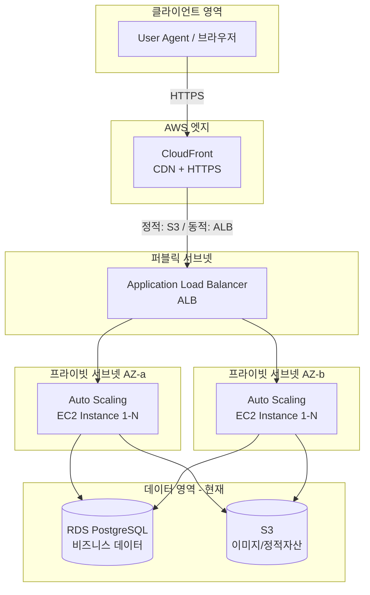
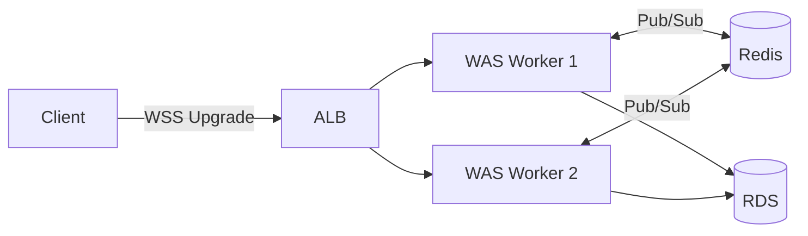
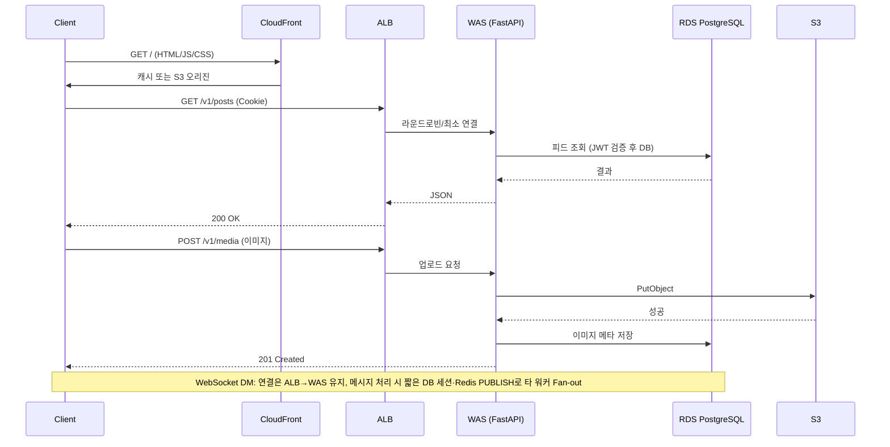
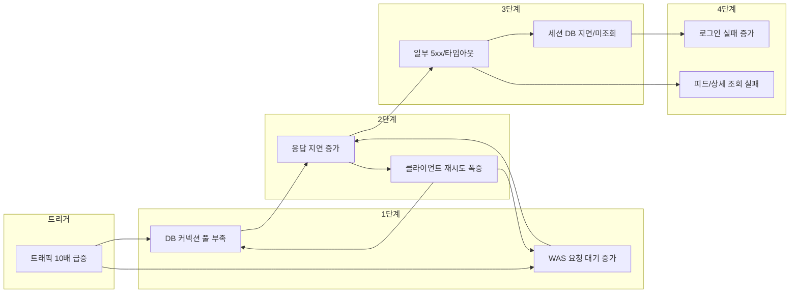

# PuppyTalk 인프라 및 안정성 설계 보고서

> **대상 서비스**: PuppyTalk (반려견 커뮤니티)  
> **초점**: 확장 가능·결함 내성(Fault-tolerant) 인프라, 장애 복구 및 고가용성(HA)  
> **기준**: 백엔드/프론트엔드 실제 코드·설정을 반영한 현재 구현 + 확장 시 권장 사항을 구분해 기술함.  
> **관계**: 애플리케이션 구조(폴더 트리·도메인·엔드포인트·미들웨어 상세)는 README·architecture.md에 있으며, 본 문서는 **인프라·안정성·장애 시나리오·고가용성**에 초점을 둔다.

**관련 문서**

- [README](../README.md)
- [architecture.md](architecture.md)
- [PuppyTalk Infra](https://github.com/kyjness/2-kyjness-community-infra) — Docker/EC2/K8s 배포 정의 (별도 레포)

---

## 목차

1. [시스템 아키텍처 설계 (AWS 기반)](#1-시스템-아키텍처-설계-aws-기반)
2. [예상 트래픽 기반 장애 시나리오 분석](#2-예상-트래픽-기반-장애-시나리오-분석)
3. [고가용성(HA) 및 장애 복구 전략](#3-고가용성ha-및-장애-복구-전략)
4. [운영 단계 안정성·복원력 조치](#4-운영-단계-안정성복원력-조치)
5. [한계·가정 및 목표 아키텍처 (Target Architecture)](#5-한계가정-및-목표-아키텍처-target-architecture)

---

## 1. 시스템 아키텍처 설계 (AWS 기반)

### 1.1 기술 스택

| 구분             | 기술                                                     | 비고                                                                                  |
| -------------- | ------------------------------------------------------ | ----------------------------------------------------------------------------------- |
| **언어·패키지**     | Python 3.11+, uv                                       | `pyproject.toml` (PEP 621), `uv.lock`; 의존성·optional `dev`, Poe 태스크                        |
| **클라이언트**      | React 19, Vite 8, Tailwind CSS 4, TypeScript           | SPA (`src/`), `src/config.js`·환경변수 `VITE_API_BASE_URL`로 API 베이스 URL 설정 (기본 `/api/v1`) |
| **WAS**        | FastAPI, Uvicorn(개발) / Gunicorn + Uvicorn worker(프로덕션) | `Dockerfile`: `-w 4`, `UvicornWorker`; `app/main.py` 진입                             |
| **DB**         | PostgreSQL (psycopg 비동기)                             | `app/db/engine.py`, SQLAlchemy 2.x AsyncSession, Alembic; RDS 배포 시 동일 스택              |
| **ORM·마이그레이션** | SQLAlchemy 2.x, Alembic                                | 루트 `migrations/` (`env.py`, `versions/`); `alembic.ini`의 `script_location=migrations`          |
| **캐시/세션**      | **현재** JWT + Redis(Refresh Token·Rate Limit) / 세션 테이블 없음     | README·`.env.example`: `REDIS_URL` 설정 시 Redis; `pyproject.toml`에 redis 의존성 있음 |
| **스토리지**       | 로컬 파일 / S3 (boto3)                                     | `app/core/config.py`: `STORAGE_BACKEND=local` 또는 `s3`; `app/core/storage.py`에서 분기      |
| **검증·암호화**     | Pydantic v2, bcrypt(비밀번호)                              | 요청·응답 DTO 검증; `app/core/security.py`                                                |
| **외부 연동**      | 동일 백엔드 REST API, S3 API                                | 프론트는 `src/api/client.js`(axios)로 `baseURL`·`withCredentials: true` 설정, 쿠키 기반 인증    |

### 1.2 전체 구성도 (Mermaid)

### 1.2.1 실시간 경로: WebSocket(WSS) · Redis Pub/Sub · Stateless Scale-out

REST 트래픽과 별도로, **DM 채팅**은 브라우저가 `wss://`(TLS)로 **WebSocket**을 업그레이드해 **장시간 연결**을 유지한다. WAS 프로세스(Gunicorn **Worker**)마다 메모리가 분리되므로, **한 사용자의 소켓이 붙은 인스턴스**와 **메시지를 저장·발행하는 요청이 처리된 인스턴스**가 다를 수 있다. 이 간극을 메우기 위해 **Redis Pub/Sub**으로 채널(`puppytalk:channel:chat:dm` 등)에 **Fan-out**하여, 모든 워커가 메시지를 구독한 뒤 **로컬 `ConnectionManager`**만 해당 사용자 소켓으로 push한다. 이로써 **Sticky Session 없이도 Scale-out**이 가능한 **Stateless WAS** 패턴을 유지한다([architecture.md](architecture.md) §14 참고).

**ALB·WebSocket 실무 고려**

| 항목 | Impact |
|------|--------|
| **Idle timeout** | ALB 기본 **유휴 타임아웃** 동안 송수신이 없으면 연결 종료 가능. 채팅처럼 **조용한 소켓**은 끊길 수 있으므로, 운영에서 **타임아웃 상향**(예: 수백 초~3600초) 또는 **클라이언트 keepalive/ping** 권장. |
| **동일 타겟 그룹** | HTTP와 WebSocket을 **동일 WAS 타겟**으로 처리 가능. `Connection: Upgrade` 후 **단일 TCP 세션** 장시간 유지. |
| **TLS** | `wss://`는 ACM 인증서로 ALB에서 종단 간 암호화. |

### 1.2.2 짧은 DB 트랜잭션과 Connection Pool 방어

WebSocket은 **연결 자체**는 장시간 열려 있으나, 애플리케이션은 **메시지 처리 시에만** `AsyncSessionLocal()` 등으로 세션을 열고 `ChatService`에서 **짧은 트랜잭션**만 수행한 뒤 즉시 반환한다. **소켓 1개가 RDS 커넥션 1개를 점유하지 않도록** 설계하여, WebSocket 동시 접속 폭주가 곧바로 **Connection Pool 고갈**로 이어지지 않도록 한다(인프라는 여전히 **풀 크기 × Worker 수 × 인스턴스 수 ≤ RDS `max_connections`** 로 상한을 맞춰야 함).

### 1.3 서비스 간 흐름 및 컴포넌트 역할

| 단계     | 컴포넌트                         | 역할                                                     | 비고                        |
| ------ | ---------------------------- | ------------------------------------------------------ | ------------------------- |
| 1      | **User Agent**               | SPA 로드, API 호출, 쿠키(세션) 유지                              | -                         |
| 2      | **CloudFront**               | HTTPS 종료, 정적 자산(JS/CSS/이미지) 캐시, DDoS 완화, ALB로 동적 요청 전달 | -                         |
| 3      | **ALB**                      | Multi-AZ 트래픽 분산, 헬스체크, SSL/TLS, 타겟 그룹(EC2) 라우팅         | -                         |
| 4      | **Auto Scaling Group (WAS)** | Gunicorn+Uvicorn 실행, CPU/요청 수 기반 스케일 아웃, Multi-AZ 배치   | -                         |
| 5      | **RDS PostgreSQL**           | 쓰기·읽기. (확장 시 Multi-AZ·Read Replica 분리)                     | **현재** 단일 DB로 비즈니스 데이터 |
| 6      | **S3**                       | 업로드 이미지, 정적 웹 자산(선택), 버전·수명 주기로 백업                     | -                         |
| (확장 시) | **RDS Read Replica**         | 읽기 부하 분산(피드·조회)                                        | 현재 미사용                    |
| **Redis (ElastiCache 권장)** | Refresh·Rate Limit·`jti` 블랙리스트·알림 Pub/Sub·**DM 채팅 Fan-out** | `REDIS_URL` 설정 시 사용. **Critical Path** — Multi-AZ·복제 그룹 권장. 미설정 시 일부 기능 Fail-open |

### 1.4 요청 흐름 (단계별)

- **도메인**: `app/domain` 및 `app` 하위 — auth, users, media, posts, comments, likes, dogs, reports, admin. 각각 router → service → model → schema 4계층 패턴.
- **주요 API 경로**: `v1_router` prefix `/v1`. 예: `/v1/auth/login`, `/v1/users/me`, `/v1/posts`, `/v1/media/images`, **`/v1/ws/chat`**(WebSocket), **`/v1/chat/*`**(채팅 REST) 등.
- **미들웨어 순서** (LIFO 기준 안→바깥): CORS → security_headers → access_log → GZip → rate_limit → ProxyHeaders → RequestId.  
  - CORS: `allow_credentials=True`로 쿠키 전송.  
  - GZip: 응답 1KB 이상 시 압축(`minimum_size=1024`), 대역폭 절감.  
  - rate_limit: IP당 전역 제한, 로그인은 별도(분당 5회), 회원가입 업로드 별도.  
  - ProxyHeaders: X-Forwarded-For 등 프록시 헤더 신뢰(클라이언트 IP).  
  - RequestId: 요청별 ULID 발급, 응답 헤더 `X-Request-ID`(에러 응답 포함)로 추적.  
  - access_log: 4xx/5xx 시 request_id·Path·Status·소요 시간 로깅.

**인프라 관점 요청 흐름 (단계)**:

1. **Lifespan** — `init_database()`, `init_redis(app)`(Refresh Token·Rate Limit), 미사용 이미지 cleanup 태스크 기동; 종료 시 `close_redis`, `close_database()`.
2. **GET /health** — writer·reader DB 엔진 각각 `SELECT 1`로 ping, 성공 시 200/ 실패 시 503 (ALB 헬스체크용).
3. **미들웨어** — 위 순서대로 통과.
4. **라우터 매칭** — `/v1/`* → 해당 도메인 router.
5. **의존성** — `get_master_db` / `get_slave_db`(AsyncSession), `get_current_user`(JWT·Redis `jti` 블랙리스트), 작성자 검증 등.
6. **핸들러 → Service → Model** — DB/스토리지 접근 후 응답.

아래 시퀀스 다이어그램은 클라이언트부터 DB·S3까지의 흐름을 요약한다.

### 1.5 현재 코드·설정 기준 구현 상태

아래는 **실제 코드·설정 파일**을 기준으로 정리한 현재 구현 상태이다. 배포/인프라 문서와 함께 보면 운영 시 점검 항목으로 활용할 수 있다.  

#### 백엔드 (2-kyjness-community-be)

| 항목             | 구현 위치                                | 현재 값·동작                                                                                                                                                                                                                          |
| -------------- | ------------------------------------ | -------------------------------------------------------------------------------------------------------------------------------------------------------------------------------------------------------------------------------- |
| **진입점·라우팅**    | `app/main.py`                        | FastAPI 앱, `lifespan`에서 DB·Redis 초기화, 미사용 이미지 cleanup 태스크, `/health`·`/`·`/upload` 정적, `app.api.v1`의 `v1_router` include                                                                                                          |
| **헬스체크**       | `app/main.py` L114–134               | `GET /health` → `check_database()`(writer·reader 엔진 각각 검사). 성공 시 200 + `{ "code", "data": { "status": "ok", "database": "connected" } }`, 실패 시 **503** + `data.status: degraded`, `database: disconnected`. ALB 타겟 그룹 헬스체크 경로로 사용 가능 |
| **DB 연결·풀**    | `app/db/engine.py`                   | `create_async_engine`에 `pool_size=settings.DB_POOL_SIZE`(기본 20), `max_overflow`, `pool_recycle=3600`, `pool_pre_ping=True`, `connect_timeout=settings.DB_PING_TIMEOUT`(기본 1초). 워커 4개 시 인스턴스당 최대 80 커넥션(20×4) 수준으로 RDS `max_connections` 내 조정 필요 |
| **DB 상태 확인**   | `app/db/connection.py`               | `check_database()`: writer_engine·reader_engine 각각 `SELECT 1`로 연결 검사. `init_database()` 실패 시에도 앱은 기동하며, 요청 시점에 재시도됨(`main.py` 로그 메시지)                                                                                           |
| **세션**         | JWT + Redis (Refresh Token)             | 세션 테이블 없음. `SIGNUP_IMAGE_CLEANUP_INTERVAL`은 회원가입 임시 이미지 TTL 정리용(`app/core/cleanup.py`).                                                                      |
| **Rate Limit** | `app/core/middleware/rate_limit.py`  | **`REDIS_URL` 설정 시**: Redis **Fixed Window** + **Lua** 원자 연산. Redis 장애 시 Fail-open(대부분 경로 무제한), 로그인·회원가입 업로드 등은 **인메모리 Fallback**. `/health` 제외. |
| **미들웨어 순서**    | `app/main.py`                         | CORS → `security_headers` → `access_log` → `GZipMiddleware`(minimum_size=1024) → `RateLimitMiddleware` → `ProxyHeadersMiddleware` → `RequestIdMiddleware`. LIFO이므로 요청 시 RequestId가 맨 먼저 실행. |
| **WebSocket·DM** | `app/api/v1/chat/ws.py`, `pubsub.py` | 메시지마다 **짧은** `AsyncSessionLocal` + `ChatService`; Redis **PUBLISH**로 **Fan-out**. Lifespan에서 **채팅 Pub/Sub 구독** 태스크(`run_chat_subscribe_listener`). |
| **전역 예외 처리**   | `app/core/exception_handlers.py`      | 모든 에러 응답을 `{ code, message, data }` 형태로 통일. 500 발생 시 클라이언트에는 스택/쿼리 노출 없이 마스킹, 서버 로그에는 `request_id` 포함해 추적 가능. 응답 헤더 `X-Request-ID`는 에러 시에도 포함. |
| **설정**         | `app/core/config.py`, `.env.example` | 프로젝트 루트 `.env` 로드(로컬). 배포 시 infra의 `.env` 또는 컨테이너 환경 변수로 주입. CORS, Rate Limit, S3/로컬 스토리지, `BE_API_URL` 등 환경 변수로 제어.                                                                                                                        |
| **프로덕션 실행**    | `Dockerfile`                         | Python 3.11-slim, Gunicorn `-w 4` `-k uvicorn.workers.UvicornWorker`, `-b 0.0.0.0:8000`. `ARG PORT=8000`은 EXPOSE용; 바인딩 포트 변경 시 CMD 수정·재빌드 필요. TrustedHostMiddleware는 `TRUSTED_HOSTS != ["*"]`일 때만 등록.                              |

#### 프론트엔드 (2-kyjness-community-fe)

| 항목              | 구현 위치               | 현재 값·동작                                                                                                                                             |
| --------------- | ------------------- | --------------------------------------------------------------------------------------------------------------------------------------------------- |
| **API 베이스 URL** | `src/config.js`     | `VITE_API_BASE_URL` 환경변수 또는 기본값 `'/api/v1'`. 배포 시 백엔드 URL과 맞춰 설정 (프록시/Vite env 참고)                                                                  |
| **API 호출**      | `src/api/client.js` | axios 인스턴스 `baseURL`·`withCredentials: true`. `api.get/post/patch/delete/postFormData` 등. 401 시 `setUnauthorizedHandler`로 로그인 페이지 이동 등 처리          |
| **라우팅·페이지**     | `src/` (React Router) | `Router.jsx`, 페이지 컴포넌트; 게시글·댓글·프로필·미디어·관리자 등은 `/v1/`* API 사용. 상태 관리 Zustand                                                                          |

#### 현재 구성과 확장 시 차이

| 구분         | 현재 구현        | 확장 시 권장 (본 문서 1.2~~1.4, 3~~4절)                  |
| ---------- | ------------ | ----------------------------------------------- |
| 세션         | JWT + Redis     | 이미 Redis 사용(Refresh·Rate Limit). 세션 테이블 없음           |
| Rate Limit | Redis Lua + Fail-open / 치명 경로 인메모리 Fallback | 프로덕션에서는 **ElastiCache** 등으로 **분산 한도** 유지 권장 |
| DB 풀       | `settings.DB_POOL_SIZE`(기본 20) | RDS `max_connections`·워커 수에 맞춰 조정. 확장 시 Read Replica 분리 권장 |
| 헬스체크       | DB(writer·reader)만 검사 | Redis 사용 시 `/health`에서 Redis 연결도 검사해 ALB와 일치시키기 |

---

## 2. 예상 트래픽 기반 장애 시나리오 분석

### 2.1 상황 가정

| 항목          | 평소          | 이벤트 시 (가정) |
| ----------- | ----------- | ---------- |
| 동시 접속       | ~500        | **5,000+** |
| RPS (초당 요청) | ~100        | **1,000+** |
| **WebSocket 동시 연결 (DM)** | 저부하 | **급증 가능** (이벤트·바이럴) |
| 피크 시간대      | 20:00–22:00 | 이벤트 기간 전체  |

**시나리오**: 이벤트로 인해 **평소 대비 10배 이상** 트래픽 급증.

### 2.2 병목 지점(Bottleneck) 분석

| 병목 지점             | 원인                               | 증상                             | 영향도       | 현재 코드 기준                                                                                   |
| ----------------- | -------------------------------- | ------------------------------ | --------- | ------------------------------------------------------------------------------------------ |
| **DB 커넥션 풀 고갈**   | SQLAlchemy 풀 크기 고정, 장시간 쿼리·락 대기  | `Too many connections`, 5xx 증가 | **높음**    | `engine.py`: `pool_size=settings.DB_POOL_SIZE`(기본 20). 워커 4개면 인스턴스당 최대 80 커넥션 수준. RDS `max_connections` 내로 조정 필요 |
| **WAS 스레드/워커 고갈** | Gunicorn worker 수 제한, 블로킹 I/O 대기 | 요청 큐잉·타임아웃, ALB 5xx            | **높음**    | `Dockerfile`: **-w 4** 고정. 스케일 아웃 또는 워커 수 증가 필요                                            |
| **PostgreSQL 쓰기 한계** | Single Primary, 인덱스 부족·풀스캔       | 쓰기 지연, 복제 지연(Lag) 증가           | **중간**    | 단일 DB 구성 시 쓰기 집중                                                                           |
| **네트워크 대역폭**      | EC2 인스턴스 타입별 제한                  | 패킷 드롭, 지연 증가                   | 중간        | -                                                                                          |
| **Rate Limit 분산** | Redis 미사용·장애 시 워커별 Fallback       | IP당 한도가 인스턴스마다 달라질 수 있음  | **중간**    | **`REDIS_URL` + ElastiCache**로 **전역 Fixed Window** 권장. |
| **웹소켓 동시 접속 폭주로 인한 DB 커넥션 풀 고갈 위험** | 소켓 수 ≫ 풀 상한 가정 시 오인 가능 | `Too many connections`, API 전반 지연 | **높음** | **짧은 DB 트랜잭션**: 메시지 처리 시에만 `AsyncSessionLocal`로 세션을 열고 즉시 반환 — **장기 점유 차단**. 풀·`max_connections`는 여전히 운영 산정 필요. |
| **특정 WAS 인스턴스 다운 시 채팅 유실 위험** | 해당 노드의 WebSocket 끊김 | 일시 미수신 | **중간**    | **Redis Pub/Sub Fan-out**: 메시지는 **다른 워커** 구독자가 수신자 소켓이 있는 노드로 전달. 재연결·오프라인 정책은 클라이언트·제품 측과 병행. |
| **Redis 연결 수·SPOF**    | maxclients, 단일 노드         | Refresh·Rate Limit·DM·알림 동시 악화          | **높음**    | **ElastiCache Multi-AZ** 또는 **Sentinel** 등 **HA** 권장. `REDIS_URL` 미설정 시 기능 축소·Fail-open. |
| **ALB 연결/처리량**    | 연결 수·새 연결 생성률 제한                 | 503, Latency 상승                | 낮음(상한 높음) | -                                                                                          |

### 2.3 장애 전파(Cascading Failure) 분석

| 전파 단계   | 현상                              | 결과              |
| ------- | ------------------------------- | --------------- |
| **1단계** | DB 풀·WAS 워커 한도 도달               | 새 요청이 대기열에 쌓임   |
| **2단계** | 응답 지연 증가 → 클라이언트·ALB 재시도 증가     | 동일 자원에 부하 가중    |
| **3단계** | 타임아웃·5xx 발생, DB/Redis 조회 지연·실패 | 로그인 불가·일부 기능 오류 |
| **4단계** | 사용자 이탈·문의 증가, 일부 API 완전 불통      | 서비스 신뢰도 하락      |

**핵심**: 한 리소스(DB/WAS)의 한도 돌파가 재시도와 결합되어 **전체 시스템**으로 빠르게 퍼져 나감.

---

## 3. 고가용성(HA) 및 장애 복구 전략

### 3.1 Multi-AZ 분산 배치 전략

| 리소스              | 배치                                    | 효과                          |
| ---------------- | ------------------------------------- | --------------------------- |
| **ALB**          | Multi-AZ 기본 동작                        | AZ 장애 시에도 로드밸런싱 유지          |
| **EC2 (WAS)**    | 최소 2 AZ, ASG에서 AZ 균등 분배               | 단일 AZ 장애 시 나머지 AZ에서 서비스     |
| **RDS PostgreSQL** | Multi-AZ 배포 (Primary + Standby)     | DB 장애 시 자동 페일오버, 데이터 유실 최소화 |
| **Read Replica** | 다른 AZ (예: Primary AZ-a, Replica AZ-b) | 읽기 분산 + AZ 격리               |
| **ElastiCache**  | 복제 그룹 Multi-AZ                        | 프라이머리 장애 시 리드 레플리카 승격       |

**효과**: 단일 가용 영역(AZ) 장애만으로 서비스 중단이 발생하지 않도록 설계.

### 3.2 ALB와 Auto Scaling 그룹 연동 상세

| 설정 항목                 | 권장값                                        | 설명                                                                                                          |
| --------------------- | ------------------------------------------ | ----------------------------------------------------------------------------------------------------------- |
| **ALB 타겟 그룹**         | HTTP:80 또는 HTTPS:443                       | 헬스체크 경로: `/health`. **현재 구현**: writer·reader DB 엔진 연결 성공 시 200, 실패 시 503 반환(`app/main.py`) → ALB가 503 인스턴스를 Unhealthy로 제외 가능 |
| **헬스체크**              | 간격 30초, 임계값 2회 실패 Unhealthy, 2회 성공 Healthy | 짧은 일시 장애에 덜 민감                                                                                              |
| **Deregistration 지연** | 30초                                        | 인스턴스 종료 시 진행 중 요청 완료 유예                                                                                     |
| **ASG 최소/최대/희망**      | 2 / 10 / 2 (평소)                            | 트래픽 증가 시 10대까지 스케일 아웃                                                                                       |
| **스케일 아웃 정책**         | CPU ≥ 70% 또는 ALB 요청 수/인스턴스 ≥ 1000          | 트래픽 급증에 대응                                                                                                  |
| **스케일 인 정책**          | CPU < 30% 지속 5분                            | 비용과 안정성 균형, 과도한 스케일 인 방지                                                                                    |

**연동 흐름**: ALB가 Unhealthy 인스턴스로 트래픽을 주지 않음 → ASG가 부하 지표에 따라 인스턴스 증설 → 새 인스턴스가 Healthy 되면 ALB가 자동으로 트래픽 분산.

### 3.3 데이터 이중화 및 백업

| 항목               | 방식                                  | 목적                     |
| ---------------- | ----------------------------------- | ---------------------- |
| **RDS Multi-AZ** | 동기 복제 (Primary–Standby)             | 자동 페일오버, RPO 최소화       |
| **Read Replica** | 비동기 복제 (읽기 전용)                      | 읽기 부하 분산, 분석/리포트 부하 격리 |
| **RDS 스냅샷**      | 자동 백업(1일 1회, 보존 7일), 수동 스냅샷(배포 전 등) | 특정 시점 복구(PITR) 및 DR    |
| **S3**           | 버전 관리 활성화, 크로스 리전 복제(DR 시)          | 객체 단위 복구, 리전 장애 대비     |
| **Redis**        | AOF + RDB 또는 ElastiCache 백업         | 캐시 재구성, 세션은 DB/다중화로 보완 |

### 3.4 RDS 성능: UUID v7·B-Tree·디스크 I/O

엔티티 PK에 **UUID v7**(시간 순서가 드러나는 UUID)을 사용하면, 대량 **INSERT** 시 클러스터형 PK 인덱스에서 **무작위 UUID(v4 등) 대비 키 분포가 순차에 가깝게** 쌓인다. **Impact**: RDS(PostgreSQL)에서 **Page Split** 빈도와 인덱스 **단편화**를 완화하고, 피크 시 **디스크 I/O·쓰기 지연·복제 Lag** 완화에 기여할 수 있다(워크로드·보조 인덱스·`pg_trgm` 등과 함께 튜닝). 세부는 [architecture.md](architecture.md) 식별자 절과 README 기술 스택을 참고한다.

### 3.5 재해 복구(DR) 지표 제안

| 지표                                 | 목표값        | 설명                                                                             |
| ---------------------------------- | ---------- | ------------------------------------------------------------------------------ |
| **RTO (Recovery Time Objective)**  | **1시간 이내** | 장애 인지 후 서비스가 정상화되기까지 허용 시간. Multi-AZ·자동 페일오버로 단일 AZ/단일 노드 장애는 수 분 이내 목표.       |
| **RPO (Recovery Point Objective)** | **5분 이내**  | 허용 가능한 데이터 손실 구간. RDS Multi-AZ 동기 복제로 보통 수 초 이내, 스냅샷 간격·복제 지연을 고려해 5분으로 여유 두기. |

**정리**:  

- **RTO 1시간**: 대규모 장애 시 수동 개입(리전 DR, 배포 롤백 등)을 가정한 목표.  
- **RPO 5분**: 자동 백업·복제만으로도 대부분 1분 미만이지만, 운영 실수·논리적 오류 대비해 5분으로 설정.

---

## 4. 운영 단계 안정성·복원력 조치

### 4.1 Circuit Breaker 도입

| 구간              | 적용 위치                      | 동작                                      |
| --------------- | -------------------------- | --------------------------------------- |
| **WAS → RDS**   | SQLAlchemy 풀 또는 애플리케이션 레이어 | 연속 실패 N회 시 일정 시간 DB 호출 중단 → 풀/스레드 고갈 방지 |
| **WAS → Redis** | 캐시 클라이언트 래퍼                | Redis 장애 시 캐시 미사용(폴백 to DB), 재시도 제한     |
| **WAS → S3**    | 업로드/다운로드 래퍼                | 타임아웃·연속 실패 시 업로드 실패만 반환, WAS 블로킹 최소화    |

**효과**: 하위 리소스 장애가 WAS 전체를 붕괴시키지 않도록 차단하고, 자동 복구 시도(주기적 재연결)로 복구 가능하게 함.

### 4.2 Throttling(속도 제한) 정책

| 대상                      | 권장 정책                             | 목적                                                                                                         |
| ----------------------- | --------------------------------- | ---------------------------------------------------------------------------------------------------------- |
| **ALB / WAF**           | IP당 초당 요청 수 제한(예: 100 req/s)      | 비정상 트래픽·봇 완화                                                                                               |
| **로그인 API**             | IP당 분당 5회 (기존 설계 유지)              | 브루트포스 방지. **현재 구현**: `rate_limit.py` + `check_login_rate_limit()` (auth 라우터에서 사용), `LOGIN_RATE_LIMIT_`* 설정 |
| **쓰기 API (게시글/댓글/업로드)** | 사용자당 분당 N회                        | 스팸·오용 방지, DB 쓰기 부하 완화                                                                                      |
| **WAS 미들웨어**            | 전역 요청 수 제한(예: worker당 동시 처리 수 상한) | 스레드 고갈 방지                                                                                                  |

Throttling 시 **429 Too Many Requests** + `Retry-After` 헤더로 클라이언트 재시도 주기 조절 권장.

### 4.3 모니터링·알람 권장

| 항목                 | 알람 조건                             | 조치 예시                           |
| ------------------ | --------------------------------- | ------------------------------- |
| **ALB 5xx 비율**     | 5분간 ≥ 5%                          | WAS/DB 로그·헬스체크 확인, 스케일 아웃 검토    |
| **RDS CPU / 연결 수** | CPU ≥ 80%, Connections ≥ max의 80% | 슬로우 쿼리·풀 설정 점검, Read Replica 활용 |
| **RDS 복제 지연**      | Replica Lag ≥ 10초                 | 쓰기 부하·인덱스 점검                    |
| **ASG**            | 의도치 않은 스케일 아웃(예: 10대 도달)          | 트래픽 원인 분석, 비용·한도 검토             |
| **ElastiCache**    | 메모리 사용률 ≥ 80%, Eviction 급증        | 캐시 키 정책·용량 증설                   |

CloudWatch (및 RDS/ALB 메트릭) + SNS로 온콜 담당자에게 알림 설정 권장.

### 4.4 배포·변경 시 안정성

- **블루/그린 또는 카나리**: ASG 기반으로 새 AMI/버전 배포 후, ALB 타겟 그룹으로 트래픽을 점진적 전환해 롤백 시간 단축.
- **DB 마이그레이션**: Alembic 마이그레이션은 **비파괴적** 변경 우선 적용, 필요 시 단계별 배포(스키마 → 코드).
- **헬스체크 일치**: ALB 헬스체크 경로(`/health`)는 **현재 DB(writer·reader 엔진)만 검사**함. Redis 사용 시 `/health`에서 Redis 연결도 검사해, 장애 인스턴스가 트래픽에서 제외되게 유지할 것.

### 4.5 병목 방어 및 안정성: WebSocket × Connection Pool

| 구분 | 인프라 관점 |
|------|----------------|
| **문제** | WebSocket은 **연결**을 오래 유지해, “동시 소켓 수 = 동시 DB 작업 수”로 오인하기 쉽다. 실제로는 **풀·RDS `max_connections`** 한도에 걸리면 REST·WS 전반이 지연된다. |
| **현재 설계** | DM 처리 시 **메시지당 짧은 `AsyncSession`/`async with db.begin()`** 만 사용해 **Connection Pool 점유 시간**을 최소화한다. **Fan-out**은 **Redis Pub/Sub**이 담당하고, WAS는 **Stateless**에 가깝게 Scale-out한다. |
| **운영** | `(pool_size + max_overflow) × Worker 수 × 태스크 수`가 RDS 상한을 넘지 않게 조정. WebSocket 급증 시 **ASG Scale-out**과 **RDS/Read 경로**를 함께 본다. |

---

## 요약

| 영역           | 핵심 조치                                                                                                                         |
| ------------ | ----------------------------------------------------------------------------------------------------------------------------- |
| **아키텍처**     | CloudFront → ALB → **Stateless WAS(Scale-out)** → RDS + S3. **WSS** + **Redis Pub/Sub Fan-out**(DM). Rate Limit: **Redis Lua** + Fail-open. |
| **실시간·병목 방어** | **짧은 DB 트랜잭션**으로 Pool 고갈 완화, **UUID v7**로 RDS INSERT·I/O 완화 기대, **Redis HA**로 Critical Path 보호. |
| **장애 전파 억제** | Circuit Breaker, Throttling, ALB **Idle timeout**·WS keepalive 검토 |
| **고가용성**     | Multi-AZ, ALB–ASG, RDS Multi-AZ + Replica, **ElastiCache Multi-AZ** 권장 |
| **DR**       | RTO 1시간, RPO 5분 목표(참고) |
| **목표 아키텍처** | §5 — AI·Quota·하이브리드 라우팅 등 **향후 고비용 연산**을 흡수할 확장면(큐·Presigned URL·Redis 정책) |

이 문서는 **실제 코드·설정(1.5절)**을 반영했으며, 실제 트래픽·비용에 맞춰 수치(인스턴스 수, 풀 크기, 알람 임계값)를 조정해 사용하는 것을 권장합니다.

---

## 5. 한계·가정 및 목표 아키텍처 (Target Architecture)

### 5.1 한계·가정

- **트래픽 가정**: 본 문서의 장애 시나리오·병목 분석은 평소 동시 접속 약 500명, 초당 요청 약 100건, 이벤트 시 10배 급증(동시 5,000명·RPS 1,000 이상)을 가정한 수치이다. 실제 서비스 규모에 따라 조정할 것.
- **인프라 배포**: Docker Compose, EC2, Kubernetes 등 실제 정의는 [PuppyTalk Infra](https://github.com/kyjness/2-kyjness-community-infra) 레포가 단일 진실 공급원이다. 본 보고서의 구성도·권장값은 해당 인프라에 적용할 설계 기준이다.
- **기능 확장(추후 도입 시)**  
  - 알림: 내 게시글에 댓글 등록 시 알림 목록 제공.  
  - 비밀번호 찾기·이메일 인증: 이메일 재설정 링크 발송, 가입 시 이메일 인증 — 도입 시 auth·users 도메인 확장 예정.

### 5.2 현재 구현과 목표 아키텍처의 연결 (Why this foundation)

아래 **향후 확장 계획**([README](../README.md) 「확장 전략」「구독 및 비즈니스 운영」과 동일 계열)은 아직 전부 프로덕션에 구현된 것이 아니지만, **인프라 설계의 목표점(Target)** 으로 둔다.  
**현재**의 **Stateless WAS + Redis(Pub/Sub·Rate Limit·토큰 상태) + 짧은 DB 트랜잭션 + UUID v7** 조합은, 향후 **고비용 연산·트래픽 스파이크**가 더해져도 **수평 확장·큐 분리·스토리지 오프로드**를 붙이기 쉬운 바닥을 제공한다.

### 5.3 기능·데이터 계층 (README 확장 전략 — 기능)

- **데이터 무결성(페이로드 계약)**: 메시지 큐·외부 브로커를 붙일 때도 Redis 캐시와 같이 Pydantic V2 **`TypeAdapter` / `validate_json`** 으로 메시지 형태를 고정하는 패턴을 권장. (현재 코드베이스는 Redis 캐시·멱등성 응답·WS 페이로드에 적용.)
- **비동기 태스크**: Celery 기반 대용량 비동기 작업 처리.
- **검색 레이어 확장**: PostgreSQL 단일 스토어를 유지한 채 **`pg_trgm` GIN** 과 쿼리·인덱스 튜닝. AI 모델 연동 시 같은 DB에 **`pgvector`** 를 두어 임베딩 기반 **벡터 검색**을 붙이고, 기존 GIN 경로와 **하이브리드 검색**으로 키워드 일치와 벡터 유사도를 동시에 활용.

### 5.4 AI·추천 (README 확장 전략 — AI)

- **RAG 기반 ‘우리 아이 건강 척척박사’**: 커뮤니티 지식 베이스와 LLM을 결합한 실시간 스트리밍(StreamingResponse) 챗봇. Vercel AI SDK 등과 Context Window 최적화.
- **하이브리드 추천 시스템 (GraphQL Hybrid)**  
  - 지능형 피드: 행동 로그·클릭 기반 무한 스크롤 추천.  
  - 데이터 최적화: 추천·복합 쿼리 증가 시 GraphQL 부분 도입 검토.  
  - 동네 친구 제안: 위치·견종 유사도 결합.

**인프라 함의**: 추론·임베딩 워크로드는 **API 워커와 분리**된 **전용 Auto Scaling 그룹·GPU 풀·큐(SQS 등)** 로 격리하는 것이 일반적이며, 본 문서 §1의 **ALB·ASG·RDS** 확장면과 합치된다.

### 5.5 인프라 확장 (README 확장 전략 — 인프라)

- **성능 가속**: 메시지 큐(**SQS/Kafka**)로 시스템 간 결합도 완화.
- **Presigned URL 기반 스토리지**: S3 Presigned URL로 클라이언트 직접 업로드·다운로드, 서버는 메타데이터만 — **WAS 대역폭·CPU** 절약.

### 5.6 구독 및 비즈니스 운영 (README — 목표 인프라)

- **AI 운영 비용 최적화**  
  - **Tiered Quota 관리**: Redis 기반 실시간 사용량 제한(Rate Limiting)으로 사용자 등급별(Basic/Premium) **AI 호출 횟수**를 차등 제어하고 LLM **Token Cost** 리스크를 최소화.  
  - **하이브리드 모델 라우팅**: 요청 난이도에 따라 경량 모델과 고성능 모델을 **동적 할당**하는 게이트웨이 인프라.
- **이벤트 기반 결제 및 권한**  
  - Stripe/Toss **Webhook** 비동기 수신 → RBAC·접근성 즉시 반영.  
  - 재시도·**멱등성**으로 결제 정합성 확보.
- **데이터 기반 건강 인사이트**  
  - Celery Beat 배치 리포트, 이상 징후 감지 시 푸시 등 — **워커·스케줄러·푸시 채널**에 대한 별도 용량 계획.

### 5.7 정리

위 목표들은 **Redis를 비용·Quota·Rate Limit의 중앙 허브**로 쓰고, **큐·별도 컴퓨트**로 무거운 연산을 빼는 방향과 맞닿는다. **현재**의 Redis **Critical Path** 고가용성(Multi-AZ)·**짧은 DB 트랜잭션**·**Fan-out**은 그 전 단계에서 이미 **운영 복잡도와 비용 리스크**를 줄이는 기반이 된다.

