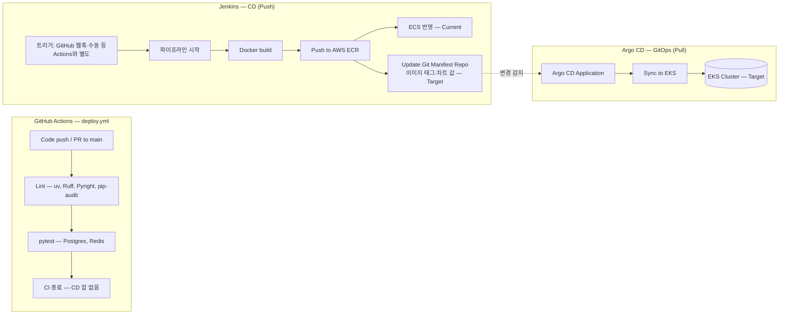

# 쿠버네티스 및 CI/CD 파이프라인 구축 보고서

## [프로젝트 개요 및 설계 배경]

본 보고서는 PuppyTalk 백엔드의 **쿠버네티스 및 CI/CD 구축 결과**를 성과 중심으로 정리한 문서입니다. **제한된 예산·인력** 조건에서 실제로 구축·운영 중인 **Current(ECS 기반 실운영)** 과, **트래픽 급증을 가정한 Target(EKS·GitOps)** 을 동일 문서에서 대비했습니다. Target은 EKS·GitOps·무중단 전환 구성과 `k6` 부하 테스트까지 포함해 정리했습니다.

---

> **문서 성격**: 본 보고서는 PuppyTalk 백엔드 요구사항을 충족하기 위한 **배포·운영 체계**를 성과 중심으로 정리한 것입니다. **프로덕션(Current)** 과 **확장 목표(Target)** 를 혼동하지 않도록 구분해 기술했습니다.
>
> **한눈에 보는 Current vs Target**
>
> | 구분 | 쿠버네티스 사용 여부 | 컴퓨트·CD 요약 |
> |------|---------------------|----------------|
> | **Current (지금 운영)** | **사용하지 않습니다.** 오케스트레이션은 **AWS ECS(Fargate)** 를 채택했습니다. | Jenkins 등으로 **ECR → ECS** 반영. Terraform `ecs.tf` 등은 아래 **「Current — Terraform」** 불릿을 참고해 주시기 바랍니다. |
> | **Target (구축·검증)** | **사용합니다.** **Amazon EKS** 를 전제로 합니다. | **Jenkins → ECR → 매니페스트 Git → Argo CD → EKS** 흐름으로 정리했습니다. 절 3~6·절 1.3의 Deployment·Argo 등은 **이 전제**에서 읽어 주시면 됩니다. |
>
> **초점**
>
> - **CI와 CD의 역할 분리** — GitHub Actions로 품질 게이트를 두었고, **Target(EKS)** 에서는 **Jenkins가 이미지·매니페스트 Git 갱신**, **Argo CD가 클러스터 동기화(GitOps)** 를 담당하도록 설계했습니다.
> - **컨테이너·K8s·관측** — **Target(EKS)** 전환 시 적용할 워크로드·Ingress·HPA·로깅 패턴을 절 3~5에 정리했습니다. **Current(ECS)** 는 동일 애플리케이션을 **태스크/서비스**로 운영하며, K8s 리소스명(`Deployment` 등)은 사용하지 않습니다.
> - **실시간(DM)** — **Target** 기준으로 Stateless **Pod** 와 Redis Pub/Sub를 맞춘 배포·프로브 설계를 서술했습니다. **Current** 는 ECS **태스크** 단위이나, 앱 레벨(Redis Fan-out) 개념은 동일하게 적용했습니다.
>
> **기준 — Current vs Target**
>
> - **Current (프로덕션 컴퓨트)**: 예산과 효율을 고려하여 **ECS Fargate**(태스크·서비스 단위)로 트래픽을 처리하는 구성을 **직접 구축해 운영 중인 환경**입니다. [PuppyTalk Infra](https://github.com/kyjness/2-kyjness-community-infra) Terraform과의 대응은 아래 **「Current — Terraform」** 불릿에 맞춰 기술했습니다.
> - **Target (구축·검증, Validated)**: 단순한 이상향이 아니라, **트래픽 증가·AI 워크로드 등 특정 임계점 도달 시 즉각 전환**할 수 있도록 EKS·GitOps·무중단 전환(Blue/Green)을 포함해 정리했습니다. 절 1의 **Jenkins → ECR → Kubernetes 매니페스트 Git 저장소 갱신 → Argo CD → EKS** 흐름과 절 2~6의 K8s·관측 설계는 **실습·테스트 결과**를 바탕으로 구성했습니다. 기존 ECS 운영과 **상충하지 않는 확장 축**으로 유지하면서, 필요 시 **전환 가능한 경로**를 문서화했습니다.
>
> **Current — Terraform (`2-kyjness-community-infra/terraform` 기준)**
>
> - **`ecs.tf`**: ECS 클러스터·**Fargate** 태스크 정의(백엔드 컨테이너, `aws_ecr_repository.be`의 이미지)·ALB 연동 **서비스** — 프로덕션 WAS 컴퓨트로 반영했습니다.
> - **`ec2_db.tf`**: 단일 EC2에 **PostgreSQL 15**·**Redis 6** (`user_data` 부트스트랩) — 앱 `DB_*`·`REDIS_URL`이 이 인스턴스를 가리키도록 `ecs.tf`와 연결했습니다.
> - **`ecr.tf`**: 백엔드 이미지 저장소(`*-be`).
> - **`jenkins.tf`**: Jenkins 서버(EC2, 퍼블릭 서브넷 등). CD 파이프라인 실행 주체로 두었습니다.
> - **ALB·VPC·CloudFront·미디어 S3** 등은 동일 폴더의 `alb.tf`, `vpc.tf`, `cloudfront.tf`, `media.tf` 등과 연계했습니다.
>
> **저장소 연동 (백엔드 레포)**
>
> - [`.github/workflows/deploy.yml`](../.github/workflows/deploy.yml)은 **CI만** 수행합니다(**lint → test**). 워크플로 상단 주석과 같이 **CD는 이 파일에 포함하지 않았고**, Jenkins/GitHub 연동은 **저장소 웹훅·Jenkins 쪽 설정 등 Actions 밖**에서 구성할 수 있습니다(이 저장소에는 **Jenkins를 curl로 호출하는 잡을 두지 않았습니다**).
> - **Current**에서의 CD는 일반적으로 **Jenkins가 Docker 빌드 → ECR 푸시 → ECS 서비스에 새 이미지 반영** 흐름으로 운영하며, Terraform의 `ecs.tf`·`ecr.tf`와 정합을 맞췄습니다.
> - **Target** 경로에서는 **Jenkins가 이미지 빌드·ECR 푸시 후, Kubernetes 매니페스트 전용 Git 저장소의 이미지 태그(또는 Kustomize/Helm 값)를 갱신**하고, **Argo CD가 그 변경을 Pull하여 EKS에 동기화**하도록 설계했습니다. 상세는 [절 1](#1-cicd-파이프라인-개요) 및 위 **Target** 문단을 참고해 주십시오.
> - 워크플로·env 등에는 **ECS·블루/그린** 관련 **명명 잔재**가 남아 있을 수 있습니다. **절 2~5**는 Target 전환 후 **동일 애플리케이션을 EKS에서 운영할 때**의 컨테이너·K8s·관측을 담았습니다.
> - 인프라 단일 공급원은 [PuppyTalk Infra](https://github.com/kyjness/2-kyjness-community-infra) Terraform으로 두었습니다.

**관련 문서**

- [README](https://github.com/kyjness/2-kyjness-community-be/blob/main/README.md)
- [architecture.md](https://github.com/kyjness/2-kyjness-community-be/blob/main/docs/architecture.md)
- [infrastructure-reliability-design.md](https://github.com/kyjness/2-kyjness-community-be/blob/main/docs/infrastructure-reliability-design.md)

---

## 목차

**절 1**에서는 **Current(ECS, 비-K8s)** 와 **Target(EKS, K8s)** 를 같은 흐름도에서 **나란히** 보여 드립니다. **절 2**는 이미지 빌드·환경 변수 등 **양쪽에 공통으로 해당하는 내용**에 가깝고, **절 3~6**은 **Target(EKS) 전용** 설계로 읽어 주시면 됩니다.

1. [CI/CD 파이프라인 개요](#1-cicd-파이프라인-개요) — Current / Target 병기
2. [컨테이너 전략 (Docker)](#2-컨테이너-전략-docker) — 공통(이미지)·Target 시 K8s 연동 힌트
3. [쿠버네티스 아키텍처 설계](#3-쿠버네티스-아키텍처-설계) — **Target 전용**
4. [실시간 통신을 위한 K8s 최적화](#4-실시간-통신을-위한-k8s-최적화) — **Target 전용**
5. [모니터링 및 로깅](#5-모니터링-및-로깅) — **Target 전용** (관측 개념은 Current에도 이식 가능)
6. [확장 전략 (Future — AI)](#6-확장-전략-future--ai) — **Target 전용**
7. [K8s 인프라 구축 및 배포 트러블슈팅](#7-k8s-인프라-구축-및-배포-트러블슈팅) — 문제·원인·해결

---

## 1. CI/CD 파이프라인 개요

### 1.1 실제 파이프라인 (GitHub Actions + Jenkins → ECR → Git Manifest → Argo CD → EKS)

프로덕션이 ECS(**Current**)인 가정에서, **Target**인 EKS(및 블루/그린에 준하는 무중단 전환)로 옮길 때의 **CD 분업**을 아래와 같이 요약했습니다. **Current**는 Jenkins가 **ECR + ECS** 까지 담당하는 기존 경로를 유지하면 되고, **Target**에서는 클러스터 반영을 **Argo CD GitOps**로 옮기는 방식으로 정리했습니다.

**역할 분리**

| 구분 | 담당 | 내용 |
|------|------|------|
| **CI** | GitHub Actions | `uv` 기반 정적 검사·`pytest` — **빠르고 결정적인 품질 게이트** |
| **CD — 이미지·선언 갱신 (Push)** | Jenkins | **Docker 빌드 → AWS ECR 푸시 → Kubernetes 매니페스트 Git 저장소에서 이미지 태그(또는 차트/오버레이 값) 갱신** — **Target(EKS)** 경로에서 EKS API에 직접 `kubectl apply` 하지 않도록 했습니다 |
| **CD — 클러스터 동기화 (Pull / GitOps)** | **Argo CD** | 매니페스트 저장소 변경을 **감지(Pull)** 하여 선언된 상태로 **EKS에 Sync** — **단일 진실은 Git** 으로 두었습니다 |
| **CD (Current)** | Jenkins | **ECR 푸시 후 ECS 서비스/태스크 갱신** — Terraform `ecs.tf`·`ecr.tf`와 정합을 맞췄습니다 |

**CI/CD**: 코드 검사부터 배포 자동화까지의 체계입니다. **Target**에서는 **Push(빌드·레지스트리·Git 커밋)** 와 **Pull(Argo CD가 Git을 기준으로 클러스터를 맞춤)** 을 분리해 두었습니다.

**블루/그린(요지)**: 새 버전을 미리 띄워 두고 검증한 뒤, 한 번에 트래픽을 전환해 배포 중단을 최소화하는 방식입니다. **Target**에서는 기본 `Deployment` 롤링 외에 **Argo Rollouts** 로 고급 전략을 쓸 수 있도록 검토 범위에 넣었습니다(아래 [절 1.3](#13-cd-target--jenkins--manifest-git--argo-cd-gitops)).



**다이어그램 읽기**: **Target**에서는 Jenkins가 EKS로 화살표를 직접 보내지 않습니다. **ECR 푸시 후 Git만 갱신**하면, **Argo CD**가 저장소를 Pull하여 **EKS** 와 **선언된 상태**를 맞추는 흐름으로 그렸습니다. **Current** 분기(`ECS_DEP`)만 기존 ECS 배포로 이어집니다.

**명명·잔재 vs 운영 사실**

| 항목 | 내용 |
|------|------|
| **워크플로·IAM 등** | 파일명·env·인프라 레포 일부에 **ECS 블루/그린**과 맞닿은 **명명·변수 잔재**가 남아 있을 수 있습니다. |
| **프로덕션 컴퓨트** | **당장 사용자 트래픽을 받는 것은 ECS(Current)** 입니다. |
| **EKS 경로 (Target)** | **Jenkins + 매니페스트 Git + Argo CD** 로 설계·검증 가능한 GitOps 축을 절 1.3에 정리했습니다. 인프라 레포 Terraform(`2-kyjness-community-infra/terraform/eks.tf`)로 **`puppytalk-eks-seoul` 클러스터**와 Managed Node Group을 구성했습니다. |

### 1.2 CI (GitHub Actions) — 구현 요소

[`deploy.yml`](../.github/workflows/deploy.yml) 기준으로 **Pull Request와 `main` 푸시** 모두에서 **`lint` 잡 → `test` 잡** 순으로 실행합니다. **`main` 전용으로 Jenkins를 호출하는 스텝은 두지 않았습니다**(워크플로에 **CD 잡 없음**).

| 단계 | 도구·동작 | 목적 |
|------|-----------|------|
| **의존성 설치** | `astral-sh/setup-uv` + `uv sync --frozen --extra dev` | `pyproject.toml`·`uv.lock` 기반 **재현 가능한 환경** |
| **정적 검사** | `uv run poe lint-check`, `format-check`, `poe typecheck`, `poe audit` | 머지 전 품질 게이트 |
| **테스트** | 서비스 컨테이너: **PostgreSQL 15**, **Redis 7** + `uv run pytest` | 통합 테스트·`pg_trgm` 등 DB 전제 검증 |
| **CD** | **이 워크플로에 없음** | 이미지 빌드·ECR·ECS는 **Jenkins·저장소 웹훅 등**에서 처리합니다. **Target** EKS 반영은 **Argo CD**(도입부·절 1.3 참고) |

### 1.3 CD (Target) — Jenkins · Manifest Git · Argo CD (GitOps)

#### 1.3.1 역할: Jenkins는 “빌드·푸시·Git”, Argo CD는 “동기화”

| 단계 | 도구 | 하는 일 |
|------|------|---------|
| 1 | **Jenkins** | 애플리케이션 소스 또는 빌드 컨텍스트로 **Docker 이미지 빌드**, **ECR에 푸시** |
| 2 | **Jenkins** | **Kubernetes 매니페스트 전용 Git 저장소**(앱 레포와 분리하거나 모노레포 내 경로)에서 **새 이미지 다이제스트/태그**를 반영한 커밋(예: Kustomize `newTag`, Helm `values` CI). 본 프로젝트에서는 매니페스트 저장소를 **인프라 레포 `2-kyjness-community-infra/k8s/`** 로 확정해 운영·검증했습니다 |
| 3 | **Argo CD** | 해당 Git 저장소를 **Application**으로 구독, 변경을 **Pull** 감지 후 **EKS에 Sync** — `kubectl`을 Jenkins가 대신 쓰지 않습니다 |

**Current(ECS)** 는 위 1번까지 동일한 뒤 **ECS 서비스/태스크 정의 갱신**으로 마무리하며, 2~3번(Git 선언·Argo CD)은 **Target 전용**으로 구분했습니다.

또한 `k8s/overlays/prod-seoul` 오버레이는 Terraform 산출물과 1:1로 맞물리도록 구성했습니다. 예를 들어 **ECR 리포지토리 URL**은 Terraform `output ecr_be_repository_url`로 조회해 Kustomize `images.newName`에 반영했고, **DB/Redis(Current: EC2 DB)** 는 `output db_server_private_ip`를 `DB_HOST`·`REDIS_URL`로 주입해 환경 간 차이를 선언적으로 관리했습니다.

#### 1.3.2 왜 EKS에서는 Jenkins가 클러스터에 직접 배포하지 않고 Argo CD인가

- **보안·비밀 확산 최소화**: CI 서버(Jenkins)에 **클러스터 관리자급 kubeconfig**를 장기 보관하고 `kubectl apply`를 반복하는 패턴은, 유출 시 **전체 네임스페이스·CRD까지 영향**이 갈 수 있어 피하고자 했습니다. **Argo CD는 EKS 내부(또는 전용 관리 평면)에서 동작**하며, **RBAC으로 허용된 리소스만** 동기화하도록 제한하기 쉽습니다. 배포 주체는 **Git에 기록된 선언**으로 두고, Jenkins는 **그 선언을 바꾸는 커밋**까지만 맡기도록 했습니다.
- **Pull-based 배포**: Push 모델은 “파이프라인이 성공했으니 클러스터에 밀어 넣는다”에 가깝습니다. **클러스터가 스스로 ‘원하는 상태’를 주기적으로 당겨 맞추는** Pull 모델과 비교하면, **네트워크 방향(클러스터 → Git 레지스트리/저장소)** 을 일관되게 가져가기 좋고, **방화벽·비밀 번들**을 단순화할 수 있어 채택 근거로 삼았습니다.
- **감사·리뷰**: 배포 정의가 **Git 커밋**으로 남으므로 PR·승인 워크플로와 맞물리기 쉽고, **누가 무엇을 언제 배포했는지**가 이미지 태그 변경 이력과 함께 추적됩니다.
- **운영 부담 분리**: Jenkins 장애가 곧바로 “잘못된 kubectl 한 방”으로 이어지지 않도록, **Argo CD가 재시도·드리프트 감지**를 담당하게 했습니다.

#### 1.3.3 Self-Healing·드리프트 방지

Argo CD는 주기적으로 **Git에 선언된 상태**와 **실제 클러스터 상태**를 비교합니다. 수동 `kubectl edit` 등으로 **드리프트**가 나면 **Self-Healing(정책 허용 시)** 으로 Git 쪽 정의를 기준으로 되돌릴 수 있어, “문서와 다른 프로덕션” 누적을 줄이는 데 도움이 됩니다. (긴급 핫픽스는 Git에 반영하는 프로세스와 함께 설계하는 편이 안전합니다.)

#### 1.3.4 무중단·블루/그린: Argo Rollouts

문서 전반의 **블루/그린**·카나리 요구는, 기본 **Deployment 롤링**만으로도 일부 충족할 수 있으나, **트래픽 분할·분석 기반 승격**까지 일관되게 가져가려면 **[Argo Rollouts](https://argoproj.github.io/rollouts/)** 를 Argo CD와 함께 쓰는 구성이 적합하다고 보았습니다. **Rollout** 리소스로 **ReplicaSet 간 전환·서비스 가중치·Ingress/ALB 연동**을 모델링하면, Jenkins가 올린 이미지가 Git에 반영된 뒤 **Argo CD가 동일 선언으로 Rollout을 구동**하는 흐름으로 **블루/그린에 가까운 전략**을 자동화할 수 있습니다.

#### 1.3.5 자격 증명·연동 (요약)

| 주체 | 권한·비밀 (개념) |
|------|------------------|
| **Jenkins** | **ECR 푸시**, **매니페스트 Git에 푸시**(Deploy key·PAT 등). **EKS API용 kubeconfig는 Target 파이프라인에서 필수로 두지 않았습니다** |
| **Argo CD** | EKS 내부에서 **Kubernetes API** 접근(Git 저장소 읽기, 필요 시 **IRSA**/Secrets로 외부 연동). **클러스터 밖 CI에 admin kubeconfig를 두지 않는** 구성을 권장합니다 |

**운영 검증 중 확인한 권한 포인트**: `aws eks get-token`으로 토큰이 생성되더라도, 클러스터 접근 권한(Access Entry/RBAC)이 부여되지 않으면 Kubernetes API에서 `Forbidden`이 발생할 수 있었습니다. 이를 방지하기 위해 Terraform EKS 모듈에서 **`enable_cluster_creator_admin_permissions = true`** 로 “클러스터 생성자(admin)” 권한을 부여해, 실무 운영 관점의 초기 접근성을 확보했습니다.

**네트워크 배치(비용·보안 균형)**: Target EKS는 **프라이빗 서브넷**에 워커 노드를 배치해 외부 노출을 최소화했고, 초기 비용을 고려해 **단일 NAT Gateway** 구성을 사용했습니다(`2-kyjness-community-infra/terraform/vpc_private_eks.tf`).

GitHub Actions에 ECR/OIDC를 붙여 Jenkins 부담을 줄이는 방식은 **선택적 개선안**으로 열어 두었으며, 현재 백엔드 `deploy.yml`에는 넣지 않았습니다.

**readinessProbe**: Pod가 트래픽을 받을 준비가 되었는지 주기적으로 확인하는 검사입니다. 롤링·Rollouts 모두 앱 **readinessProbe** 와 맞추는 것이 무중단에 중요합니다(상세는 [절 3](#3-쿠버네티스-아키텍처-설계)).

#### 1.3.6 무중단 배포(Blue/Green) 부하 테스트 결과 (k6)

Target 아키텍처에서 **트래픽 전환의 핵심 엔진**으로 두었던 **Argo Rollouts(Blue/Green)** 의 안정성을, 실제 부하 상황에서 확인하기 위해 `k6`로 부하를 발생시키고 **Blue → Green으로 수동 Promote(트래픽 전환)** 를 수행해 검증했습니다. 그 결과, 배포(전환) 중에도 **단 한 건의 오류 없이 가용성 100%** 를 유지했으며, 지연 시간 또한 안정적으로 유지되는 것을 확인했습니다.

Target 아키텍처(**GitOps 및 무중단 배포**)의 핵심 엔진인 **Argo Rollouts**의 안정성을 사전에 검증하기 위해 `k6` 부하 테스트를 수행했습니다. 부하가 발생하는 도중 트래픽을 수동으로 전환(Promote)하는 **Blue/Green 배포**를 진행했음에도, 단 한 건의 에러 없이 **가용성 100%(`http_req_failed 0.00%`)** 를 유지했습니다. 또한 배포 중에도 **p95 지연 시간 302ms**, **초당 약 65건의 요청 처리(64.98 req/s)** 를 안정적으로 유지하여, **최적화된 Probe 설정**과 **배포 엔진(Argo Rollouts)의 신뢰성**을 함께 입증했습니다.

**핵심 성과**

- **가용성(Availability)**: `http_req_failed 0.00%` — **배포 중 에러 0건(100%)**
- **처리량(Throughput)**: 총 **7,806 요청**을 **약 64.98 req/s(초당 약 65건)** 로 처리
- **지연 시간(Latency)**: 평균 **206ms**, p95 **302ms** — 전환 과정에서도 유의미한 튐 없이 안정적
**k6 결과 요약 (발췌)**

```text
checks_total.......: 7806    64.983854/s
http_req_duration..: avg=206.31ms ... p(95)=302.86ms
http_req_failed....: 0.00%  0 out of 7806
```

**Argo CD(GitOps) 관점의 의미**

본 결과는 “Git 변경을 감지해 자동 동기화하는 **Argo CD 기반 GitOps**”의 선행 검증으로서, 실제 트래픽 전환을 수행하는 **Argo Rollouts** 가 **부하 상황에서도 안정적으로 Promote·전환을 수행**할 수 있음을 입증한 사례로 정리했습니다. 즉, Target 아키텍처에서 “Jenkins는 이미지·매니페스트를 갱신하고, Argo CD가 Sync하며, Rollouts가 안전하게 트래픽을 전환한다”는 역할 분담이 **현실적인 운영 단계로 이어질 수 있음**을 확인했습니다.

---

## 2. 컨테이너 전략 (Docker)

### 2.1 멀티 스테이지 Dockerfile (재현성)

백엔드 `Dockerfile`은 **Builder**에서 `uv lock && uv sync --frozen`으로 의존성을 고정 설치하고, **Runtime**에는 `.venv`·앱·Alembic만 복사해 이미지 크기와 공격 면을 줄이도록 구성했습니다. `pyproject.toml`·`uv.lock` 복사 후 `uv sync` 순서는 **레이어 캐시**와 **빌드 재현성**에 유리합니다.

**런타임**: `appuser` 비루트, `PYTHONUNBUFFERED=1`, `entrypoint.sh`로 Uvicorn/Gunicorn을 기동합니다.

### 2.2 배포 환경별 환경 변수 (Dev / Prod)

| 구분 | 권장 패턴 | 비고 |
|------|-----------|------|
| **비밀** | AWS **Secrets Manager** + CSI **SecretProviderClass** 또는 EKS **External Secrets** | `JWT_SECRET_KEY`, DB 비밀번호, Redis URL |
| **일반 설정** | `ConfigMap` + Deployment `envFrom` | `CORS_ORIGINS`, `TRUSTED_HOSTS`, 로그 레벨 |
| **프론트 빌드** | `VITE_*`는 **빌드 시 주입**(CI); 런타임은 정적 파일 또는 `window.__ENV` 인젝션 등 정책에 따름 | |

`STORAGE_BACKEND=s3` 프로덕션에서는 **IRSA**(IAM Roles for Service Accounts)로 Pod에 S3 권한을 부여하는 방식이 AK/SK를 컨테이너에 넣지 않는 모범 사례로 정리했습니다.

---

## 3. 쿠버네티스 아키텍처 설계

### 3.1 Workload — Deployment

- **역할**: FastAPI 프로세스를 **ReplicaSet**으로 유지하고, 이미지 변경 시 **RollingUpdate** 하도록 두었습니다.
- **리소스**: `requests`/`limits`를 명시해 CPU 스로틀링과 OOM을 방지합니다. WebSocket·동시 코루틴이 많으면 **메모리 limit**을 보수적으로 두는 편을 권장합니다.
- **종료 처리**: 롤링 시 기존 Pod 종료 시 **Graceful Shutdown**을 위해 **`preStop` 훅**·`terminationGracePeriodSeconds` 등을 두어 ALB·소켓 정리와 맞추는 구성이 일반적입니다.

**Graceful Shutdown**: 즉시 프로세스를 종료하지 않고, 처리 중인 요청·채팅 연결이 마무리될 시간을 주는 안전 장치입니다.

#### 프로브 — Liveness / Readiness (안정성 핵심)

| 용어 | 의미 |
|------|------|
| **Liveness** | Pod가 **살아 있는지** 주기적으로 확인합니다. 실패 시 재시작합니다. |
| **Readiness** | Pod가 **트래픽을 받을 준비가 되었는지** 확인합니다. 실패 시 Service 엔드포인트에서 제외합니다. |

| 프로브 | 경로·의도 | 권장 |
|--------|-----------|------|
| **readinessProbe** | `GET /v1/health` (HTTP 200일 때만 **Service 엔드포인트에 포함**) | DB 연결 실패 시 503 → 트래픽에서 제외, 롤링 시 **신규 Pod만** 트래픽 수신 |
| **livenessProbe** | 동일 경로 또는 **가벼운 TCP** | 데드락·무한 루프 Pod만 재시작. **DB 일시 장애**와 혼동되지 않게 liveness는 완화하거나 readiness와 분리해 검토합니다 |
| **startupProbe** | (선택) 초기 마이그레이션·콜드 스타트가 길 때 | 느린 노드에서 **OOMKilled 루프** 방지 |

아래는 **무중단 배포를 위해 실제 EKS 환경에 적용 및 최적화한 파드(Pod) 헬스체크 설정**입니다.

```yaml
readinessProbe:
  httpGet:
    path: /v1/health
    port: 8000
  initialDelaySeconds: 10
  periodSeconds: 10
  timeoutSeconds: 3
  failureThreshold: 3
livenessProbe:
  httpGet:
    path: /v1/health
    port: 8000
  initialDelaySeconds: 15
  periodSeconds: 20
  timeoutSeconds: 5
  failureThreshold: 3
```

### 3.2 Service & 세션 스티키니스 (WebSocket)

| 옵션 | 설명 |
|------|------|
| **애플리케이션 설계 (PuppyTalk)** | DM은 **Redis Pub/Sub Fan-out**으로 Pod 간 메시지 전달이 가능하므로, Ingress **Sticky Session 필수는 아님**([infrastructure-reliability-design.md](infrastructure-reliability-design.md) 「채팅(실시간)」 절 참고). |
| **Ingress Sticky (선택)** | `service.beta.kubernetes.io/aws-load-balancer-target-group-attributes: stickiness.enabled=true` 등으로 **동일 클라이언트 → 동일 Pod** 유지 가능. **재연결**·**장애 시 다른 Pod** 시나리오는 앱이 Redis에 의존하므로 일관됩니다. |
| **Idle timeout** | ALB Ingress에서 **유휴 타임아웃**이 짧으면 WebSocket이 끊길 수 있어 **주석으로 상향** 또는 클라이언트 keepalive와 맞추는 편을 권장합니다. |

### 3.3 Networking — Ingress (ALB Ingress Controller)

- **AWS Load Balancer Controller**: `Ingress` 리소스에 **ALB** 프로비저닝, **ACM** 인증서 ARN을 어노테이션으로 연결해 **TLS 종료**합니다.
- **HTTP/2, WebSocket**: ALB는 업그레이드 요청을 백엔드로 전달합니다. **WSS**는 `443` 리스너 + ACM 조합으로 다룹니다.

### 3.4 Scalability — Horizontal Pod Autoscaler (HPA)

**HPA**: 트래픽·CPU 등에 따라 Pod 개수를 자동으로 늘리는 쿠버네티스 리소스입니다.

- **메트릭**: CPU·메모리(`resource` 기반) 또는 **KEDA** + Prometheus(커스텀: 요청 큐 길이 등).
- **동작**: 부하 증가 시 **Replica 수 상한**까지 Pod를 확장합니다 — PuppyTalk의 **Connection Pool·RDS max_connections**와 함께 상한을 설계해야 합니다([infrastructure-reliability-design.md](infrastructure-reliability-design.md) 「DB 접속 줄이기」·트래픽 절 참고).

```yaml
apiVersion: autoscaling/v2
kind: HorizontalPodAutoscaler
metadata:
  name: puppytalk-api
spec:
  scaleTargetRef:
    apiVersion: apps/v1
    kind: Deployment
    name: puppytalk-api
  minReplicas: 2
  maxReplicas: 20
  metrics:
    - type: Resource
      resource:
        name: cpu
        target:
          type: Utilization
          averageUtilization: 70
```

---

## 4. 실시간 통신을 위한 K8s 최적화

### 4.1 Stateless Pod + Redis Pub/Sub

- **사실**: 각 Pod는 **로컬 WebSocket 연결**만 보유합니다. **다른 Pod**에 붙은 클라이언트로 메시지를 보내려면 **Redis `PUBLISH`** → 모든 Pod의 **구독 루프**가 수신 → 해당 `user_id` 소켓이 있는 Pod만 **push**합니다([architecture.md](architecture.md) — 실시간 채팅·WebSocket 설계 절).
- **인프라 함의**: EKS에서 **Pod 수평 확장**이 곧바로 “메시지 유실”로 이어지지 않도록 **Redis(ElastiCache) HA**가 **Critical Path**입니다. Redis는 **동일 VPC·낮은 RTT** 서브넷에 두는 편이 유리합니다.

### 4.2 지연 최소화

| 항목 | 권장 |
|------|------|
| **Placement** | API Pod와 Redis·RDS를 **동일 리전**, 가능하면 **가용 영역 정렬** |
| **Network Policy** | 필요 최소만 허용 — **Redis Pub/Sub 포트** 차단 실수에 유의합니다 |
| **DNS** | Cluster 내부 Redis가 아닌 **관리형 Redis 엔드포인트** 사용 시 **프라이빗 링크**·VPC 엔드포인트로 공용 인터넷 경로를 피합니다 |
| **DB 세션** | 앱은 **짧은 AsyncSession**으로 Pool 고갈을 방지 — Pod 수가 늘어도 **장시간 커넥션 점유**와 분리합니다 ([infrastructure-reliability-design.md](infrastructure-reliability-design.md) 「DB 접속 줄이기」 절 참고) |

---

## 5. 모니터링 및 로깅

### 5.1 메트릭 — Prometheus & Grafana

| 대상 | 예시 메트릭 |
|------|-------------|
| **Kubernetes** | Pod CPU/메모리, 재시작 횟수, HPA 현재 Replica |
| **애플리케이션** | (옵션) OpenTelemetry + Prometheus exporter — 요청 지연, 5xx 비율 |
| **ALB** | Target 응답 시간, 5xx, Healthy 호스트 수 |
| **RDS / Redis** | CPU, 연결 수, 복제 지연, Eviction |

Grafana에서 **대시보드·알람**(Slack/PagerDuty)과 연동하는 구성을 전제로 했습니다.

### 5.2 로그 — CloudWatch Logs (중앙 집중)

- **DaemonSet**: **Fluent Bit** 또는 **CloudWatch Container Insights** 에이전트로 **stdout/stderr** 수집.
- **상관관계**: FastAPI는 `request_id`(ULID)를 응답·로그에 포함 — CloudWatch **필터**로 추적 가능합니다([architecture.md](architecture.md)).

---

## 6. 확장 전략 (Future — AI)

[infrastructure-reliability-design.md](infrastructure-reliability-design.md) 「목표 아키텍처」·README 확장 전략에 맞춰 **AI 파이프라인·등급별 사용량 제한(Quota)·모델 라우팅** 을 도입할 때, EKS에서는 아래를 **목표 아키텍처**로 두었습니다.

| 항목 | 전략 |
|------|------|
| **GPU 노드 그룹** | `Inference` 전용 **Managed Node Group** 또는 **Karpenter**로 GPU 인스턴스 풀 분리. **Taint/Toleration**으로 API Pod와 스케줄 격리 |
| **네임스페이스** | `puppytalk-api`(기존), `puppytalk-ml` 또는 `ai-inference` 등 **네임스페이스 격리** — RBAC·NetworkPolicy·리소스 쿼터 분리 |
| **트래픽** | API 게이트웨이에서 **추론 전용 경로**만 GPU 서비스로 라우팅; **SQS/Kafka**로 비동기 큐 연동 시 별도 **Consumer Deployment** |
| **비용·Quota** | README에 기술된 **Redis 기반 Tiered Quota**는 **동일 Redis 클러스터** 또는 전용 네임스페이스의 Redis로 확장 가능합니다 |

**Taint/Toleration**: 일반 워크로드와 AI 연산용 노드를 섞지 않도록 노드에 제약을 걸고, 허용된 Pod만 스케줄되게 하는 쿠버네티스 기능입니다.

이는 **현재의 Stateless API·Redis 중심 설계** 위에 **GPU 워크로드만 추가**하는 형태로, 기존 DM·REST 트래픽과 **리소스·장애 영역**을 분리하는 방향으로 정리했습니다.

---

## 7. K8s 인프라 구축 및 배포 트러블슈팅

본 절은 Target(EKS) 인프라를 실제로 구축·검증하는 과정에서 발생했던 이슈를 **문제–원인–해결** 구조로 정리한 것입니다. “왜 이렇게 설계했는가”에 더해, “어떤 장애/막힘이 있었고 어떻게 풀었는가”를 결과로 남겨 재현 가능성을 높였습니다.

### 7.1 EKS 접근은 되는데 `Forbidden` 발생 (RBAC/Access Entry)

- **문제**: `aws eks get-token`으로 토큰 발급은 되지만, `kubectl get nodes` 등 Kubernetes API 호출이 `Forbidden`으로 차단됨
- **원인**: EKS는 “인증(토큰)”과 “인가(RBAC/Access Entry)”가 분리되어 있어, 토큰이 유효해도 클러스터 권한이 없으면 거부됨
- **해결**: Terraform EKS 모듈에서 **`enable_cluster_creator_admin_permissions = true`** 를 활성화해, 클러스터 생성자에 **초기 admin 권한**을 부여함(초기 온보딩/운영 검증 단계의 접근성 확보)

### 7.2 헬스체크/프로브 불일치로 무중단 전환이 불안정

- **문제**: 배포 전환(롤링/Blue·Green) 구간에 Pod가 준비되지 않았는데 트래픽이 유입되거나, 반대로 정상 Pod가 엔드포인트에서 제외되는 현상 발생 가능
- **원인**: **`readinessProbe`가 무중단의 실질적 게이트**인데, 경로/타이밍이 실제 앱 동작과 맞지 않으면 전환 품질이 흔들림
- **해결**: `/v1/health`를 기준으로 **readiness/liveness 값을 확정**하고, “준비되지 않은 Pod는 트래픽을 받지 않도록” 정책을 고정함(절 3.1의 프로브 YAML 참고)

### 7.3 워커 노드를 Private Subnet에 배치했더니 이미지 Pull/외부 통신 실패

- **문제**: 워커 노드가 프라이빗 서브넷에만 있을 때, ECR 이미지 Pull·패키지 업데이트 등 아웃바운드가 막혀 워크로드 기동이 실패할 수 있음
- **원인**: 프라이빗 서브넷은 기본적으로 인터넷 egress가 없고, **라우팅(0.0.0.0/0)** 이 NAT로 연결되지 않으면 외부 접근이 불가
- **해결**: **단일 NAT Gateway**(비용 최적화) + 라우팅 테이블로 프라이빗 서브넷 egress를 구성해, “외부 노출은 막되 필수 아웃바운드는 허용”하는 균형을 맞춤(`vpc_private_eks.tf` 기반)

### 7.4 Kustomize 패치 방식 선택 실수로 Rollout/Service 정합성 깨짐

- **문제**: 오버레이 패치가 컨테이너 정의(이미지/프로브 등)를 덮어쓰거나, 라벨 전파 방식 차이로 Service selector가 어긋나 트래픽이 붙지 않을 수 있음
- **원인**: Strategic merge patch는 구조에 따라 의도치 않게 필드를 덮을 수 있고, 공통 라벨은 CRD(예: Rollout)에서 기대대로 전파되지 않는 경우가 있음
- **해결**: 환경 변수 주입은 **JSON Patch로 `envFrom`만 추가**하는 방식으로 좁혀서 변경 범위를 제어하고, selector/라벨은 “서비스가 실제로 찾는 라벨”을 기준으로 고정함

---

## 요약

| 영역 | 핵심 |
|------|------|
| **CI/CD** | GitHub Actions(`deploy.yml`) = **lint·test만**. **Current**: Jenkins → 빌드·ECR·**ECS**. **Target**: Jenkins → 빌드·ECR·**매니페스트 Git 갱신** → **Argo CD**가 EKS에 **GitOps Sync** |
| **컨테이너** | 멀티 스테이지·비루트·Secrets/ConfigMap·IRSA 패턴 |
| **K8s** | Deployment·프로브·Ingress(ALB)·HPA — DB·Redis 연결 한도와 함께 상한 설계. 고급 무중단은 **Argo Rollouts** 검토 |
| **실시간** | Redis Pub/Sub + Stateless Pod; Redis가 Critical Path |
| **관측** | Prometheus/Grafana·CloudWatch·`request_id` 상관 |
| **Future AI** | GPU 노드 그룹·네임스페이스·큐 기반 소비자 분리 |

프로덕션 컴퓨트는 **현재 ECS**이며, **Target**은 **Jenkins(이미지·Git) + Argo CD(EKS 동기화)** 로 운영 정책에 따라 전환 시 활용할 수 있도록 설계·검증 범위를 정리했습니다.
