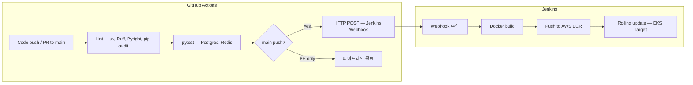

# 쿠버네티스 및 CI/CD 파이프라인 구축 보고서

> **문서 성격**: PuppyTalk 백엔드([README](../README.md), [architecture.md](architecture.md), [infrastructure-reliability-design.md](infrastructure-reliability-design.md))의 요구사항을 충족하기 위한 **AWS EKS 기반 자동 배포·운영 체계**를 설계 관점에서 정리한 보고서이다.  
> **현재 운영(Current)**: 실제 서비스 트래픽은 초기 비용을 아끼기 위해 **ECS(AWS의 기본 컨테이너 서비스, 태스크·서비스 단위로 컨테이너를 돌리는 방식)** 로 배포·운영 중이다.  
> **검증된 목표(Target & Validated)**: 본 문서 **§1**이 설명하는 **Jenkins 기반 EKS 블루/그린 배포(새 버전을 미리 띄워두고 테스트한 뒤, 한 번에 트래픽을 전환해 사용자가 배포 중단을 거의 느끼지 않게 하는 방식)** 파이프라인과 **§2~§6**의 K8s·관측 설계는 **실습·테스트를 통해 검증(Validated)을 완료**한 **목표 아키텍처**이다. 대규모 트래픽 등으로 **ECS에서 즉시 전환이 필요해질 때 그대로 가동할 수 있도록** 갖춰 둔 체계이며, 현재 ECS 운영과 **경쟁하지 않고 병행해 두었다가 필요 시 꺼내 쓰는 준비된 무기**에 해당한다.  
> **현재 저장소 연동**: `.github/workflows/deploy.yml`은 **GitHub Actions로 CI(lint·pytest)** 까지 수행하고, **`main` 푸시 시에만** Jenkins에 **HTTP 웹훅**으로 CD를 위임한다. **Docker 빌드·ECR 푸시·EKS 반영**은 Jenkins 파이프라인이 담당하며([§1](#1-cicd-파이프라인-개요)), 그중 **EKS 단계는 위 Target·Validated 경로**이다. 워크플로우 명·env 등에는 **ECS 블루/그린** 시절 흔적이 남아 있다. **§2~§5**는 **Target 전환 후** 동일 애플리케이션을 **EKS에서 운영할 때**의 컨테이너·K8s·관측 설계를 서술한다. 클러스터·네트워크 등 IaC는 [PuppyTalk Infra](https://github.com/kyjness/2-kyjness-community-infra) Terraform을 기준으로 한다.

---

## 목차

1. [CI/CD 파이프라인 개요](#1-cicd-파이프라인-개요)
2. [컨테이너 전략 (Docker)](#2-컨테이너-전략-docker)
3. [쿠버네티스 아키텍처 설계](#3-쿠버네티스-아키텍처-설계)
4. [실시간 통신을 위한 K8s 최적화](#4-실시간-통신을-위한-k8s-최적화)
5. [모니터링 및 로깅](#5-모니터링-및-로깅)
6. [확장 전략 (Future — AI)](#6-확장-전략-future--ai)

---

## 1. CI/CD 파이프라인 개요

### 1.1 실제 파이프라인 (GitHub Actions + Jenkins → ECR → EKS)

아래 흐름은 **프로덕션 Current가 ECS**이더라도, **검증 완료된 Target**인 **EKS(및 블루/그린에 준하는 무중단 전환)** 로 **즉시 배포를 옮길 때** Jenkins가 수행하는 단계를 요약한 것이다. 본 저장소의 **CI/CD**(코드 검사부터 서버 배포까지의 전 과정을 사람이 개입하지 않고 자동화하는 체계)에서는 **CI와 CD를 분리**한다. GitHub Actions는 **`uv` 기반 정적 검사·`pytest`까지**를 수행해 **빠르고 결정적인 품질 게이트**만 담당하고, **이미지 빌드·레지스트리 푸시·클러스터 반영**은 전부 **Jenkins 파이프라인**이 맡는다.



> **Note (명명·잔재 vs 운영 사실)**: 워크플로우 파일명·상단 env 등에 **Amazon ECS Blue/Green** 배포와 맞닿은 명명·변수가 남아 있고, 인프라 레포의 **IAM·CloudWatch 등에도 ECS 시절 잔재**가 있을 수 있다. **당장 사용자 트래픽을 받는 프로덕션 컴퓨트는 ECS(Current)** 이고, **`eks.tf`의 EKS**와 본 절의 Jenkins 배포 경로는 **검증 완료된 Target**으로—전환 결정 시 **이미 만들어 둔 파이프라인·클러스터 정의를 그대로 켜서 쓰는** 위치에 있다.

### 1.2 CI (GitHub Actions) — 구현 요소

[`deploy.yml`](../.github/workflows/deploy.yml) 기준으로 **Pull Request와 `main` 푸시** 모두에서 **lint → test** 잡이 실행된다. **`test`가 성공한 뒤**, **이벤트가 `push`이고 브랜치가 `refs/heads/main`일 때만** 별도 잡이 **Jenkins 잡 `puppytalk-backend-pipeline`**을 **HTTP POST(Webhook)** 로 트리거한다(`curl` + 빌드 토큰 URL, Basic 인증용 시크릿).

| 단계 | 도구·동작 | 목적 |
|------|-----------|------|
| **의존성 설치** | `astral-sh/setup-uv` + `uv sync --frozen --extra dev` | `pyproject.toml`·`uv.lock` 기반 **재현 가능한 환경** |
| **정적 검사** | `uv run poe lint-check`, `format-check`, `poe typecheck`, `poe audit` | 머지 전 품질 게이트 |
| **테스트** | 서비스 컨테이너: **PostgreSQL 15**, **Redis 7** + `uv run pytest` | 통합 테스트·`pg_trgm` 등 DB 전제 검증 |
| **CD 트리거** | `secrets.JENKINS_IP`·`JENKINS_USER`·`JENKINS_API_TOKEN`으로 Jenkins API 호출 | **GitHub Actions는 이미지 빌드·ECR·EKS 조작을 하지 않음** |

### 1.3 CD (Jenkins) — 빌드·ECR·EKS

Jenkins 파이프라인은 웹훅 수신 후 **Docker 이미지 빌드**, **AWS ECR로 푸시**, 그리고 **[PuppyTalk Infra](https://github.com/kyjness/2-kyjness-community-infra) Terraform(`eks.tf` 등)으로 프로비저닝된 EKS 클러스터(Target 환경)** 에 대한 **롤링 업데이트 형태의 배포**(예: `kubectl` / Helm 등 Jenkins 스테이지에서 정의된 방식; **블루/그린에 준하는 트래픽 전환 전략이 스테이지에 포함될 수 있음**)를 **전담**한다. 이 경로는 **실습·테스트로 검증을 마친 목표 아키텍처**의 CD 축이다. GitHub 저장소에는 해당 Jenkinsfile·스테이지 정의가 없을 수 있으므로, **태그 전략·배포 스텝의 단일 소스**는 Jenkins 측 설정을 기준으로 한다.

| 항목 | 설명 |
|------|------|
| **아티팩트** | Jenkins에서 빌드한 이미지 → ECR에 푸시된 태그가 EKS 워크로드의 새 버전 |
| **클러스터** | 인프라 레포의 **EKS** 리소스와 동일 계정·리전 정책에 맞춰 배포 |
| **무중단** | EKS `Deployment` **RollingUpdate**와 앱 **readinessProbe(준비 상태 Probe: 트래픽 받을 준비가 되었는지 주기적으로 확인하는 검사)** 조합이 일반적(상세는 [§3](#3-쿠버네티스-아키텍처-설계)) |

**자격 증명**: ECR 푸시·EKS API 접근용 AWS 자격 증명은 **Jenkins 에이전트 또는 파이프라인 자격**에서 구성하는 것이 현재 구조와 맞다. GitHub Actions에 ECR/OIDC를 붙이는 방식은 **선택적 개선안**이지, 현재 워크플로우에는 없다.

---

## 2. 컨테이너 전략 (Docker)

### 2.1 멀티 스테이지 Dockerfile (재현성)

백엔드 `Dockerfile`은 **Builder**에서 `uv lock && uv sync --frozen`으로 의존성을 고정 설치하고, **Runtime**에는 `.venv`·앱·Alembic만 복사해 이미지 크기와 공격 면을 줄인다. `pyproject.toml`·`uv.lock`을 복사한 뒤 `uv sync`하는 순서는 **레이어 캐시**와 **빌드 재현성**에 유리하다.

**런타임**: `appuser` 비루트, `PYTHONUNBUFFERED=1`, `entrypoint.sh`로 Uvicorn/Gunicorn 기동.

### 2.2 배포 환경별 환경 변수 (Dev / Prod)

| 구분 | 권장 패턴 | 비고 |
|------|-----------|------|
| **비밀** | AWS **Secrets Manager** + CSI **SecretProviderClass** 또는 EKS **External Secrets** | `JWT_SECRET_KEY`, DB 비밀번호, Redis URL |
| **일반 설정** | `ConfigMap` + Deployment `envFrom` | `CORS_ORIGINS`, `TRUSTED_HOSTS`, 로그 레벨 |
| **프론트 빌드** | `VITE_*`는 **빌드 시 주입**(CI); 런타임은 정적 파일 또는 `window.__ENV` 인젝션 등 정책에 따름 |

`STORAGE_BACKEND=s3` 프로덕션에서는 IRSA(IAM Roles for Service Accounts)로 Pod에 S3 권한을 부여하는 것이 AK/SK를 컨테이너에 넣지 않는 모범 사례이다.

---

## 3. 쿠버네티스 아키텍처 설계

### 3.1 Workload — Deployment

- **역할**: FastAPI 프로세스를 **ReplicaSet**으로 유지, 이미지 변경 시 **RollingUpdate**.
- **리소스**: `requests`/`limits`를 명시해 CPU 스로틀링과 OOM을 방지. WebSocket·동시 코루틴이 많으면 **메모리 limit**을 보수적으로.
- **종료 처리**: 롤링 시 구 Pod가 내려갈 때 **Graceful Shutdown(우아한 종료: 즉시 프로세스를 죽이지 않고, 처리 중인 요청·채팅 연결이 마무리될 시간을 주는 안전 장치)** 을 위해 **`preStop` 훅**·`terminationGracePeriodSeconds` 등을 두어 ALB·소켓 정리와 맞추는 것이 일반적이다.

**프로브 — Liveness/Readiness Probe(상태 검사: 쿠버네티스가 주기적으로 “살아 있는지(liveness)”, “손님을 받을 준비가 되었는지(readiness)”를 찔러 확인하는 기능) (안정성 핵심)**

| 프로브 | 경로·의도 | 권장 |
|--------|-----------|------|
| **readinessProbe** | `GET /health` (HTTP 200일 때만 **Service 엔드포인트에 포함**) | DB 연결 실패 시 503 → 트래픽에서 제외, 롤링 시 **신규 Pod만** 트래픽 수신 |
| **livenessProbe** | 동일 경로 또는 **가벼운 TCP** | 데드락·무한 루프 Pod만 재시작. **DB 일시 장애**와 혼동되지 않게 하려면 liveness는 완화하거나 readiness와 분리 검토 |
| **startupProbe** | (선택) 초기 마이그레이션·콜드 스타트가 길 때 | 느린 노드에서 **OOMKilled 루프** 방지 |

예시 (발췌, 값은 튜닝 필요):

```yaml
readinessProbe:
  httpGet:
    path: /health
    port: 8000
  initialDelaySeconds: 5
  periodSeconds: 10
  timeoutSeconds: 3
  failureThreshold: 3
livenessProbe:
  httpGet:
    path: /health
    port: 8000
  initialDelaySeconds: 15
  periodSeconds: 20
  timeoutSeconds: 5
  failureThreshold: 3
```

### 3.2 Service & 세션 스티키니스 (WebSocket)

| 옵션 | 설명 |
|------|------|
| **애플리케이션 설계 (PuppyTalk)** | DM은 **Redis Pub/Sub Fan-out**으로 Pod 간 메시지 전달이 가능하므로, Ingress **Sticky Session 필수는 아님**([infrastructure-reliability-design.md](infrastructure-reliability-design.md) 「채팅(실시간)」 절 참고). |
| **Ingress Sticky (선택)** | `service.beta.kubernetes.io/aws-load-balancer-target-group-attributes: stickiness.enabled=true` 등으로 **동일 클라이언트 → 동일 Pod** 유지 가능. **재연결**·**장애 시 다른 Pod** 시나리오는 앱이 Redis에 의존하므로 일관됨. |
| **Idle timeout** | ALB Ingress에서 **유휴 타임아웃**이 짧으면 WebSocket이 끊길 수 있음 → **주석으로 상향** 또는 클라이언트 keepalive와 정합. |

### 3.3 Networking — Ingress (ALB Ingress Controller)

- **AWS Load Balancer Controller**: `Ingress` 리소스에 **ALB** 프로비저닝, **ACM** 인증서 ARN을 어노테이션으로 연결 → **TLS 종료**.
- **HTTP/2, WebSocket**: ALB는 업그레이드 요청을 백엔드로 전달; **WSS**는 `443` 리스너 + ACM.

### 3.4 Scalability — Horizontal Pod Autoscaler (HPA, 트래픽·CPU 등에 따라 Pod 개수를 자동으로 늘리는 쿠버네티스 리소스)

- **메트릭**: CPU·메모리(`resource` 기반) 또는 **KEDA** + Prometheus(커스텀: 요청 큐 길이 등).
- **동작**: 부하 증가 시 **Replica 수 상한**까지 Pod 확장 → PuppyTalk의 **Connection Pool·RDS max_connections**와 함께 상한을 설계해야 함([infrastructure-reliability-design.md](infrastructure-reliability-design.md) 「DB 접속 줄이기」·트래픽 절 참고).

```yaml
# 개념 예시
apiVersion: autoscaling/v2
kind: HorizontalPodAutoscaler
metadata:
  name: puppytalk-api
spec:
  scaleTargetRef:
    apiVersion: apps/v1
    kind: Deployment
    name: puppytalk-api
  minReplicas: 2
  maxReplicas: 20
  metrics:
    - type: Resource
      resource:
        name: cpu
        target:
          type: Utilization
          averageUtilization: 70
```

---

## 4. 실시간 통신을 위한 K8s 최적화

### 4.1 Stateless Pod + Redis Pub/Sub

- **사실**: 각 Pod는 **로컬 WebSocket 연결**만 보유. **다른 Pod**에 붙은 클라이언트로 메시지를 보내려면 **Redis `PUBLISH`** → 모든 Pod의 **구독 루프**가 수신 → 해당 `user_id` 소켓이 있는 Pod만 **push**한다([architecture.md](architecture.md) §14).
- **인프라 함의**: EKS에서 **Pod 수평 확장**이 곧바로 “메시지 유실”로 이어지지 않도록 **Redis(ElastiCache) HA**가 **Critical Path(이 경로가 끊기면 핵심 기능이 같이 멈추는 지점)** 이다. Redis는 **동일 VPC·낮은 RTT** 서브넷에 두는 것이 유리하다.

### 4.2 지연 최소화

| 항목 | 권장 |
|------|------|
| **Placement** | API Pod와 Redis·RDS를 **동일 리전**, 가능하면 **가용 영역 정렬** |
| **Network Policy** | 필요 최소만 허용하되, **Redis Pub/Sub 포트** 차단 실수 주의 |
| **DNS** | Cluster 내부 Redis가 아닌 **관리형 Redis 엔드포인트** 사용 시 **프라이빗 링크**·VPC 엔드포인트로 공용 인터넷 경로 회피 |
| **DB 세션** | 앱은 **짧은 AsyncSession**으로 Pool 고갈 방지 — Pod 수가 늘어도 **장시간 커넥션 점유**와 분리 ([infrastructure-reliability-design.md](infrastructure-reliability-design.md) 「DB 접속 줄이기」 절 참고) |

---

## 5. 모니터링 및 로깅

### 5.1 메트릭 — Prometheus & Grafana

| 대상 | 예시 메트릭 |
|------|-------------|
| **Kubernetes** | Pod CPU/메모리, 재시작 횟수, HPA 현재 Replica |
| **애플리케이션** | (옵션) OpenTelemetry + Prometheus exporter — 요청 지연, 5xx 비율 |
| **ALB** | Target 응답 시간, 5xx, Healthy 호스트 수 |
| **RDS / Redis** | CPU, 연결 수, 복제 지연, Eviction |

Grafana에서 **대시보드·알람**(Slack/PagerDuty)과 연동한다.

### 5.2 로그 — CloudWatch Logs (중앙 집중)

- **DaemonSet**: **Fluent Bit** 또는 **CloudWatch Container Insights** 에이전트로 **stdout/stderr** 수집.
- **상관관계**: FastAPI는 `request_id`(ULID)를 응답·로그에 포함 — CloudWatch **필터**로 추적 가능([architecture.md](architecture.md)).

---

## 6. 확장 전략 (Future — AI)

[infrastructure-reliability-design.md](infrastructure-reliability-design.md) 「목표 아키텍처」·README 확장 전략에 맞춰 **AI 파이프라인·등급별 사용량 제한(Quota)·모델 라우팅** 을 도입할 때, EKS에서는 다음을 **목표 아키텍처**로 둔다.

| 항목 | 전략 |
|------|------|
| **GPU 노드 그룹** | `Inference` 전용 **Managed Node Group** 또는 **Karpenter**로 GPU 인스턴스 풀 분리, **Taint/Toleration(노드 격리: 일반 서버와 AI 연산용 무거운 서버가 섞이지 않도록 노드에 ‘자물쇠’를 걸고, 허용된 Pod만 ‘열쇠’로 들어오게 하는 기능)** 으로 API Pod와 스케줄 격리 |
| **네임스페이스** | `puppytalk-api`(기존), `puppytalk-ml` 또는 `ai-inference` 등 **네임스페이스 격리** — RBAC·NetworkPolicy·리소스 쿼터 분리 |
| **트래픽** | API 게이트웨이에서 **추론 전용 경로**만 GPU 서비스로 라우팅; **SQS/Kafka**로 비동기 큐 연동 시 별도 **Consumer Deployment** |
| **비용·Quota** | README에 기술된 **Redis 기반 Tiered Quota**는 **동일 Redis 클러스터** 또는 전용 네임스페이스의 Redis로 확장 가능 |

이는 **현재의 Stateless API·Redis 중심 설계** 위에 **GPU 워크로드만 추가**하는 형태로, 기존 DM·REST 트래픽과 **리소스·장애 영역**을 분리한다.


