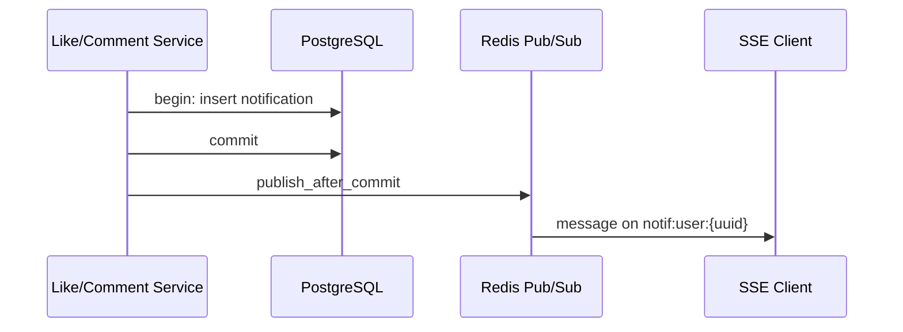
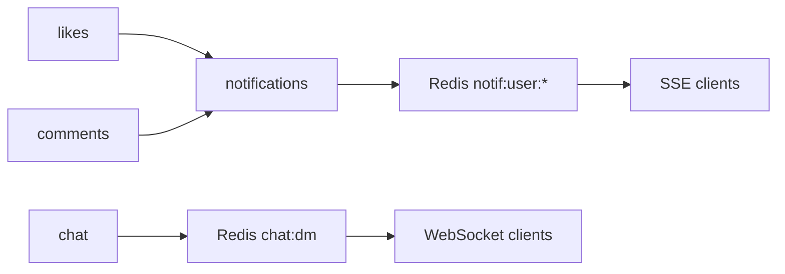

# 실시간·알림 (SSE · Redis · Celery)

인앱 알림의 **DB 영속화 → 커밋 후 Redis Pub/Sub → SSE**, 선택적 **SNS·Celery 재전달** 파이프라인과 DM 채팅 Redis 패턴을 정리한다.

[← 아키텍처 개요](architecture.md) · [도메인 플로우](domain-flows.md)

---

## 1. 알림 종류·트리거

**enum**: `NotificationKind` (`app/common/enums.py`)

| kind | 발생 시점 | 수신자 |
|------|-----------|--------|
| `COMMENT_ON_POST` | 타인 게시글에 댓글 | 게시글 작성자 |
| `LIKE_POST` | 타인 게시글 좋아요 | 게시글 작성자 |
| `LIKE_COMMENT` | 타인 댓글 좋아요 | 댓글 작성자 |

**발행 코드**

- `app/domain/comments/service.py` — 댓글 생성 후
- `app/domain/likes/service.py` — 좋아요 INSERT 성공 후

자기 글·자기 댓글에는 알림을 만들지 않는다(서비스 내부 분기).

---

## 2. 핵심 원칙: DB 먼저, Redis 나중



**이유**

1. 커밋 전 publish 하면 DB 롤백 시 **유령 알림**이 SSE로 전달될 수 있다.
2. Redis 실패는 **fail-open** — DB·목록 API로 복구 가능 (`publish_after_commit` docstring).

**구현**: `NotificationService.publish_after_commit` (`app/domain/notifications/service.py`)

---

## 3. DB 모델·API

### 3.1 테이블·모델

- `Notification` ORM — `user_id`(수신자), `kind`, `actor_id`, `post_id`, `comment_id`, `read_at`, `created_at`
- `NotificationsModel` — insert, list, mark_read, purge

### 3.2 REST (`/v1/notifications`)

| 메서드 | 경로 | 설명 |
|--------|------|------|
| GET | `/stream` | SSE (Redis 필수) |
| GET | `` | 페이지 목록 (`get_slave_db`) |
| PATCH | `/read` | 읽음 처리 (`ids` 생략 시 전체) |
| POST | `/{notification_id}/dispatch` | Celery 재전달 (202) |

**파일**: `app/domain/notifications/router.py`

---

## 4. SSE 스트림

### 4.1 연결

```
GET /v1/notifications/stream
Authorization: Bearer <access>
```

- `get_current_user` 필수.
- `get_optional_redis` — **없으면 503** JSON (`NOTIFICATION_SSE_UNAVAILABLE`), ApiResponse 형식 (`dump_api_response`).

### 4.2 스트림 본문

- `media_type=text/event-stream`
- 헤더: `Cache-Control: no-cache`, `Connection: keep-alive`, `X-Accel-Buffering: no` (Nginx 버퍼링 방지)

### 4.3 `sse_subscribe` 동작

1. `pubsub.subscribe("notif:user:{user_uuid}")`
2. `get_message(timeout=25s)` — 메시지 없으면 **`: ping\n\n`** heartbeat
3. 수신 시 `data: {json}\n\n` (한 이벤트)
4. 클라이언트 disconnect → `CancelledError` → unsubscribe·aclose

### 4.4 실시간 JSON 필드 (camelCase)

`build_realtime_payload`:

| 필드 | 설명 |
|------|------|
| `notificationId` | Base62 |
| `kind` | enum 문자열 |
| `actorId` | 좋아요/댓글한 사용자 |
| `postId` | 관련 게시글 |
| `commentId` | 댓글 관련 시 |

목록 API의 `NotificationItem`과 의미는 같고, SSE는 **푸시용 최소 필드**만 보낸다.

---

## 5. Redis Pub/Sub

| 항목 | 값 |
|------|-----|
| 채널 | `notif:user:{recipient_uuid}` |
| 메시지 | `json.dumps(build_realtime_payload(...))` |
| 구독자 | 각 API 워커의 SSE 연결(해당 유저 소켓이 붙은 워커만) |

**다중 워커**

- SSE 연결은 **한 워커 프로세스**에만 존재한다.
- publish는 **모든 구독자**(해당 채널을 subscribe 중인 워커)에게 전달된다.
- 따라서 유저 A의 SSE가 워커 1에 있으면, 워커 2에서 발생한 좋아요도 Redis가 워커 1로 메시지를 넘긴다.

DM 채팅과 달리 알림은 **ConnectionManager 없이** pubsub → 제너레이터 yield 직결이다.

---

## 6. SNS (선택)

`SNS_TOPIC_ARN` 설정 시 `publish_after_commit` 이후 **비동기 태스크**로 SNS publish (`asyncio.to_thread` + boto3).

- 실패해도 DB·인앱 알림은 유지 (로그만).
- 페이로드: `build_sns_payload` — `recipientUserId`, `message` 요약 문구 포함.
- 모바일 푸시·Lambda 구독 등 **외부 채널**용; SSE와 병행 가능.

---

## 7. Celery delivery

### 7.1 언제 쓰는가

- API 요청 경로에서 이미 `publish_after_commit`으로 Redis에 쏜다.
- `POST .../dispatch`는 **재전달·오프로딩·푸시 파이프라인 보조**용.
- `CELERY_ENABLED=false` 이면 dispatch 엔드포인트는 400.

### 7.2 태스크

**파일**: `app/worker/tasks/notifications.py`

```text
deliver_notification_push.delay(
  notification_id, user_id, idempotency_key
)
```

- 큐: `high_priority` (celery 라우팅 설정 참고)
- Job: `app/worker/jobs/notification_delivery.py` → `deliver_notification_async`

### 7.3 Job 단계

1. `parse_public_id_value` — Base62 → UUID
2. Redis `SET NX` — `celery:notif:delivered:{idempotency_key}` (`CELERY_TASK_IDEMPOTENCY_TTL_SECONDS`)
3. DB에서 `(notification_id, user_id)` 행 로드 — 없으면 `NotificationDeliverySkip`
4. `build_realtime_payload` 후 **동일 채널**에 `publish`
5. 연결 종료 시 redis `aclose`

### 7.4 멱등 키

- 헤더 `X-Idempotency-Key` 또는 기본 `dispatch:{notificationId}`
- HTTP POST 멱등(`idemp:...`)과 **별도 네임스페이스**

---

## 8. 도메인 협업 (알림·채팅)



| 경로 | 저장 | 실시간 |
|------|------|--------|
| 알림 | PostgreSQL `notifications` | Redis → SSE |
| DM | PostgreSQL 메시지 | Redis Pub/Sub → WS ([architecture §8](architecture.md#8-dm-채팅)) |

**공통**: 커밋 후 Redis. Redis 장애 시 알림은 GET 목록, DM은 REST 이력으로 복구.

---

## 9. Redis 키 요약 (알림·관련)

| 키/채널 | 용도 |
|---------|------|
| `notif:user:{uuid}` | 알림 Pub/Sub 채널 |
| `celery:notif:delivered:{key}` | Celery delivery 멱등 |
| `blacklist:jti:{jti}` | 로그아웃 Access 차단 (SSE 인증과 동일) |
| `idemp:*` | HTTP 멱등 ([요청·API](request-and-api-contract.md#6-멱등성-x-idempotency-key)) |
| `puppytalk:channel:chat:dm` | DM ([architecture §8](architecture.md#8-dm-채팅)) |

전체 Redis 표: [아키텍처 §6](architecture.md#6-redis-용도-요약).

---

## 10. 운영·장애 시나리오

| 상황 | 동작 |
|------|------|
| Redis 없음 | SSE 503; 알림 insert·목록은 DB만 |
| publish 예외 | 로그; 수신자는 목록 API로 동기화 |
| Celery 꺼짐 | dispatch 불가; 인앱 실시간은 요청 경로 publish에 의존 |
| SSE 끊김 | 프론트 재연결 + 목록 폴링/재조회 권장 |
| 오래된 알림 | `purge_old_notifications` (lifespan/cron 연동 가능) |

---

## 11. 프론트 연동 체크리스트

1. 로그인 후 `EventSource` 또는 fetch stream으로 `/v1/notifications/stream`.
2. `data` JSON 파싱 → 배지·토스트 갱신.
3. heartbeat `:` 라인 무시.
4. 503이면 실시간 off + `GET /notifications` 폴링.
5. 푸시 재시도 필요 시 `POST .../dispatch` (Celery on).

관련: [보안 §4](security.md#4-인증세션토큰), [요청·ApiResponse](request-and-api-contract.md).
