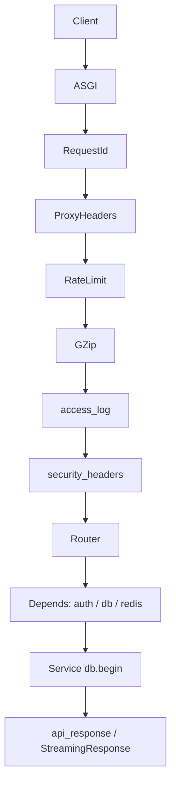

# 요청·응답·API 계약

HTTP 요청이 미들웨어를 거쳐 라우터·서비스까지 도달하는 과정, 클라이언트와 맞춰 둔 **응답 JSON 규격**, **멱등성**, **OpenAPI camelCase** 를 정리한다.

[← 아키텍처 개요](architecture.md)

---

## 1. 미들웨어 파이프라인

### 1.1 실행 순서

Starlette는 **나중에 등록한 미들웨어가 요청 시 먼저** 실행된다. `app/main.py`에서 `RequestIdMiddleware`를 **맨 마지막**에 등록해, 모든 요청에 `request_id`가 붙는다.

**요청 진입 순서**

1. `RequestIdMiddleware` — ULID `request_id` → `request.state`, 로깅 context
2. `ProxyHeadersMiddleware` — 신뢰 프록시만 `X-Forwarded-For` 반영 → `scope["client"]`
3. `RateLimitMiddleware` — Redis Lua 고정 윈도우 ([보안 §7](security.md#7-brute-forcedos남용))
4. `GZipMiddleware` — 1KB 이상 응답 압축
5. `access_log_middleware` — 구조화 접근 로그
6. `security_headers_middleware` — CSP, X-Frame-Options 등
7. 라우터 + FastAPI `Depends`

### 1.2 흐름도



### 1.3 기타 앱 레벨 설정

| 항목 | 파일 | 설명 |
|------|------|------|
| CORS | `main.py` | `CORS_ORIGINS`, `allow_credentials=True` |
| Trusted Host | `main.py` | `TRUSTED_HOSTS != ["*"]` 일 때만 활성 |
| 정적 업로드 | `main.py` | `STORAGE_BACKEND=local` → `/upload` 마운트 |
| OpenAPI | `main.py` | `_custom_openapi()` → camelCase 변환 |

---

## 2. 의존성 주입 (DI)

**파일**: `app/api/dependencies/`

| 의존성 | 용도 | DB |
|--------|------|-----|
| `get_master_db` | CUD | Writer (`AsyncSessionLocal`) |
| `get_slave_db` | 조회 | Reader (`AsyncSessionLocalReader`) |
| `get_current_user` | 필수 로그인 | JWT + `jti` 블랙리스트 |
| `get_current_user_optional` | 선택 로그인 | 피드·조회수 등 |
| `get_current_admin` | 관리자 | `role == ADMIN` |
| `get_optional_redis` | Redis 선택 | 없으면 `None` (Fail-open) |
| `get_client_identifier` | 조회수 방문자 키 | `scope["client"]` 또는 XFF 첫 hop |
| `require_post_author` / `require_comment_author` | 작성자 검증 | [보안 §5](security.md#5-idor권한-상승) |

**규칙**: DI는 세션을 **yield만** 한다. `commit`/`rollback`은 서비스의 `async with db.begin():` 에서만 수행한다.

---

## 3. 헬스체크

| 경로 | 응답 | HTTP |
|------|------|------|
| `GET /v1/health` | `ApiResponse` + `data.status` | DB OK → 200, 실패 → **503** `DB_ERROR` |
| `GET /v1/` | `ApiResponse[RootData]` | 200 |
| `GET /` | `{ status, message }` | ALB용 단순 JSON (ApiResponse 아님) |

구현: `app/main.py` — `check_database()`, `api_response()`.

---

## 4. ApiResponse 계약

### 4.1 성공·실패 공통 형식

**파일**: `app/common/schemas.py` (`ApiResponse`), `app/common/responses.py` (`api_response`)

```json
{
  "code": "OK",
  "message": "",
  "data": { },
  "requestId": "01HXXXXXXXXXXXXXXXXXXXXXXX"
}
```

- 필드명은 **camelCase** (`serialize_by_alias=True`).
- `requestId`는 `RequestIdMiddleware`가 발급한 값과 동일.
- 성공 시 `message`는 빈 문자열인 경우가 많다.
- 실패 시 `code`는 `ApiCode` enum 문자열 ([api-codes.md](api-codes.md)).

### 4.2 라우터에서의 사용

```python
return api_response(request, code=ApiCode.OK, data=payload)
```

`response_model=ApiResponse[T]` 로 OpenAPI 스키마와 런타임을 맞춘다.

### 4.3 예외 시 변환

**파일**: `app/core/exception_handlers.py`

| 예외 | HTTP | code |
|------|------|------|
| `BaseProjectException` | `exc.status_code` | `exc.code` |
| `RequestValidationError` | 400 | 휴리스틱 (`INVALID_REQUEST_BODY` 등) |
| `IntegrityError` | 409 등 | `EMAIL_ALREADY_EXISTS`, `CONFLICT` … |
| `HTTPException` | `exc.status_code` | `detail.code` 또는 매핑 |
| 미처리 `Exception` | 500 | `INTERNAL_SERVER_ERROR`, 메시지 마스킹 |

500 응답 본문 메시지는 `Internal Server Error`로 통일. 스택·SQL은 **서버 로그만**.

### 4.4 SSE·스트리밍 예외

- `GET /v1/notifications/stream` — 본문은 `text/event-stream`, Redis 없으면 **503 JSON** (`dump_api_response` 사용).
- WebSocket — 프레임 JSON, 인증 실패 시 close code 1008 등 ([실시간·알림](realtime-notifications.md)).

---

## 5. OpenAPI · camelCase

### 5.1 런타임 직렬화

- `BaseSchema` — `alias_generator=to_camel`, `serialize_by_alias=True`.
- `PublicId` — DB `UUID` ↔ JSON Base62 문자열.

### 5.2 OpenAPI 문서

**파일**: `app/core/openapi_camel.py`

`get_openapi()` 결과의 `components.schemas.*.properties` 키를 snake_case → camelCase로 변환한다. `required` 배열 이름도 함께 맞춘다.

**이유**: 실제 HTTP JSON과 Swagger·프론트 codegen 스펙이 어긋나지 않게 하기 위함.

---

## 6. 멱등성 (X-Idempotency-Key)

**파일**: `app/api/dependencies/client.py`, `app/main.py` (Axios 인터셉터)

### 6.1 적용 엔드포인트

| 엔드포인트 | namespace | TTL (기본) |
|------------|-----------|------------|
| `POST /v1/posts` | post create | `IDEMPOTENCY_POST_CREATE_*` |
| `POST /v1/media/images` | media upload | `IDEMPOTENCY_MEDIA_UPLOAD_*` |
| `POST /v1/media/images/signup` | signup upload | 동일 |
| `POST /v1/notifications/{id}/dispatch` | Celery dispatch | 헤더 또는 `dispatch:{id}` |

### 6.2 동작

1. 헤더 `X-Idempotency-Key` — 8~128자 (`_normalize_idempotency_key`).
2. Redis 없으면 멱등 **비활성**(정상 처리).
3. fingerprint = `SHA256(scope_parts + key)` — 사용자 ID 등 scope에 사용자·엔드포인트 포함.
4. **캐시 히트**: `idemp:{namespace}:res:{fp}` 에 저장된 JSON → 즉시 동일 HTTP status + body (`TypeAdapter` 검증).
5. **진행 중**: `idemp:{namespace}:lock:{fp}` SET NX → 실패 시 **409 CONFLICT**.
6. 성공 후 응답 저장, 실패 시 lock 해제 (`post_create_idempotency_after_failure`).

### 6.3 게시글 생성 라우터 예

```text
post_create_idempotency_before → (캐시면 return)
  → PostService.create_post
  → post_create_idempotency_after_success
예외 시 post_create_idempotency_after_failure
```

미디어 업로드는 **라우터 dependency**에서 `File()` 파싱 전 캐시 응답을 `request.state`에 심어 중복 업로드를 막는다.

### 6.4 TypeAdapter와 스키마 드리프트

캐시 JSON 복원 시 `TypeAdapter(ApiResponse[PostIdData])` 등으로 검증. 불일치면 캐시 미스 후 정상 플로우 ([보안 §12](security.md#12-비정상-페이로드캐시)).

---

## 7. 페이징·목록 응답

`PaginatedResponse[T]` (`app/common/schemas.py`):

| 필드 | 의미 |
|------|------|
| `items` | 현재 페이지 목록 |
| `hasMore` | 다음 페이지 존재 |
| `total` | 전체 개수(쿼리 가능 시) |

게시글 피드는 **커서** 기반 (`cursor` = 마지막 게시글 공개 ID). 댓글·알림 목록은 **page/size** 기반.

---

## 8. 관련 문서

- [데이터·식별자·검색](architecture.md#3-데이터-계층) — RW DB, `PublicId`
- [보안](security.md)
- [도메인 플로우](domain-flows.md) — POST 멱등이 걸린 게시글·미디어
